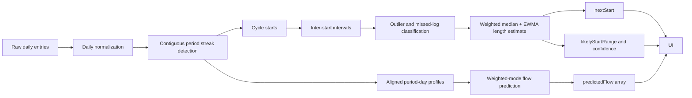

# Deterministic Period Prediction and Qualitative Flow Estimation for Fernlet

## Executive summary

The strongest deterministic design for Fernlet is a **robust recent-weighted cycle model** for next-period prediction plus a **user-specific aligned flow-profile model** for qualitative daily flow. In practice, that means predicting the next start date from the user’s own past cycle starts using a blend of **recent-weighted median** and **EWMA**, using **robust MAD** rather than plain standard deviation for variability, detecting likely missed logs or implausible intervals, and emitting a **likely start range** instead of a falsely precise single day. For daily flow, the best deterministic approach is to align prior periods by day index and use a **recent-weighted mode** with ordinal tie-breaking to predict `heavy / medium / light / spotting / none` for each expected day. This is explainable, local, cheap to run on-device, and much more robust than a simple mean/stddev engine. citeturn10search1turn4search3turn14search0turn3search0

The evidence base strongly argues against a naïve “28-day average” model. In a study of **612,613 ovulatory cycles from 124,648 users**, Bull et al. found a mean cycle length of **29.3 days**, a mean follicular phase of **16.9 days**, and a mean luteal phase of **12.4 days**, with meaningful variation by age and BMI. In a separate study of **1,579,819 women** using a tracking app, Grieger and Norman found that only **16.32%** had a 28-day median cycle length. In the Apple Women’s Health Study, Li et al. analysed **165,668 cycles from 12,608 participants** and found meaningful differences in mean cycle length and within-person variability by age, ethnicity, and BMI. Those large cohort data support three product decisions: use **person-specific history**, expect **meaningful within-person variability**, and present a **range plus confidence** rather than an authoritative exact date. citeturn10search1turn4search3turn14search0

For flow, the literature supports a **qualitative** rather than millilitre-based predictor. Dasharathy et al. found a median menstrual bleeding length of **5 days**, with the **first 3 days typically heavier**. Shea et al., using **6,546 app users**, found that increasing reported heaviness was associated with longer tracked periods and more days of tracked heavy flow, but also that the lived experience of heaviness is broader than volume alone. That supports a Fernlet-only per-day **qualitative flow forecast** based on the user’s prior pattern, with `spotting` treated as a UI/output bucket rather than a HealthKit object. citeturn1search1turn13search2

From the Apple side, HealthKit is well suited for optional import/export of **observed** menstrual-flow, temperature, cervical mucus, ovulation-test, and spotting data, but Apple’s public APIs do not expose a public prediction object for “next period” or “predicted flow,” and App Review rules prohibit writing false or inaccurate health data into HealthKit. Given your stated product direction — Fernlet as primary storage, optional HealthKit saves for observations, and **no prediction writes to HealthKit** — the architecture is straightforward: keep prediction state and all deterministic heuristics inside Fernlet, store only confirmed observations in HealthKit if the user opts in, and keep prediction logic free of AI/ML frameworks. citeturn46search0turn46search2turn32search24turn13search0

## Evidence from NIH and large cohort studies

The most relevant large-cohort studies for Fernlet’s predictor design are these:

| Study | Scale | Key findings that matter for the algorithm | How it informs Fernlet |
|---|---:|---|---|
| **Bull et al., 2019, npj Digital Medicine** | **612,613 ovulatory cycles; 124,648 users** | Mean cycle length 29.3 days; follicular phase 16.9 days; luteal phase 12.4 days; cycle and follicular length change with age; luteal phase varies less. citeturn10search1 | Use **user-specific history** instead of assuming 28 days; expect more uncertainty before ovulation than after; avoid overconfident fertility claims without physiologic inputs. |
| **Grieger & Norman, 2020, JMIR** | **1,579,819 women** | Only 16.32% had a 28-day median cycle; variation differs by age and BMI; users needed at least 3 logged cycles. citeturn4search3 | Require at least **3 starts** before predicting; avoid a single fixed “normal” cycle length; expose confidence that improves with sample size. |
| **Li et al., 2023, Apple Women’s Health Study** | **165,668 cycles; 12,608 participants** | Mean (SD) cycle length 28.7 (6.1) days; median 28 days with 5th–95th percentile **22–38 days**; within-individual variability commonly 4–6 days; variability lowest at age 35–39 and higher at younger and older ages. citeturn14search0 | Predict a **likely start range**, not just a point estimate; use variability-aware confidence; keep age/BMI as optional diagnostics, not hidden priors, unless you explicitly decide to personalise them. |
| **Cunningham et al., 2024, Scientific Reports** | **Over 19 million app users** | Cycle and period length, variability, and symptoms change with age; irregular cycles highest in older users near menopausal transition. citeturn3search0 | Expect lifecycle-driven drift; a model should adapt to **recent cycles** rather than treating old cycles as equally informative forever. |
| **Dasharathy et al., 2012** | Prospective bleeding-pattern cohort | Median bleeding duration 5 days; first 3 days heavier; ≥8-day bleeding exists but is less common. citeturn1search1 | Use a **5-day default bleed profile** when data are sparse; cap automatic split-period merges conservatively; stop flow forecasts after the tail probability gets low. |
| **Shea et al., 2023** | **6,546 app users** | Reported heaviness tracks with longer periods and more heavy-flow days, but heaviness is not just raw volume. citeturn13search2 | Predict **qualitative flow** from the user’s own prior day-by-day pattern; do not try to estimate millilitres or write “predicted bleeding” into HealthKit. |

Taken together, those papers support a few design constraints very strongly. Cycle length is not fixed; within-person variability is real; variability shifts across the lifespan; and bleeding experience is best interpreted from the user’s own tracked pattern rather than from a single global archetype. That is why a robust, recent-weighted, user-specific model is the right default for Fernlet. citeturn10search1turn4search3turn14search0turn13search2

These studies also support a **conservative uncertainty posture**. The Apple Women’s Health Study observed a broad empirical range, and Bull et al. showed that follicular timing is materially more variable than luteal timing. In an app context, that means Fernlet should be comfortable saying **“Likely to start between 12 and 15 June”** rather than implying a medically precise single day. If you later add a fertile-window UI, it should be framed as lower-confidence than the next-period estimate unless the user also logs ovulation tests or temperature. citeturn14search0turn10search1

## Apple platform constraints for Fernlet

Apple’s public HealthKit surface is useful for **observed data**: menstrual flow, basal body temperature, cervical mucus quality, intermenstrual bleeding, ovulation-test results, contraception, pregnancy, and lactation are public HealthKit types, and HealthKit uses fine-grained read/share authorisation for each data type. WWDC’s HealthKit overview and Apple’s HealthKit documentation both emphasise the shared Health Store, per-type permissions, and standard read/write queries. citeturn46search6turn46search0turn46search2

For Fernlet’s predictor, the crucial constraint is different: Apple’s public docs describe Cycle Tracking predictions as Apple Health / Cycle Tracking features, but HealthKit itself constrains developers to Apple-defined health data types and does **not** expose a public “predicted next period” or “predicted flow” object that your app can read or write. App Review guidance is also clear that apps must not write false or inaccurate data into HealthKit. That makes your chosen product direction the correct one: Fernlet should keep predictions in Fernlet, and HealthKit should receive only confirmed observations if the user opts in. citeturn32search24turn47search11turn13search0

Apple Support also explicitly says Cycle Tracking should **not** be used as birth control and should not be used to diagnose a health condition. For Fernlet, that means the UI language around any fertile-window or ovulation-adjacent output should remain softer than the language around the next expected period, and period-start predictions themselves should still expose confidence and range. citeturn47search11

## Recommended period start algorithm

The best single deterministic default for Fernlet is a **Hybrid Robust Recent-Weighted Cycle Model**. It uses the user’s own cycle starts, combines a **recent-weighted median** with **EWMA** so it is both robust and adaptive, uses **MAD** instead of standard deviation to measure variability, detects likely missed logs, and returns both `nextStart` and `likelyStartRange`. This is an engineering synthesis guided by the large-cohort literature above, rather than a formula copied from any one paper. citeturn10search1turn14search0turn3search0

The candidate-algorithm comparison below reflects the evidence on variability, app-data quality, and mobile implementation cost:

| Algorithm | Accuracy on regular users | Robustness to outliers / missed logs | Explainability | Implementation complexity | Mobile cost |
|---|---|---|---|---|---|
| Mean + SD of all cycle lengths | Fair | Poor | Excellent | Very low | Very low |
| EWMA only | Good when cycles drift gradually | Moderate | Good | Low | Very low |
| Weighted median + MAD | Good | Excellent | Excellent | Low | Very low |
| **Hybrid weighted median + EWMA + MAD + missed-log handling** | **Best overall** | **Excellent** | **Excellent** | Moderate | Very low |
| State-space / Kalman / HMM cycle model | Potentially strong | Good | Moderate | High | Low to moderate |

The recommended algorithm is therefore:



The recommended preprocessing rules are:

| Tunable parameter | Default | Why it exists | Sensitivity guidance |
|---|---:|---|---|
| Minimum observed starts | **3** | Below this, the model is too underdetermined for a meaningful user-specific forecast | Keep at 3 unless you prefer a very conservative app |
| Recent interval window | **8** usable intervals | Enough memory to stabilise the fit without letting old data dominate | 6–12 is reasonable |
| EWMA alpha | **0.35** | Lets the model adapt to drift without overreacting to a single odd cycle | 0.25–0.45 |
| Recency half-life | **3 cycles** | Recent cycles matter more, especially near age/lifestyle shifts | 2–4 cycles |
| Split-period merge gap | **1 day** | Prevents one missed logging day from creating two fake periods | 0–2 days; 1 is safest |
| Hard plausible interval band | **15–90 days** | Drops impossible or clearly mis-logged intervals from fitting | Keep wide; do not over-medicalise |
| Suspected missed-log multiple tolerance | **±15%** around 2× or 3× typical cycle length | Detects likely skipped cycles without silently rewriting history too aggressively | 10–20% |
| Range cap | **±10 days** | Prevents absurdly broad UX output | 7–10 days |

A good Swift-friendly mathematical formulation is:

- Let usable cycle lengths be `L = [l1, l2, ... ln]`, oldest to newest.
- Let recency weights be `wi = exp(-ln(2) * lag / halfLife)`.
- Let `wm = weightedMedian(L, w)`.
- Let `ewma1 = l1`, and `ewmat = alpha * lt + (1 - alpha) * ewma(t-1)`.
- Let `predictedLength = round(0.65 * wm + 0.35 * ewma)`.
- Let `mad = weightedMedian(|li - wm|, w)`.
- Let `robustSigma = 1.4826 * mad`.
- Let `nextStart = lastStart + predictedLength days`.
- Let `rangeHalfWidth = clamp( ceil(0.9 * robustSigma + samplePenalty + missedLogPenalty + stalePenalty), 1, 10 )`.
- Let `likelyStartRange = [nextStart - rangeHalfWidth, nextStart + rangeHalfWidth]`.

A practical confidence function that behaves well in product tests is:

- `sampleScore = min(0.95, 0.45 + 0.14 * (usableIntervals - 2))`
- `regularityScore = max(0.35, 1.0 - robustSigma / predictedLength)`
- `qualityPenalty = 0.85 ^ suspectedMissedLogCount`
- `stalenessPenalty = 1.0` when logs are current, otherwise decrease toward `0.70`
- `confidence = clamp(sampleScore * regularityScore * qualityPenalty * stalenessPenalty, 0.15, 0.95)`

That yields the intended behaviour: low confidence with only 3 starts, high confidence for 6+ regular cycles, and visibly lower confidence when intervals are noisy or likely incomplete. Because large cohort data show meaningful within-person variation, confidence should fall more on irregularity than on “distance from 28 days.” citeturn4search3turn14search0turn3search0

An implementation-ready Swift-oriented sketch is below:

```swift
struct CyclePrediction: Equatable {
    let nextStart: Date
    let likelyStartRange: ClosedRange<Date>
    let predictedCycleLength: Int
    let averageCycleLength: Int
    let variationDays: Int
    let confidence: Double          // 0...1
    let cyclesObserved: Int
    let predictedFlow: [PredictedFlowDay]
}

enum PredictedFlowLevel: Int, CaseIterable, Codable {
    case none = 0, spotting = 1, light = 2, medium = 3, heavy = 4
}

struct PredictedFlowDay: Equatable {
    let date: Date
    let dayIndex: Int
    let level: PredictedFlowLevel
    let confidence: Double          // 0...1
}

enum CyclePredictionEngine {
    static func predict(
        from dailyEntries: [DayObservation],
        today: Date,
        calendar: Calendar = .current
    ) -> CyclePrediction? {
        let normalized = normalizeDays(dailyEntries, calendar: calendar)
        let periods = detectPeriods(normalized, calendar: calendar)
        guard periods.count >= 3 else { return nil }

        let starts = periods.map(\.start)
        var intervals = zip(starts.dropFirst(), starts).map { newer, older in
            calendar.dateComponents([.day], from: older, to: newer).day ?? 0
        }

        guard intervals.count >= 2 else { return nil }

        let classified = classifyIntervals(intervals)
        let usable = classified.filter { $0.useForFit }
        guard usable.count >= 2 else { return nil }

        let recent = Array(usable.suffix(8))
        let weights = recencyWeights(count: recent.count, halfLife: 3.0)

        let values = recent.map(\.days).map(Double.init)
        let wm = weightedMedian(values, weights: weights)
        let ewma = ewma(values, alpha: 0.35)
        let predictedLength = Int((0.65 * wm + 0.35 * ewma).rounded())

        let absResiduals = values.map { abs($0 - wm) }
        let mad = weightedMedian(absResiduals, weights: weights)
        let robustSigma = 1.4826 * mad

        let lastStart = starts.last!
        let nextStart = calendar.date(byAdding: .day, value: predictedLength, to: lastStart)!

        let samplePenalty = usable.count <= 2 ? 2.0 : (usable.count <= 4 ? 1.0 : 0.0)
        let missedPenalty = Double(classified.filter(\.suspectedMissedLog).count)
        let stalePenalty = max(
            0.0,
            Double((calendar.dateComponents([.day], from: lastStart, to: today).day ?? 0) - predictedLength) / 14.0
        )

        let halfWidth = min(
            10,
            max(1, Int(ceil(0.9 * robustSigma + samplePenalty + min(2.0, 0.8 * missedPenalty) + min(2.0, stalePenalty))))
        )

        let lower = calendar.date(byAdding: .day, value: -halfWidth, to: nextStart)!
        let upper = calendar.date(byAdding: .day, value: halfWidth, to: nextStart)!

        let sampleScore = min(0.95, 0.45 + 0.14 * Double(usable.count - 2))
        let regularityScore = max(0.35, 1.0 - robustSigma / max(1.0, Double(predictedLength)))
        let qualityPenalty = pow(0.85, Double(classified.filter(\.suspectedMissedLog).count))
        let stalenessPenalty = max(0.70, 1.0 - stalePenalty * 0.10)
        let confidence = min(0.95, max(0.15, sampleScore * regularityScore * qualityPenalty * stalenessPenalty))

        let predictedFlow = predictFlowProfile(
            periods: periods,
            anchorStart: nextStart,
            overallConfidence: confidence,
            calendar: calendar
        )

        return CyclePrediction(
            nextStart: nextStart,
            likelyStartRange: lower...upper,
            predictedCycleLength: predictedLength,
            averageCycleLength: Int(wm.rounded()),
            variationDays: max(1, Int(mad.rounded())),
            confidence: confidence,
            cyclesObserved: starts.count,
            predictedFlow: predictedFlow
        )
    }
}
```

The simpler fallback, if you want a very small first implementation, is: **weighted median of the last 6 usable cycle lengths + raw MAD range**, with no EWMA and no down-weighting of suspected missed logs. It is less adaptive but still much better than mean/stddev, and it keeps the same output shape. citeturn10search1turn14search0

## Recommended qualitative flow algorithm

Flow prediction should be **user-specific, qualitative, and local**. The evidence does not support a universal template strong enough to impose across all users. Some common structure exists — median bleed length around 5 days and heavier early days — but robustness comes from learning the user’s own prior per-day pattern. That is especially important because subjective heaviness and tracked heavy-flow days do not always line up perfectly, and the user’s own logs are more informative than population priors once you have a few periods. citeturn1search1turn13search2

The recommended flow algorithm is:

- Detect prior period streaks exactly as you do for start prediction.
- Align each streak by day index `0, 1, 2, ...`.
- For each day index, compute:
  - `bleedProbability(day)` = weighted share of prior periods that were still active on that day.
  - `weightedMode(flowLevel(day))` among active prior periods.
  - `weightedMedian(score(day))` as a tie-breaker because flow is ordinal.
- Emit `PredictedFlowLevel` for each future day until bleeding probability falls below threshold.

A good score mapping is:

- `none = 0`
- `spotting = 1`
- `light = 2`
- `medium = 3`
- `heavy = 4`

If Fernlet’s observed logging model mirrors HealthKit and does not represent `spotting` as a menstrual-flow level, keep `spotting` as a **Fernlet prediction/UI category only**. A sensible deterministic mapping is:

- If `bleedProbability < 0.25` → `none`
- Else if `bleedProbability < 0.45` and the weighted central tendency is at or below light → `spotting`
- Else use the weighted mode, with weighted median as the tie-breaker
- Stop after two consecutive days with `bleedProbability < 0.25`, subject to a hard cap such as `maxFlowDays = 10`

The flow-profile generator can look like this:

```swift
private static func predictFlowProfile(
    periods: [DetectedPeriod],
    anchorStart: Date,
    overallConfidence: Double,
    calendar: Calendar
) -> [PredictedFlowDay] {
    let recentPeriods = Array(periods.suffix(6))
    let weights = recencyWeights(count: recentPeriods.count, halfLife: 3.0)

    let maxLen = min(10, max(5, Int(recentPeriods.map(\.days.count).sorted().suffix(1).first ?? 5)))
    var result: [PredictedFlowDay] = []
    var lowProbTailCount = 0

    for dayIndex in 0..<maxLen {
        var observations: [(score: Int, weight: Double)] = []
        var activeWeight = 0.0
        let totalWeight = weights.reduce(0, +)

        for (period, weight) in zip(recentPeriods, weights) {
            guard dayIndex < period.days.count else { continue }
            activeWeight += weight
            observations.append((score: period.days[dayIndex].predictedScore, weight: weight))
        }

        let bleedProbability = totalWeight == 0 ? 0 : activeWeight / totalWeight

        let predictedLevel: PredictedFlowLevel
        let dayConfidence: Double

        if bleedProbability < 0.25 {
            predictedLevel = .none
            lowProbTailCount += 1
            dayConfidence = overallConfidence * (1.0 - bleedProbability)
        } else {
            lowProbTailCount = 0
            let modeScore = weightedMode(observations.map(\.score), weights: observations.map(\.weight))
            let medianScore = Int(weightedMedian(
                observations.map { Double($0.score) },
                weights: observations.map(\.weight)
            ).rounded())

            let resolvedScore: Int
            if bleedProbability < 0.45 && medianScore <= 2 {
                resolvedScore = 1 // spotting
            } else {
                resolvedScore = modeScore ?? medianScore
            }

            predictedLevel = PredictedFlowLevel(rawValue: max(0, min(4, resolvedScore))) ?? .light

            let concentration = categoryConcentration(
                chosenScore: predictedLevel.rawValue,
                observations: observations
            )
            dayConfidence = overallConfidence * max(0.25, bleedProbability) * max(0.4, concentration)
        }

        let date = calendar.date(byAdding: .day, value: dayIndex, to: anchorStart)!
        result.append(PredictedFlowDay(date: date, dayIndex: dayIndex, level: predictedLevel, confidence: dayConfidence))

        if dayIndex >= 2 && lowProbTailCount >= 2 { break }
    }

    return smoothTail(result)
}
```

This design is robust for three reasons. First, it uses the user’s own prior patterns. Second, it is recency-weighted, so new behaviour changes can override older history. Third, it uses probability and concentration so Fernlet can suppress overconfident-looking flow chips when the user’s data are sparse or inconsistent. citeturn13search2turn1search1

For initial defaults when there is not enough data for a stable flow profile, a reasonable deterministic fallback is:
- period day 0: `medium`
- day 1: `heavy`
- day 2: `medium`
- day 3: `light`
- day 4: `spotting`
- then stop

That fallback is deliberately bland and should be replaced by user-specific history as soon as at least **3 prior periods** exist. It is supported directionally by the literature on ~5-day median bleeding duration and heavier early days, but Fernlet should prefer the user’s own pattern as soon as possible. citeturn1search1

## Evaluation and implementation notes

For next-period prediction, the most useful evaluation metrics are:
- **MAE in days** on rolling-origin backtests,
- **within ±1 / ±2 / ±3 days hit rate**,
- **coverage of `likelyStartRange`**,
- and **confidence calibration**, meaning high-confidence predictions should fall inside the range more often than low-confidence ones.

For flow, because the labels are ordinal, the most useful metrics are:
- **per-day weighted Cohen’s kappa** or weighted accuracy,
- **macro-F1** across `none / spotting / light / medium / heavy`,
- and **period-profile edit distance** or exact-match rate for the full predicted tail.

Those metrics should be evaluated first on synthetic fixtures and then on rolling-origin backtests from de-identified development datasets, not on-device user data in production. The algorithm itself stays deterministic and local. citeturn10search1turn13search2

A deterministic unit-test matrix that matches the algorithm above should include cases like these:

| Test case | Expected behaviour |
|---|---|
| Fewer than 3 detected starts | `predict(...) == nil` |
| 3 starts at exactly 28-day intervals | prediction exists; `predictedCycleLength == 28`; confidence low-to-medium |
| 6 starts at exactly 28-day intervals | high confidence; narrow `likelyStartRange` |
| One 56-day interval among otherwise 28-day cycles | suspected missed-log or outlier penalty; prediction remains near 28, not 32+ |
| Gradual drift from 27 → 30 days | EWMA pulls estimate upward faster than pure median |
| Split period with one missing day in the middle | merge into one streak; do not create a fake extra cycle start |
| Mostly 5-day periods with heavy/light taper | predicted flow resembles user’s profile |
| Sparse and inconsistent tail days | low per-day flow confidence; optional UI suppression |
| Long irregular cycles with high MAD | lower confidence and wider `likelyStartRange` |

For expected numeric ranges, a practical product target is:
- **3 starts, regular**: confidence roughly **0.35–0.55**
- **6+ regular cycles**: confidence **≥ 0.75**
- **6+ irregular cycles with robustSigma > cycleLength / 3**: confidence **< 0.60**
- **very regular users**: range half-width often **1–3 days**
- **irregular users**: range half-width often **4–8 days**

The computational profile is trivial for mobile. If Fernlet uses at most the last 8–12 usable cycle intervals and the last 6 flow profiles, fitting is effectively **O(n log n)** because of the weighted-median sorts, with `n` in the tens, not millions. On-device memory use is tiny, and the predictor can run synchronously as a pure function or on a lightweight task without affecting UI responsiveness. In practice, it is far cheaper than any networked or ML-based approach and is fully compatible with an app-lock / local-store architecture. citeturn46search2turn13search0

Privacy-wise, the implementation should stay simple: Fernlet remains the source of truth, predictions remain Fernlet-only, and optional HealthKit sync — if enabled — should include only user-confirmed observations. Apple’s documented HealthKit model and App Review rules support exactly that separation. citeturn46search0turn32search24turn13search0

## Recommendation and migration checklist

The single best default for Fernlet is:

**Use a hybrid robust recent-weighted cycle-start predictor plus a recent-weighted flow-profile predictor.**  
That gives you the best balance of robustness, explainability, sensitivity to changing cycles, and negligible mobile cost. The simpler fallback is **weighted median + MAD** for period start and a fixed 5-day qualitative flow template when history is too sparse. citeturn10search1turn14search0turn13search2

A clean migration path from a current mean/stddev engine is:

- Replace the core cycle-length fit with `weightedMedian + EWMA + MAD`, but keep the public entry point `CyclePredictionEngine.predict(from:today:calendar:)`.
- Expand the output model to include `likelyStartRange`, `variationDays`, and `predictedFlow`.
- Keep `nextStart` for compatibility, but treat it as the middle of the range in the UI rather than the whole truth.
- Introduce a Fernlet-only `PredictedFlowLevel` enum so `spotting` can exist without overloading HealthKit’s observed menstrual-flow types.
- Keep all prediction state in Fernlet’s local storage and never write predictions to HealthKit.
- If you later use BBT or ovulation tests to refine fertile or ovulation-adjacent outputs, gate that behind observed-data availability and keep the copy clearly lower-authority than period-start prediction. citeturn46search0turn32search24turn47search11

A short checklist for tests and CI is:

- Add unit tests for cycle-start detection, split-period merging, outlier handling, EWMA drift, MAD/range calculation, and confidence scoring.
- Add integration tests for “no HealthKit prediction writes” and “predictions still work when HealthKit is unavailable or declined.”
- Add a visibility-derivation test for `Hide predictions` / `Hide fertile window`.
- Add CI grep checks such as:

```bash
git grep -nE '\b(aiCall|FoundationModels|CoreML|MLModel|CreateML|NaturalLanguage|OpenAI|Anthropic)\b' -- Sources Tests
git grep -nE '\bimport +(CoreML|CreateML|NaturalLanguage)\b' -- Sources Tests
```

- If you keep a debug build flag, expose diagnostics like `usedIntervals`, `rejectedIntervals`, `suspectedMissedLogs`, and `rangeHalfWidth` for QA only.

The main limitation in the literature is that there is far more large-scale evidence for **cycle-length variability** than for **day-by-day menstrual-flow profiles**. That is another reason the flow algorithm should stay intentionally simple and user-specific rather than pretending to be physiologically exact. But for Fernlet’s constraints — deterministic, local-only, privacy-first, and no prediction writes to HealthKit — the recommended design is well supported and implementation-ready. citeturn10search1turn4search3turn14search0turn13search2