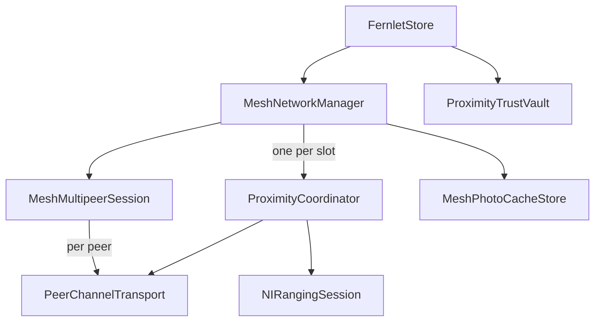

> **CLOSED 2026-07-19 — COMPLETE.** By its own status the lower-risk consolidation landed; the remaining broader folder moves are explicitly optional (tracker, tech debt). Live tracker: [RemainingWork-2026-07-19.md](../RemainingWork-2026-07-19.md).

# Proximity + Mesh Consolidation Plan

**Status:** Lower-risk consolidation complete; broader folder moves remain optional
**Updated against:** Current post-redesign tree
**Scope:** The proximity connection engine, mesh session manager, MultipeerConnectivity transport layer, ranging support, identity envelopes, trust policy, audit data, and friend-photo pipeline.

---

## 1. TL;DR

The proximity redesign has already removed the largest architectural duplication:

- Production routes pairwise and mesh friend sessions through `MeshNetworkManager`.
- `MeshNetworkManager` is the only production owner that constructs `ProximityCoordinator`.
- The standalone `FriendPhotoSharingService` and its cache store have already been deleted.
- Mesh slots already use real `NIRangingSession` instances and the 15 cm proximity-commit flow.

The lower-risk cleanup is complete. The consolidation work landed as focused extractions rather than a rewrite:

1. Extracted shared transport types from the legacy `MultipeerSession` file and deleted the unused concrete single-connection wrapper.
2. Moved on-the-wire payload types out of UI and oversized envelope files.
3. Removed dead `NoopRangingSession`.
4. Renamed the mesh manager's transient distance-window sample so it is not confused with persisted inspector diagnostics.
5. Added focused transport, wire, ranging, engine, mesh, trust, and photo-support folders as declarations move.
6. Evaluated separate extension files for the oversized owner classes and kept the classes intact because the apparent sections remain tightly coupled through private state.
7. Deferred a shared MultipeerConnectivity substrate and typed payload routing until they provide a concrete benefit.

This is consolidation around the existing `ProximityCoordinator`, not a rewrite.

---

## 2. Current architecture

`ProximityCoordinator` is the per-connection state machine. It is dependency-injected with a transport, ranging provider, optional inspector, payload handler, trust policy, replay cache, and foreground anchor.



Current behavior:

- `MeshNetworkManager.startJoin()` starts the friend discovery flow.
- `MeshMultipeerSession` owns one shared `MCSession` and creates one `PeerChannelTransport` per connected peer.
- `MeshNetworkManager` constructs one `ProximityCoordinator` per channel.
- Each slot coordinator receives a real `NIRangingSession`.
- One committed friend remains pairwise with no `MeshDescriptor`.
- A second committed friend promotes the session in place to a mesh.
- `ProximityCoordinator` owns identity exchange, heartbeat handling, trust checks, and proximity/manual commit gates.
- `MeshNetworkManager` owns mesh, admission, removal, encryption, photo, and manifest payloads.

### Legacy transport status

The unused concrete `MultipeerSession` wrapper has been deleted. Its reusable support types now live in `Proximity/Transport/`:

- `MultipeerTransportState`
- `MultipeerPendingInvite`
- `MultipeerInboundMessage`
- `MultipeerTransportError`
- `MultipeerServiceType.trainer`

The reserved trainer service identifier remains available for future trainer connection work. No replacement single-connection adapter has been added prematurely.

---

## 3. Remaining maintenance issues

### P1 - Transport support extraction complete

The reusable transport contract, value types, peer model, and `MCPeerID` persistence now live in `Proximity/Transport/`. The unused concrete `MultipeerSession` wrapper and its wrapper-focused tests have been deleted.

A replacement single-connection adapter remains deferred until trainer connection work needs one.

### P2 - Wire-type extraction complete

`PayloadType`, mesh payloads, admission tokens, rotation payloads, and friend-photo payloads now live in focused files under `Proximity/Wire/`. Envelope signing and verification remain in `FernletIdentityEnvelope.swift`.

**Resolution:** wire models moved without changing their Codable shape.

### P3 - Large owner files hide boundaries

`MeshNetworkManager.swift` and `ProximityCoordinator.swift` contain several distinct responsibilities. Their existing `// MARK:` sections show useful boundaries, but splitting them into extensions is not automatically mechanical: Swift `private` declarations are file-scoped.

**Resolution:** standalone types and helpers were extracted first. The independent mesh session models now live in `Proximity/Mesh/MeshSessionTypes.swift`, and the vault-backed friend policy lives in `Proximity/Trust/FriendSessionTrustPolicy.swift`. A follow-up extension evaluation found no narrow separate-file boundary worth taking now: manager routing, admission, photo, and encryption sections share private session state and send helpers; coordinator transport, ranging, identity, heartbeat, and inspector paths share one private state machine. Keep both classes intact until a cohesive helper can own one of those responsibilities without broad `private` to internal widening. Keep file-scoped photo-wall preferences beside the manager until they have that boundary.

### P4 - Similar names hide intentionally different models

Two distance sample types currently share the name `DistanceSample`:

| Type | Purpose | Resolution |
|---|---|---|
| `ConnectionSessionLog.DistanceSample` | Persisted inspector diagnostic with timestamp and optional direction components | Keep as-is |
| `MeshDistanceSample` in `Proximity/Mesh/MeshSessionTypes.swift` | Transient rolling window for mesh slot ranking | Renamed; keep separate from persisted inspector diagnostics |

The two event enums are intentionally different. Decision complete: keep both enums separate.

| Type | Purpose | Resolution |
|---|---|---|
| `ConnectionSessionLog.Event.Kind` | Detailed inspector telemetry | Keep |
| `TrainerAuditEvent.Kind` | Persisted security audit vocabulary | Keep |

Do not merge persisted diagnostics and security audit data simply because some cases overlap.

### P5 - Dead and misleading declarations remain

- Deleted dead `NoopRangingSession`; slots use `NIRangingSession()`.
- `FriendSessionTrustPolicy` is a thin wrapper over `ProximityTrustVault`. It delegates revoked, blocked, and audit operations directly to the vault while returning `true` for remembered-trust checks. In friend mode that permissiveness is intentional because the proximity gate is the authorization step. This replaces the misleading store-backed `MeshSlotTrustPolicy` name.

**Resolution:** dead ranging stub removed. Friend-session trust-policy cleanup is complete with focused tests.

### P6 - Payload dispatch should remain layered

There are two live inbound dispatch layers:

1. `ProximityCoordinator` handles connection-engine payloads such as identity introduction, identity acknowledgement, and session heartbeat.
2. `MeshNetworkManager` handles feature payloads such as mesh descriptors, admission, removal, rotation, and friend photos.

This is an intentional boundary. A future typed router can improve exhaustiveness and auditing, but it should preserve the two layers rather than create one global registry.

---

## 4. Target structure

Names can be adjusted to match Xcode project conventions. The folder boundaries are the important part.

```text
Proximity/
├── Transport/
│   ├── MultipeerTransport.swift          # protocol + neutral State, PendingInvite, InboundMessage, Error
│   ├── MultipeerPeer.swift               # MultipeerPeer + MCPeerID persistence
│   └── MeshMultipeerSession.swift        # fan-out MCSession owner + PeerChannelTransport
├── Engine/
│   ├── ProximityCoordinator.swift
│   └── ProximityCommitDetector.swift
├── Ranging/
│   ├── RangingProvider.swift             # RangingDistance, RangingState, protocol
│   └── NIRangingSession.swift
├── Identity/
│   ├── IdentityService.swift
│   └── ReplayCache.swift
├── Wire/
│   ├── PayloadType.swift
│   ├── FernletIdentityEnvelope.swift
│   ├── MeshPayloads.swift
│   ├── FriendPhotoPayloads.swift
│   └── TrainerPayloads.swift              # add when concrete trainer wire models exist
├── Trust/
│   ├── FriendSessionTrustPolicy.swift
│   ├── ProximityTrustVault.swift
│   └── TrainerAuditLog.swift              # includes ProximityTrustPolicy
├── Audit/
│   ├── ConnectionSessionLog.swift
│   └── ConnectionInspector.swift
├── Mesh/
│   ├── MeshNetworkManager.swift
│   ├── MeshSessionTypes.swift
│   └── MeshNameGenerator.swift
├── Photos/
│   ├── MeshPhotoCacheStore.swift
│   ├── FriendPhotoReviewSheet.swift
│   └── FriendPhotoImageHelpers.swift
├── ForegroundAnchor/
│   └── ProximityForegroundAnchor.swift
└── UI/
    ├── ConnectionInspectorView.swift
    └── ConnectionInspectorHistoryView.swift
```

Keep app-level surfaces such as `ConnectView`, `DisposableCameraView`, and `MeshAdmissionPromptSheet` with the app UI unless moving them provides a concrete navigation benefit.

---

## 5. Recommended phases

### Phase 0 - Refresh documentation and baseline

- Update `FileIndex.md` as files move.
- Update older implementation docs that still refer to `FriendPhotoSharingService`, `FriendPhotoCacheStore`, lobby browsing, or the pre-redesign owner model.
- Build and run the focused proximity suites before editing.

**Gate:** clean build and a recorded passing baseline.

### Phase 1 - Low-risk dead-code and naming cleanup

- Deleted `NoopRangingSession`.
- Renamed the manager's transient `DistanceSample` to `MeshDistanceSample`.
- Extracted `ProximityCommitDetector` from `NIRangingSession.swift`.
- Moved `RangingDistance`, `RangingState`, and `RangingProvider` into a small ranging contract file.

**Gate:** build, `ProximityCoordinatorTests`, `MeshNetworkManagerTests`, and ranging tests pass.

### Phase 2 - Wire-type extraction (complete)

- Moved friend-photo payload models out of `FriendPhotoShareView.swift`.
- Moved mesh payload models out of `FernletIdentityEnvelope.swift`. Add `TrainerPayloads.swift` only when concrete trainer wire models exist.
- Preserved raw values, Codable field names, defaults, and canonical-byte ordering.
- Left envelope signing and verification code in `FernletIdentityEnvelope.swift`.

**Gate:** build, encryption tests, snapshot round-trip tests, and mesh tests pass.

### Phase 3 - Retire the legacy single-connection transport (complete)

- Extracted `MultipeerPeer`, `MCPeerIDStoring`, and `FileMCPeerIDStore`.
- Replaced nested `MultipeerSession.*` support types with neutral transport-layer names.
- Updated `MultipeerTransport`, `PeerChannelTransport`, `MeshMultipeerSession`, coordinator code, and mocks.
- Deleted the unused concrete `MultipeerSession` wrapper and its wrapper-focused tests.
- Preserved `MultipeerServiceType.trainer` for future trainer connection work without adding an unused adapter.

**Gate:** app target builds cleanly. Full test-target execution remains blocked by the pre-existing missing `TrainerProximityService` implementation referenced by `TrainerProximityServiceTests.swift`.

### Phase 4 - Folder organization and selective extraction (complete)

- Moved proximity implementation files into focused ownership folders.
- Extracted photo cache and image helpers from `FriendPhotoShareView.swift`.
- Extracted independent mesh session supporting types from `MeshNetworkManager.swift`.
- Evaluated manager and coordinator extension boundaries; no separate-file split is justified without broad access-control widening.

**Gate:** build and full test suite pass with behavior unchanged.

### Phase 5 - Optional transport substrate

Evaluate whether `MeshMultipeerSession` still contains enough duplicated or hard-to-test `MCSession` lifecycle code to justify an `MCNearbyServiceCore`.

The previous plan assumed two live adapters. That is no longer true. A shared substrate should be added only if it creates a real testing or ownership benefit for the remaining fan-out implementation.

### Phase 6 - Optional typed payload routing

Add typed routing only if it improves exhaustiveness, forbidden-payload rejection, or auditing. Preserve the engine-versus-feature dispatch boundary.

---

## 6. Explicit non-goals

- Do not merge `ProximityCoordinator` into `MeshNetworkManager`.
- Do not recreate a single-connection transport without a live caller.
- Do not unify inspector telemetry with persisted trainer audit events.
- Do not unify transient mesh ranking samples with persisted inspector ranging samples.
- Do not change wire formats during file moves.
- Do not combine behavior changes with broad file moves.
- Do not widen large groups of `private` members solely to split files.

---

## 7. Risks and safeguards

- **Wire compatibility:** admission tokens and identity envelopes depend on canonical byte ordering. Move types without changing encoding or signature input.
- **Persisted data:** audit events, trusted peers, connection logs, and snapshots are Codable. Raw-value or field-name changes require migration work.
- **Concurrency:** `MeshMultipeerSession` has ordering-sensitive channel setup. Keep its invitation and `notifyConnected()` sequencing intact.
- **Trust behavior:** friend sessions intentionally use proximity commit as authorization. Preserve blocked and revoked checks while clarifying the policy type.
- **Test coverage:** deleting the legacy adapter must not reduce coverage of active fan-out behavior. Replace tests where needed before removal.

---

## 8. Documentation follow-up

Updated as the lower-risk consolidation landed:

- `Docs/FileIndex.md`
- `Docs/MeshNetworkImplementationPlan.md`
- `Docs/Dead-Code-and-Carryover-Gap-Review.md`
- `Docs/FernletSpecificationV3.md`

Older completed implementation plans may remain historical, but active planning docs should stop presenting the deleted standalone friend-photo owner as current architecture.
