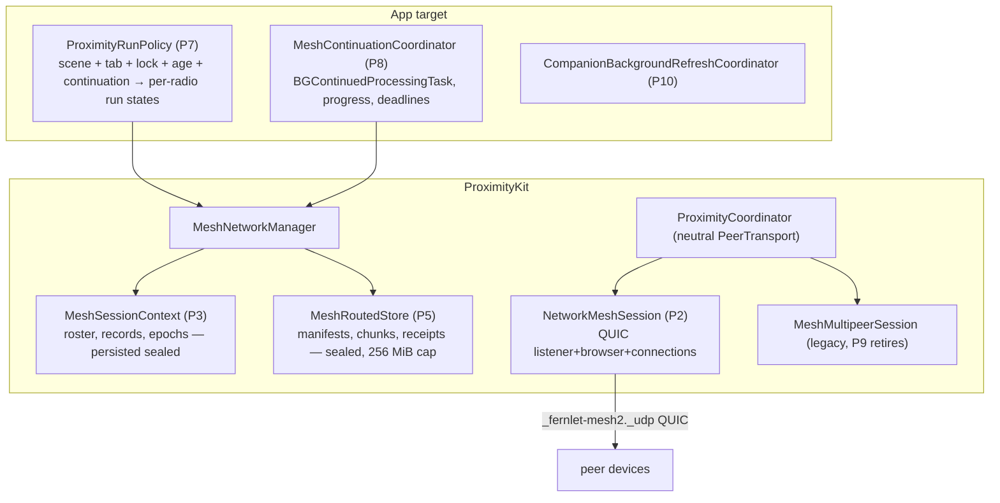
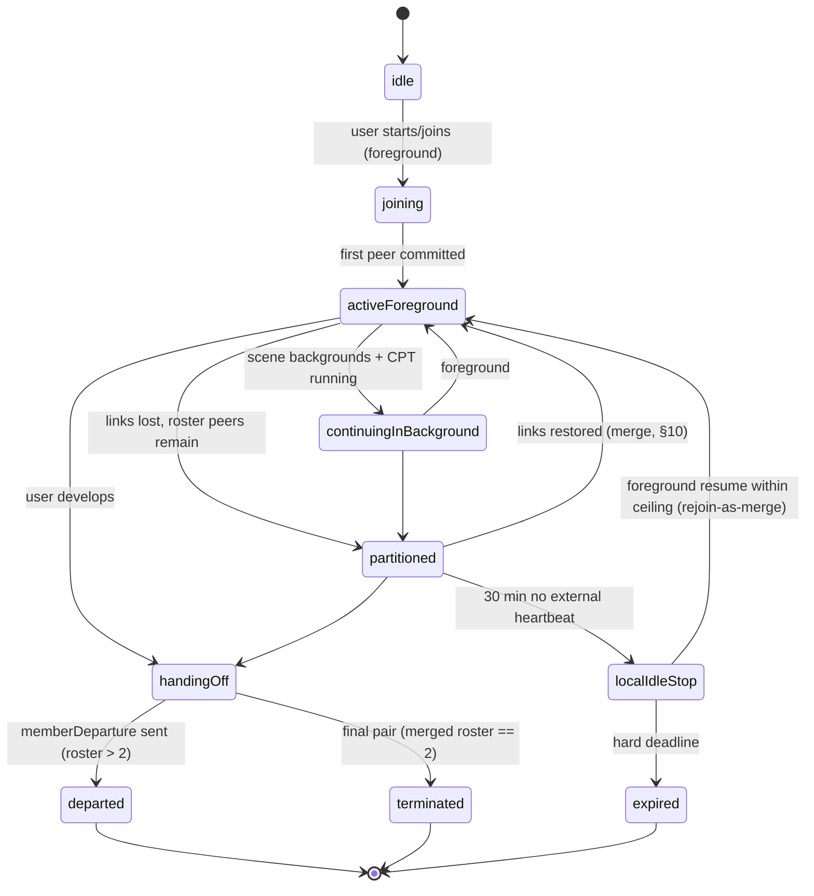

# ProximityKit Network Migration & Partition-Tolerant Mesh — Implementation Plan v2

**Date:** 2026-08-27
**Supersedes:** the first-pass "Background Mesh Continuation" plan (chat draft, 2026-08-27) and extends
[Docs/Proximity-Mesh-Redesign-2026-07-10.md](Proximity-Mesh-Redesign-2026-07-10.md)'s radio-consolidation direction.
**Primary migration reference:** [TN3213 — Moving from Multipeer Connectivity to Network framework](https://developer.apple.com/documentation/technotes/tn3213-moving-from-multipeer-connectivity-to-network-framework)
**Feasibility artifacts:** `App/Fernlet/Proximity/Feasibility/NetworkMeshFeasibilityProbe.swift`,
[Docs/Mesh-Network-Feasibility-Runbook.md](Mesh-Network-Feasibility-Runbook.md),
`Tests/FernletTests/MeshNetworkFeasibilityTests.swift`.

---

## 1. Purpose and scope

Migrate ProximityKit's transport layer from MultipeerConnectivity to Network.framework (QUIC, new
`NetworkConnection`/`NetworkListener`/`NetworkBrowser` API per TN3213), and in the same program make the
friend mesh **partition-tolerant**: logical membership survives socket loss, process death, and mesh
splits; content converges when split groups reunite; a user-started session can continue in the
background via `BGContinuedProcessingTask`.

In scope: all four MC radios (friend mesh, presence, recipe share, coach service constant), sequenced —
friend mesh first, MC retirement last. The companion `BGAppRefreshTask` (widget/companion refresh) rides
along as an independent phase. Out of scope: the iMessage extension, Lock Screen widget redesign,
HeartDrop (CloudKit away-hearts — unchanged), and the Coach app itself.

### Corrected platform facts this plan is built on (verified against live docs 2026-08-27)

| Fact | Consequence |
|---|---|
| MC is deprecated in **iOS 27 / Xcode 27**, not iOS 26 ("Xcode 27 deprecates the entire Multipeer Connectivity framework" — TN3213). No warning in the current SDK. | Migration is right and unhurried. Phases can land incrementally; the other radios can trail the mesh without deadline pressure. |
| `BGContinuedProcessingTask` **requires progress reporting**; "the system prioritizes the termination of tasks that reflect minimal or no progress." Every documented use is finite. Indeterminate progress is undocumented. | The background phase (P8) needs a monotonic progress strategy and a soak gate proving it survives hours. See §15.3. |
| Background availability of peer-to-peer Wi-Fi / Bonjour under a continued task is **undocumented in both directions** (TN3213 contains zero occurrences of "background"). Wi-Fi Aware is the only Apple-documented background p2p path. | P8 carries its own hardware gate; infra-Wi-Fi is the expected working case, AWDL-in-background the expected degraded case. Wi-Fi Aware gets a bounded evaluation (§15.4). |
| Force-quit cancels a continued task **with no expiration callback** (documented). | Durable-before-acknowledge is a hard rule in P5. No cleanup may depend on the callback. |
| The Info.plist identifier must be the **wildcard** (`MBO.Fernlet.mesh-continuation.*`, mandatory notation), but **runtime registration and submission use concrete per-mesh identifiers** — wildcard *registration* asserts on current builds (runbook finding). | Register `MBO.Fernlet.mesh-continuation.<meshID>` at mesh start, immediately before submit. Re-validate per SDK release. |
| `BGAppRefreshTask` gives ≤ 30 s, opportunistic. | Correct for P10 (companion refresh) and nothing else. |

### Owner-confirmed policy (previously mislabeled as existing behavior)

- The **30-minute idle timeout** and **6-hour session ceiling** are **new policy additions**, joining the
  existing 200-photo and 500-message caps. Today a live session is unbounded; after P3 it is not.
- **Membership events are wanted** — signed departure/termination/epoch-change records, and rotation
  driven by membership change (fixing the confirmed gap where a voted-out member keeps the group key
  for up to 15 minutes because `applyApprovedRemoval` never rotates).
- **Session-state persistence is an approved, documented policy reversal.** The "deliberately NOT
  Codable" invariant on session types is being deliberately replaced; §17.3 lists every doc guard,
  wipe-wall row, and boundary-test update owed in the same commits.
- **Moderation during partition requires a roster quorum** (owner decision, 2026-08-27): removal needs a
  strict majority of the *current roster*, so a minority partition can never moderate. §10.4.
- **The feasibility spike's purpose** was to prove device↔simulator connection before touching
  ProximityKit — that lane is the standing dev loop (P0 closes it out); the *background* hardware gates
  move into P8 where they belong.

---

## 2. Verified ground truth (what the code actually is)

From the 2026-08-27 three-agent audit (details in memory note `mesh-background-plan-review-2026-08-27`):

- **Transport leak:** `MultipeerTransport.send(_:to:mode: MCSessionSendDataMode)` is the only reason
  `ProximityCoordinator.swift` and `MultipeerTransport.swift` import MC. Five shipping files touch MC
  APIs at all; the real blast radius is `MultipeerPeer.underlying: MCPeerID` threaded through ~40
  signatures, and `PeerSlot.id == peer.id` couples QR-ceremony and admission bookkeeping to the
  per-discovery UUID minted in `MeshMultipeerSession.peer(for:)`.
- **Four radios**, each its own `MeshMultipeerSession`: `fernlet-friend` (mesh), `fernlet-near`
  (presence, deliberately **ephemeral** MCPeerID for unlinkability), `fernlet-recipe`, `fernlet-coach`.
  `PeerChannelTransport` is consumed by MeshNetworkManager, PresenceManager, and
  ProximityRecipeShareManager. The `pauseDiscovery`/`resumeDiscovery` contract (invite-while-paused is
  dropped loudly) is load-bearing for the recipe radio.
- **Membership = sockets:** `onPeerDisconnected → removeSlot` unconditionally; committed peers get no
  retry (reconnect is pre-commit only, 3 attempts); `stopSearching()` clears slots, group key, and
  messages; `sessionID` is minted per process; nothing about a session persists.
- **Epoch machinery exists**: lowest-fingerprint coordinator election, 20 s beacon, 45 s liveness,
  15-minute timer rotation, `meshKeyRotation`/`meshKeyAck`/`meshRotationSync` payloads, per-slot
  `joinedEpoch`, `epochLog` (cap 8), removal voting (`meshRemovalProposal`/`meshRemovalSecond`),
  signed admission (`meshAdmissionRequest`/`Grant`/`Token`). It is time-driven only.
- **Crypto/identity is transport-clean:** IdentityService, envelopes, verification, trust vault, and
  UWB ranging (`RangingProvider` exchanges opaque `Data` tokens inside the signed intro) have zero MC
  types. The QR ceremony keys on slot UUIDs, not MC identities.
- **Eleven payload handlers** ride the friend radio behind the `ProximityCapability` handshake,
  including the 13+ chat age gate enforced at advertise/send/receive.
- **`sessionGoodbye`** is one generic signed byte for both "I'm leaving" and "session over", with a
  frozen English display literal (`"Session ended"`) inside the signed bytes.
- **Persisted today:** trust vault (via snapshot), photo-wall cache + prefs, activity ledger, heart
  ledgers/outbox/dedup/prekeys, moderation ledgers, `FernletPeerID.archive`. **Not persisted:** every
  piece of live-session state, by documented design.
- **App-layer gating:** ProximityKit registers no lifecycle observers (except the heart
  ProtectedSidecar). `ContentView` starts/stops discovery and presence on scene/tab changes. A
  transport that survives backgrounding will not be stopped by anything ProximityKit owns.
- **Probe status:** discovery, deterministic dial tie-breaker, QUIC streams + datagrams, and a strong
  TLS-exporter channel binding (signed transcript over meshID ‖ epoch ‖ both signing keys ‖ both
  nonces ‖ exporter hash, using the real keychain identity under the domain-separated
  `fernlet.mesh.probe.channel-introduction.v1` purpose) all work. Gate table unfilled; locked/LPM/soak
  uninstrumented; `maxConnections = 2`; **`MeshNetworkFeasibilityTests.swift` does not compile** (two
  errors); three Info.plist keys ship unconditionally in Release; probe strings missing from the string
  catalog; the TLS-exporter label is a bare string.

---

## 3. Design invariants (new, stated once, enforced everywhere)

1. **Membership ≠ connectivity.** A socket is a delivery opportunity. Membership changes only via
   signed records (admission, departure, removal, termination) or ceiling expiry — never via link loss.
2. **Partition tolerance by construction.** All durable mesh state is a **union of signed immutable
   records** (grow-only sets keyed by unique IDs): admissions, departures, removals, termination,
   content manifests, chunks, receipts. Merging two views = set union + deterministic re-derivation.
   Connectivity affects *latency*, never *correctness*. Anything that cannot be union-merged (the live
   control key, slot rankings, transcript order) must be **derivable** from the merged record sets.
3. **Content encryption is independent of the group key.** Every routed item gets its own content key,
   wrapped per recipient X25519 identity, under a signed manifest with an immutable destination set.
   The group key protects live control traffic only. (This is what makes splits harmless — see §10.)
4. **Bounded everything** (Power of 10): roster, partitions, epochs, chunks, cache bytes, retries,
   inventory sizes, vote windows — every structure in this plan carries an explicit cap.
5. **Admission is foreground-only.** Background operation may reconnect and sync *existing authenticated
   members of the current unexpired mesh*; it never admits, never rediscovers old meshes, and relaunch
   never silently reconnects — the foreground UI offers resume.
6. **Durable before acknowledged.** No custody or receipt is emitted for state that would not survive a
   force-quit (no expiration callback exists to save you).
7. **Fail-closed sealed sidecars.** Loaded / absent / deferred(protected-data) / corrupt are distinct;
   deferred is never treated as empty and overwritten.
8. **Tokens never localize.** All new wire vocabulary is frozen English tokens; display text is forked
   from day one. `sessionGoodbye` is frozen/parked per the EnumDecodeCompat pattern, never reused.

---

## 4. Target architecture



---

## 5. Phase P0 — housekeeping and spike closure

Small, unblocking, land first.

1. **Fix the compile blocker:** `MeshNetworkFeasibilityTests.swift` references
   `MeshProbeNetworkProfile.includesPeerToPeer` (now a private probe var) and property-style
   `displayName` (now `displayName(peerToPeerIncluded:)`). Repair against the current probe API.
2. **Register crypto labels:** add the TLS-exporter label (`fernlet.mesh.probe.tls-exporter.v1`) to
   `CryptographicPurpose` alongside `meshProbeChannelIntroductionV1`; reserve the production labels now
   (`fernlet.mesh.channel-introduction.v1`, `fernlet.mesh.tls-exporter.v1`, plus P5's content-key wrap
   and manifest-signature purposes) so domain separation is one review, not five.
3. **Info.plist decision:** the three uncommitted keys (`NSLocalNetworkUsageDescription`,
   `_fernlet-mesh2._udp`, `BGTaskSchedulerPermittedIdentifiers` wildcard) currently ship in Release
   while the probe compiles out. Recommendation: keep them (inert without code, needed by P2/P8
   anyway) and document each in [No-Tracking-Wall.md](No-Tracking-Wall.md) §4c in the same commit.
4. **String catalog:** run `Scripts/sync-string-catalogs.sh` so the probe's DEBUG UI strings land; the
   `--check` CI form currently fails.
5. **Runbook closure for the stated spike goal:** fill the gate table's device↔simulator lane
   (discovery, QUIC connect, stream, datagram, channel binding — pass/fail with dates). Move the
   locked/LPM/soak/battery rows into P8's gate (§15.3) and mark them "deferred to P8" rather than
   leaving the table blank.
6. **Probe upkeep for later phases:** raise `maxConnections` to 4 behind the same DEBUG toggle, and add
   the cheap counters P8's gate needs (bytes in/out, connect/reconnect timestamps,
   `ProcessInfo.thermalState` + Low Power Mode snapshots in the event ring). Nothing else grows.
7. **Docs:** update [FileIndex.md](FileIndex.md) and [ProximityFunctionIndex.md](ProximityFunctionIndex.md)
   for the Feasibility directory; cross-link this plan from the runbook.

Acceptance: full gauntlet green (`power-of-10-scan.py`, `spm-wall-check.sh`, S3 + no-tracking +
localization boundary tests, doc coverage), runbook gate table has no empty cells.

---

## 6. Phase P1 — transport neutrality

Goal: remove MC types from the shared protocol surface with **zero behavior change**, so P2 can slot in
beside MC and the other three radios keep working untouched.

```swift
public enum PeerDeliveryMode { case reliable, bestEffort }

public struct PeerHandle: Hashable, Sendable {
    public let id: UUID              // stable per discovery, == PeerSlot.id (preserves QR/admission keying)
    public let displayHint: String   // advertised instance name, display only — never identity
    // transport-opaque routing token lives inside the owning transport, keyed by id
}

public protocol PeerTransport: AnyObject {
    func send(_ frame: Data, to peer: PeerHandle, mode: PeerDeliveryMode) async throws
    func disconnect(_ peer: PeerHandle) async
    func pauseDiscovery()            // preserved contract: invite-while-paused fails loudly
    func resumeDiscovery()
}
```

Work items:
- Replace `MCSessionSendDataMode` in `MultipeerTransport` with `PeerDeliveryMode`; map inside
  `MeshMultipeerSession` (`.reliable → .reliable`, `.bestEffort → .unreliable`). This alone drops the
  MC import from `ProximityCoordinator.swift` and `MultipeerTransport.swift`.
- Introduce `PeerHandle` and migrate the ~40 `MultipeerPeer` signature sites. `MeshMultipeerSession`
  keeps its `MCPeerID ↔ id` map private. `FileMCPeerIDStore` stays (P9 retires it).
- Rename the protocol family to neutral names (`PeerTransportState`, `PeerPendingInvite`,
  `InboundPeerFrame`); keep the MC conformer as the only implementation.
- Deterministic fake transport for tests: in-memory `PeerTransport` with scriptable connect/disconnect/
  latency/partition schedules — this fake is the foundation of §16's partition tests, so build it well
  (injectable clock, no wall-clock sleeps, per the load-sensitive-flake lessons).
- Wire payloads, capability handshake, sealing, framing: untouched.

Acceptance: entire existing proximity test suite green through the neutral abstraction over the MC
adapter; no wire change (byte-identical frames verified by a golden test).

---

## 7. Phase P2 — NetworkMeshSession (the TN3213 mapping)

A second `PeerTransport` conformer used only by `MeshNetworkManager`. The other radios stay on MC until P9.

### 7.1 Concept mapping (TN3213)

| MC concept (current use) | Network.framework replacement |
|---|---|
| `MCNearbyServiceAdvertiser` | `NetworkListener` over `.bonjour(name:type:txtRecord:)`, type `_fernlet-mesh2._udp` |
| `MCNearbyServiceBrowser` | `NetworkBrowser(.bonjour(type, includeTxtRecord: true))` |
| Invitation handshake + pause contract | Dial policy: deterministic tie-breaker (probe's `localServiceName < candidate` rule), listener `newConnectionLimit`, explicit app-layer accept gate before any app frame; `pauseDiscovery` = stop browser + set limit 0 |
| `MCSession` (one object, N peers) | One authenticated QUIC `NetworkConnection` per directly reachable peer, owned by a session actor |
| `.reliable` sends | QUIC streams: one long-lived **control stream** per connection (identity, membership records, manifests, receipts, rotation) + independent per-transfer streams for photo chunks |
| `.unreliable` sends | QUIC datagrams (heartbeats; ranging chatter stays on the intro/control path as today) |
| `MCSessionState` | Connection state feeds *presence*, never membership (P3 owns membership) |
| MC "encryption required" | TLS 1.3 + the probe's exporter-bound signed introduction, productionized (§7.2) |

### 7.2 Productionizing the probe's security

- Replace the trust-all `certificateValidator` and the hardcoded DEBUG identity: each device mints an
  **ephemeral per-mesh self-signed P-256 TLS identity** at session start (never persisted, never reused
  across meshes — TLS identity is not Fernlet identity). Authentication comes solely from the signed
  channel introduction: transcript = purpose ‖ version ‖ meshID ‖ epochRef ‖ both signing pubkeys ‖
  both nonces ‖ TLS-exporter hash, Ed25519-signed by both sides under
  `fernlet.mesh.channel-introduction.v1`, verified against the trust vault / current roster. If the
  exporter secret is ever unavailable on a future SDK, the documented fallback is signing over both
  peers' TLS certificate fingerprints (decide only if forced; note in the runbook).
- Reject before any app frame: unknown identity, non-roster member, hard-departed/removed member,
  ended/foreign meshID, introduction failure, or replayed nonces (per-session nonce cache, bounded).
- ALPN `fernlet-mesh-v1`; explicit length framing stays `SealedPayloadFraming` (wire2), and the QUIC
  receive-window/frame caps move in lockstep with `maxInboundWireBytes` exactly as the MC comment
  demands today.
- Interface policy: `peerToPeerIncluded(true)` on device (per TN3213, with Apple's performance caveat
  acknowledged), **`prohibitedInterfaceTypes = [.cellular]` always** — the serverless/no-internet claim
  becomes enforced, not aspirational. Simulator lane: infra only (probe's TXT asymmetry pattern).
- Bonjour instance name: **random per session** (not derived from stable identity — an improvement over
  the archived MCPeerID: no cross-session tracking surface; identity is proven cryptographically).

### 7.3 Session actor duties

Connection set (cap = roster cap 8, §9), per-connection state machine, dial retry (3 attempts, 2 s,
matching today), duplicate-tunnel suppression via the tie-breaker, endpoint cache for direct re-dial
(so reconnection never depends on background Bonjour — feeds P8), heartbeat datagrams (30 s), and
surfacing `InboundPeerFrame`s upward unchanged.

### 7.4 No-tracking wall extension (same commit as the transport)

`NWConnection`/`NWBrowser` are banned markers today; the new API names pass through a gap. Extend
`NoTrackingBoundaryTests`' marker list with `NetworkConnection`, `NetworkListener`, `NetworkBrowser`,
`NWListener`, `NWParameters`, and permit exactly the ProximityKit transport files (and the DEBUG probe),
updating [No-Tracking-Wall.md](No-Tracking-Wall.md) §4c/§5 in the same commit. The wall stays meaningful
instead of accidentally porous.

Acceptance: mesh flows (admission, QR ceremony, photos, chat, hearts, shop, moderation, capabilities,
age gates) pass on the QUIC transport on the device↔simulator lane and on 2 physical devices;
`spm-wall-selftest.sh` and the extended no-tracking tests green.

---

## 8. Phase P3 — durable session context, roster, and membership events

### 8.1 MeshSessionContext (persisted, sealed)

```swift
struct MeshSessionContext: Codable {           // sealed sidecar; see §17.3 for the policy-reversal paperwork
    let meshID: UUID
    let protocolVersion: Int
    let createdAt: Date                        // signed into the mesh descriptor at creation
    let hardDeadline: Date                     // createdAt + 6 h — absolute, identical on every member
    var admissions: [SignedAdmissionRecord]    // grow-only; cap 16
    var departures: [SignedDepartureRecord]    // grow-only; cap 16
    var removals:   [SignedRemovalRecord]      // grow-only (completed removals only); cap 16
    var termination: SignedTerminationRecord?
    var epochHeads: [MeshEpochRef]             // current branch head(s); cap 8
    var lastExternalHeartbeat: Date?
    var developedLocally: Bool                 // set at development; permanent rejoin bar
    var routingInventorySummary: InventoryDigest
}
```

- **Roster is derived, never stored**: `admitted − departed − removed` (termination ends everything).
  Everything else (connected set, coordinator, quorum, "final pair") derives from roster + live links.
- **The group control key is NOT persisted** — it stays memory-only exactly as today. After process
  death, resume performs a reconnect + fresh membership-driven rotation (§8.3); persistence of the
  control key is never needed because content doesn't depend on it (invariant 3).
- Storage: new `MeshSessionStore` sidecar in ProximityKit, sealed with a keychain-backed key (new role
  beside `friendWall`), file protection `.completeUntilFirstUserAuthentication`, four-state load
  (loaded/absent/deferred/corrupt), **per-instance disk root** with a grep-wall test à la
  `PhotoDirectoryIsolationTests` (the shared-disk-root flake family must not grow a new member).
- Only the current, unexpired, undeveloped context is recoverable; expiry or development deletes it.

### 8.2 State machine



Rules (unchanged from v1 where good, sharpened where partition-aware):
- Losing sockets never ends membership or clears content. An authenticated external heartbeat resets
  the 30-minute idle timer; heartbeat acks stay immediate.
- **`localIdleStop` ends local *participation* (radios, CPT), not membership.** Within the ceiling the
  foreground UI may offer resume; resume re-authenticates and enters the merge path (§10) — idle-lapse
  and partition are deliberately the same mechanism. The 30-minute timer is a resource policy; the
  6-hour ceiling is the membership death.
- The ceiling is enforced against `hardDeadline` (absolute, signed at creation, ±120 s skew tolerance)
  AND a local monotonic guard.
- A developed or terminated mesh can never be rejoined (`developedLocally` + termination record).
  Relaunch never auto-reconnects; force-quit → foreground resume offer only.

### 8.3 Membership events and membership-driven rotation

New frozen wire tokens (display text forked separately; `sessionGoodbye` frozen/parked, still parsed
from legacy builds as "departure, legacy" during the transition, never emitted by new builds):

- `fernlet.mesh.member-departure.v1` — signed by the leaver: {meshID, member fingerprint, at,
  custody-handoff summary}. Delivered to every reachable member at departure; **re-gossiped by every
  holder on every later connect** (grow-only record), so it propagates transitively (§10.5 example).
- `fernlet.mesh.terminated.v1` — signed by a final-pair member: {meshID, at, roster-at-signing}.
  Receivers validate against their *merged* roster: if their roster > 2 the record downgrades to a
  departure of the signer (safe: a partitioned member who believed the mesh was a pair only removes
  themself).
- `fernlet.mesh.inventory-digest.v1`, plus P5's manifest/chunk/receipt tokens.
- Rotation reuses the existing `meshKeyRotation`/`meshKeyAck`/`meshRotationSync` family, extended with
  a `cause` token (`timer` | `membership` | `merge`) and the new `MeshEpochRef`.

**Rotation triggers become: 15-minute timer ∪ any roster change ∪ any merge.** This closes the
voted-out-member-keeps-key gap: `applyApprovedRemoval` (and departure processing, and liveness
eviction) immediately triggers rotation by the current coordinator. Removed/departed members are
excluded from the new epoch's key distribution and rejected at the transport (§7.2).

### 8.4 Epochs that survive divergence

```swift
struct MeshEpochRef: Codable, Hashable {
    let counter: UInt32                // Lamport-style; mint = max(seen) + 1; cap 4096
    let epochID: UUID                  // unique per minted epoch
    let coordinatorFingerprint: String
}
```

- The group key is bound to `epochID`. Members hold a bounded keyring: current + ≤ 3 predecessors, each
  predecessor valid ≤ 5 minutes after supersession (covers in-flight control frames; the existing
  `pendingRotationClosingEpoch` grace generalizes to this).
- Acceptance of a rotation: signed by an authenticated roster member who is the deterministic
  coordinator (lowest fingerprint) of *the roster set they present*, and `counter >` local counter.
  Divergent same-counter epochs (two partitions each rotated) never need mutual acceptance — they
  coexist until a merge mints a strictly greater successor. Epoch continuity is **not** required;
  identity + roster validation is the authority (a member returning from a long partition at counter 5
  syncs forward to 9 without being "stale").
- **Replay protection moves off epochs**: routed content carries unique IDs + meshID + expiry and
  dedups by ID (P5); only live control-frame key selection uses epochs. (Today's epoch-gated photo
  manifests would wrongly reject cross-partition content; that gating is retired with the old path.)
- Bounds: ≤ 24 timer rotations per branch per ceiling × roster ≤ 8 branches → counter cap 4096 is
  generous; keyring 4; epoch log rolling 32 (diagnostic only, continuity never required).

Acceptance (P3): unit tests for every state edge; disconnect ≠ removal; idle-lapse resume; ceiling at
both bounds; rotation on removal/departure/merge with old-key rejection after grace; context
load/deferred/corrupt matrix; legacy `sessionGoodbye` interop.

---

## 9. Roster and capacity bounds

The mesh is small by design and every partition structure inherits it:

| Bound | Value | Source |
|---|---|---|
| Roster cap (admitted, lifetime of mesh) | **8** | new; comfortably above today's `maxTotalSlots = 5` + self |
| Concurrent QUIC connections | roster − 1 ≤ 7 | §7.3 |
| Partition branches trackable | ≤ roster (everyone alone) | §8.4 |
| Admission/departure/removal records | 16 each | §8.1 |
| Session photos / texts | 200 / 500 (existing) | unchanged |
| Routed logical items | 1024 | P5 |
| Relay cache | 256 MiB, 256 KiB chunks | P5 |

---

## 10. Phase P4 — partition and merge (the split-brain design)

The scenario driving this phase (owner, 2026-08-27): four devices split into two groups of two, both
groups keep sharing photos and messages, keys may rotate while split, then everyone reunites — and the
same must generalize to larger meshes with more (and nested) splits.

### 10.1 Why splits are safe by construction

Because of invariants 2 and 3, a partition is not an error state — it is normal operation with fewer
reachable custodians:

- **Content** created during a split is manifest-signed with the destination set = *full roster at
  creation time* (not the connected set). Members of the other partition are simply destinations whose
  delivery is pending. Content keys are wrapped per recipient identity, so nothing about content
  depends on which partition (or which group-key epoch) it was created in.
- **Control keys** diverging is harmless: each partition's key only protects that partition's live
  control traffic. There is no shared secret that must remain globally consistent.
- **Membership records** are signed and grow-only, so views can only differ by *missing* records, never
  by *conflicting* ones — and missing records are supplied by union on merge.

### 10.2 What each partition does while split

- Derives its own coordinator (lowest fingerprint **present**), runs its own 15-minute rotation, its
  own liveness — all scoped to the branch.
- Marks unreachable roster members `temporarilyDisconnected` (presence state, not a record). Liveness
  eviction while split is **local presence only** — reversible, never a membership record.
- Continues photos/text/hearts normally; new items enqueue for the absent destinations in the routed
  store (P5).
- The idle timer does *not* fire while any external member heartbeats — a live partition of ≥ 2 stays
  alive. A partition of one hits `localIdleStop` after 30 minutes (§8.2) and resumes-as-merge later.

### 10.3 Merge (any reconnect is a merge; there is only one path)

Reconnect between any two members — after a blip, a partition, an idle lapse, or a process restart —
runs the identical sequence. One mechanism, deliberately: **reconnect ≡ merge ≡ relay drain.**

```mermaid
sequenceDiagram
    participant A as member (branch A)
    participant B as member (branch B)
    A->>B: QUIC + signed channel introduction (§7.2)
    B->>A: verify identity ∈ merged roster, not departed/removed, mesh current
    A->>B: membership records + epoch heads (union exchange)
    B->>A: membership records + epoch heads
    Note over A,B: both derive merged roster; hard records win over soft presence
    Note over A,B: deterministic coordinator of merged view mints epoch counter = max+1, cause = merge
    A->>B: InventoryDigest (manifest IDs held, receipts held)
    B->>A: InventoryDigest
    A->>B: missing manifests/chunks/receipts (P5 drain, bounded)
    B->>A: missing manifests/chunks/receipts
    Note over A,B: transcripts/photo sets re-derived; gates re-applied on ingestion
```

Ordering and dedup on ingestion:
- **Photos**: union by manifest ID, hash-validated on reassembly, then the existing review flow.
- **Texts**: union by message ID into the routed inbox; the visible transcript is re-derived in total
  order `(claimedSentAt clamped to ±10 min of first-seen, senderFingerprint, messageID)`. Age gate and
  moderation run at ingestion exactly as the existing rebuild path does.
- **Hearts**: union by gift ID; final receipt still only at foreground decrypt + ledger commit; the
  ledger's existing dedup/cooldown arbitrates duplicates that crossed the split.
- N-way merges need no special case: merges are pairwise and union is associative/commutative/idempotent,
  so any partition tree (6 devices in three groups, nested re-splits mid-merge) converges as links form.
  Property test in §16 asserts exactly this.

**Direct answers to the driving questions:**
- *How do the messages and photos combine?* By ID-keyed union + deterministic re-derivation; nothing is
  overwritten because nothing conflicting can exist (only missing).
- *What if rotation happened while split?* Both branches rotated independently; both old keys die at
  merge when the merged coordinator mints a strictly-greater epoch. No content is affected because no
  content ever used those keys.
- *Larger meshes, more splits?* Same machinery, bounded by roster ≤ 8; convergence is a property of the
  union-merge, not of any particular topology.

### 10.4 Moderation under partition — roster quorum (owner decision)

- Removal requires **⌊|roster|/2⌋ + 1 distinct signed votes** (the proposal counts as the proposer's
  vote; the target cannot vote), where roster is the *current merged derived roster* at evaluation time.
- Votes are signed records referencing a proposal ID; a proposal expires **5 minutes** after issuance
  (bounded window — quorum is meant to be live, not archaeological). A **completed** removal (quorum
  reached) becomes a permanent `SignedRemovalRecord` and union-merges like any record; an incomplete
  proposal simply expires and leaves no trace in the roster.
- Consequences, per the owner's example: roster 4 → quorum 3 → a 2/2 split can moderate **nobody**; a
  3/1 split can remove the isolated member (votes are valid for absent targets — an abuser who walks
  away can still be removed, and the record ejects them at their next connection attempt). Roster 2 →
  quorum 2 with the target abstaining → removal is structurally impossible; the final pair ends the
  mesh instead. After a departure shrinks roster 4 → 3, quorum drops to 2 and a connected pair regains
  moderation power.
- Self-bans/blocks (persisted moderation ledgers) are unchanged and additive.

### 10.5 Departure propagation — worked example (owner's)

Roster {A, B, C, D}; split into {A, B} and {C, D}. B develops and leaves: B's signed
`memberDeparture` reaches A (the only reachable member). Everyone now behaves by their view — A knows
roster 3, C/D still assume 4. A later walks over and connects to C: the introduction's record exchange
(§10.3) hands C the departure record; C gossips it to D. All three converge on roster {A, C, D},
quorum 2, without B ever meeting C or D. If B had left while completely alone, the record could not
propagate — the residual is that C/D carry a phantom member until the ceiling; this is accepted and
bounded (no dead-drop side channel for mesh state).

### 10.6 Termination and development under partition

- Development in a split with merged roster > 2 is a departure (§8.3) with the bounded 15 s handoff to
  the *reachable* members — custody transfers to them preserve delivery to the other branch post-merge.
- A "final pair" is judged on the **merged derived roster**, not the connected pair (a 2/2 split of a
  4-roster is not two final pairs). A wrongly-issued termination downgrades to the signer's departure
  at every receiver whose roster is larger (§8.3) — the failure mode costs one member, never the mesh.
- Genuine final pair, partner unreachable at development: the terminator ends locally; the partner's
  idle-stop/ceiling closes their side; on foreground they are offered development of what they hold.

Acceptance (P4): deterministic fake-transport suites for §16.2's scenario matrix; the convergence
property test; quorum arithmetic table-driven tests (rosters 2–8 × partition shapes); the two worked
examples above encoded verbatim as tests.

---

## 11. Phase P5 — encrypted store-and-forward routing

Carried from v1 with partition duties added. Structures (all bounded, all signed by the **origin**;
relays forward the origin's exact signed objects, never re-sign):

- `MeshRoutedManifest` — item ID, type token, content hash, size, immutable destination set (full
  roster at creation), expiry (= mesh `hardDeadline` + 20-minute development grace), per-recipient
  `MeshRecipientKeyWrap`s (X25519 wrap of the random content key; purposes registered in P0).
- `MeshChunk` (≤ 256 KiB, explicit index/count, per-chunk hash), `MeshCustodyReceipt` (relay has
  durable ciphertext), `MeshRecipientReceipt` (destination-final), `MeshInventoryDigest` (ID lists,
  bounded by the 1024-item cap — no probabilistic structures needed at this scale).
- Acknowledgement stages (unchanged from v1): photos/text final on durable recipient storage; **hearts
  final only after foreground decrypt + ledger commit**; control immediate. Custody ≠ delivery in every
  UI surface.
- Backpressure: at the 256 MiB / 1024-item caps, refuse new custody with a bounded, user-visible
  delivery failure. Nothing grows silently.
- Locked device: ciphertext-only custody; decryption and canonical-store mutation wait for unlock;
  four-state sidecar; identity-key keychain protection is never weakened for background decryption.
- Partition duty: the routed store is the *source* for §10.3's drain — delivery targets are
  "destinations lacking a `MeshRecipientReceipt`", which is partition-agnostic by construction.
- Unknown type tokens are rejected, not forwarded; every future routed type declares size cap,
  destination semantics, relay-retention, final-ack condition, and expiry at registration.

Relay scope note: v1's general A–B–C live chunk relaying is **staged**. Increment 1 ships
origin-retains + custody-transfer-on-departure (the load-bearing case — §10.6); live third-party relay
of in-flight chunks (hop count ≤ roster, TTL) is increment 2, gated on device measurements showing it
is actually needed at roster ≤ 8 on shared Wi-Fi.

---

## 12. Phase P6 — feature routing

- **Photos**: existing `resizedForFriendSharing()` (1400 px / q0.82) → content-key encrypt → chunk →
  manifest to full roster → reassemble + hash-check → existing review flow. Unfinished ciphertext
  survives process death; `maxIncomingPhotoBytes`/pixel bounds enforced at reassembly exactly as the
  store does today.
- **Temporary text**: `SessionMessageStore` stays the memory-only UI projection; the sealed routed
  inbox beneath it is the durable truth. Foreground/unlock: decrypt, validate, re-derive transcript
  (§10.3 ordering), re-apply age gate + moderation, clear everything per development/session rules.
- **Hearts**: sealed ciphertext custody in background; ledger commit, cooldown, dedup, closeness at the
  foreground final-receipt point. Mesh hearts remain a separate seam from `HeartDropService` (shared
  `ProximityHeartLedger` with per-path semantics is preserved; a routed gift whose recipient never
  foregrounds before mesh end **survives locally sealed until expiry** — v1's spec gap, closed).

---

## 13. Phase P7 — app-layer lifecycle gating seam

Today `ContentView` owns start/stop by scene/tab; ProximityKit deliberately observes nothing. Background
continuation breaks that ownership. Options reviewed:

| | Design | Verdict |
|---|---|---|
| **A — app-owned run policy (recommended)** | New app-target `ProximityRunPolicy`: the single translator from (scenePhase, tab, lock/duress state, protected data, age gates, delete-all, CPT state) → per-radio `RunState` (`run` / `foregroundOnly` / `stop`), pushed into each manager via one `apply(_:)` seam. `ContentView` stops calling managers directly and feeds the policy instead. `MeshContinuationCoordinator` *feeds* its state in (task running/refused/expired) rather than gating radios itself. | One decision point; ProximityKit stays UIKit-free and testable; matches the composition-root pattern. **Adopt.** |
| B — ProximityKit self-observes | Managers watch scenePhase/notifications internally. | Couples the SPM module to UIApplication, reverses the no-lifecycle-observers design, hurts every test. Reject. |
| C — coordinator intercepts | CPT coordinator keeps the mesh alive while ContentView keeps stopping it. | Two owners for one radio; stop-vs-keepalive ordering races are precisely the bug class to avoid. Reject. |

Policy matrix (the load-bearing rows): user-started mesh + CPT granted → mesh `run` in background,
discovery/admission `foregroundOnly` (invariant 5), presence + recipe `stop` on background (unchanged
behavior); CPT refused → mesh `foregroundOnly` with the UI explaining background continuation is
unavailable; delete-all / below-age / duress → `stop` + teardown. Table-driven tests over the full
input product.

---

## 14. Phase P8 — background continuation (`BGContinuedProcessingTask`)

App-target `MeshContinuationCoordinator`, owning: concrete-ID registration at mesh start
(`MBO.Fernlet.mesh-continuation.<meshID>`; plist wildcard already present), `.fail` submission on the
user's start/join action once the first peer commits, the 6-hour and 30-minute clocks, endpoint-cache
reconnection (never background Bonjour re-browse as the primary path), routed-store draining,
progress + title/subtitle updates, expiration/cancel handling, and exactly-once completion into one
idempotent shutdown (probe's `completeBackgroundTask` pattern, already right).

**Progress strategy (needs the §15.3 soak to confirm):** progress must advance monotonically or the
system kills the task — so the unit is **elapsed session time toward the ceiling** (monotonic by
construction), with title/subtitle carrying the human truth: `Fernlet mesh` / `N friends connected`
(count = roster members with fresh authenticated heartbeats, excluding self; hardcoded in the probe
today, dynamic here). This supersedes v1's "show no time-derived info" rule — the owner accepted the
timers as policy, and a monotonic bar is what the API's documented termination rule demands. The
30-minute idle stop also gives the task an honest finite shape: it is never "idle forever" — it is
either progressing, syncing, or ending.

The custom `ProximityForegroundAnchor` Live Activity is suppressed for continued meshes (no duplicate
UI); its once-per-launch orphan reaper stays.

Failure honesty: iOS can end the task under pressure regardless; the UI copy and privacy text say so.
Degraded ladder (pre-decided, per §15.3 results): full background mesh → background on infra-Wi-Fi only
→ foreground-only with opportunistic sync on reunite (which P4 makes automatic).

---

## 15. Hardware gates (P8 entry criteria — the honest successors to the spike)

The device↔simulator lane proved the transport (P0 closes it). These remain, on 2–4 physical devices:

**15.1 Radio matrix:** established QUIC connection surviving background+lock; re-dial via cached
endpoint while backgrounded; fresh Bonjour browse while backgrounded (expected to fail — record it);
each × infra-Wi-Fi and AWDL. Plus Low Power Mode on/off (undocumented — empirical answer required)
and memory-pressure kills.

**15.2 Partition walks:** the §10 scenarios physically — 2/2 split with traffic both sides, walk back
together, verify convergence + single post-merge rotation; 3/1 with a removal vote; departure-carried-
by-third-member (§10.5 verbatim).

**15.3 Progress soak:** 3 h and 6 h sessions with elapsed-based progress under normal use of the phone;
the gate is "the task survives while progress advances slowly." If it does not, the degraded ladder in
§14 activates and this plan's P8 scope shrinks to foreground + opportunistic — everything else stands.

**15.4 Wi-Fi Aware evaluation (bounded, 2 days):** the one Apple-documented background p2p path
("foreground and background states… BackgroundTasks API"), whose pairing requirement maps naturally
onto the existing QR ceremony. Establish: hardware floor vs the app's device floor, whether
`NetworkConnection` rides over it, battery profile. Outcome is a recommendation, not a dependency.

Results land in the runbook's gate table with dates; the probe's new counters (P0.6) supply the numbers.

---

## 16. Testing and release gates

**16.1 Unit/protocol (fake transport, injected clocks — no wall-clock waits):** neutral transport
behavior + golden wire frames; QUIC framing/bounds/malformed input; channel-binding transcripts
(byte-exact vectors); reject unknown/departed/removed/old-mesh peers; disconnect vs departure;
idle-lapse resume; ceiling at both clocks; rotation on removal/departure/merge + keyring grace expiry;
chunk dedup/TTL/caps/backpressure; custody vs final receipts; heart foreground-commit rule;
locked/deferred/corrupt sidecars; exactly-once task completion; run-policy matrix; legacy
`sessionGoodbye` interop; wipe-wall + delete-all resurrection checks for every new sidecar.

**16.2 Partition suite (the new investigation, automated):** scenario matrix = roster {3, 4, 6, 8} ×
partition shapes (2/2, 3/1, 3/3, 4/2/2, nested re-split mid-merge) × events during split (photos,
texts, hearts, timer rotation ×2, removal vote with/without quorum, departure, idle-lapse, final-pair
attempt) → assert: merged state identical on every member (**convergence property test** over
randomized bounded schedules with a fixed seed), exactly one post-merge epoch at every member, quorum
arithmetic per §10.4, no content loss, no duplicate ledger commits.

**16.3 Physical matrix:** §15 plus the v1 list (2/3/6 devices, screen off/locked, force-quit one peer,
restart + explicit resume, incomplete handoff, protected-data-unavailable launch, large photo with
concurrent heart/text traffic).

**16.4 Repository gates every phase:** existing suites; `Scripts/power-of-10-scan.py`;
`Scripts/spm-wall-check.sh`; S3 + extended no-tracking + localization + doc-coverage tests; the new
background-refresh import wall (P10 may not import mesh/AI/HealthKit/CloudKit implementation modules);
warnings-as-errors. Docs updated in the same commits: FileIndex, ProximityFunctionIndex,
No-Tracking-Wall, privacy copy, this plan's checkboxes.

---

## 17. Phase P9/P10 and paperwork

**17.1 P9 — remaining radios and MC retirement:** recipe share → QUIC request/response streams
(preserving pause/resume semantics); presence → QUIC with the **ephemeral posture reproduced** (fresh
TLS identity + randomized instance name per 900 s presence epoch — no stable name, matching today's
ephemeral MCPeerID intent); coach service constant per the Coach-app decision (§18). Then delete
`MeshMultipeerSession`, `MultipeerPeer.underlying`, `FileMCPeerIDStore` (with delete-all/wipe rows
retired), drop the eight `_fernlet-*` MC Bonjour types from the plist, remove the MC import — done
before the Xcode 27 toolchain move.

**17.2 P10 — companion `BGAppRefreshTask`:** as v1 §8 — `MBO.Fernlet.companion-refresh`, `fetch`
background mode, schedule at handle+background, handler limited to: acquire the existing store safely →
roll day → recompute deterministic companion → diff snapshot → publish via WidgetBridge → reload
timelines only on change → complete once. Never: mesh, HealthKit, CloudKit force-sync, Foundation
Models, store creation while protected data unavailable. One correction to v1: `FernletStoreAccess` is
already a single process-global cache shared by UI and App Intents — the move out of
`ExchangeIntentService.swift` into a small lifecycle service is hygiene that lets the refresh handler
share it, not a fix for a competing-stores bug. (Also delete the dead `install(store:)` path found in
the audit.)

**17.3 Documented policy reversal (owner-approved) — same-commit paperwork:**
- Rewrite the "deliberately NOT Codable" / "memory-only, never persisted" doc guards on
  `MeshSessionTypes`, `SessionMessageStore` (projection stays memory-only; state the sealed inbox
  beneath), and the `MeshGroupKey` doc (still never persisted — unchanged and now load-bearing).
- Wipe-wall disposition rows + delete-all writer wiring for: `MeshSessionContext`, `MeshRoutedStore`,
  endpoint cache, and any new UserDefaults key.
- `PrivacyInfo`/privacy copy: serverless + E2EE; nearby Fernlet devices may briefly hold ciphertext
  they cannot read; background continuation uses local network + battery and iOS may end it; content
  clears by development/session rules.
- Module DocC landing pages for ProximityKit (+ any new module) re-describe the invariants;
  `doc-coverage-scan.py` stays at zero.

---

## 18. Order, dependencies, and open decisions

```
P0 ──► P1 ──► P2 ──► P3 ──► P4 ──► P5 ──► P6 ──► P8 (gated by §15)
                       │                    ▲
                       └────────► P7 ───────┘        P9 after P2 is proven
P10 independent (after the small FernletStoreAccess move)
```

Critical path: **P2 transport → P3 membership → P4 partition → P5 routing**. P4 before P5 is
deliberate: routing's delivery targets are defined in partition terms, so the merge semantics must be
settled first. P7 can start once P3's states exist. P10 and P0 can interleave anywhere.

**Open decisions for the owner:**
1. Progress display: accept elapsed-toward-ceiling as the bar (recommended, §14)?
2. Partition UX: surface "N friends out of range — will sync when you reunite" or stay silent
   (recommended: the subtitle count only)?
3. Roster cap 8 and the 5-minute removal-vote window — confirm values.
4. Coach radio disposition in P9 (retire with the rest vs hold for the Coach-app decision).
5. Wi-Fi Aware evaluation (§15.4): run it during P2, or only if §15.1's AWDL rows fail?
6. Plist keys shipping in Release now (P0.3 recommendation: yes, documented).
