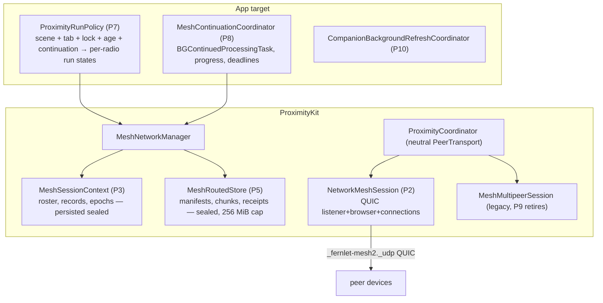
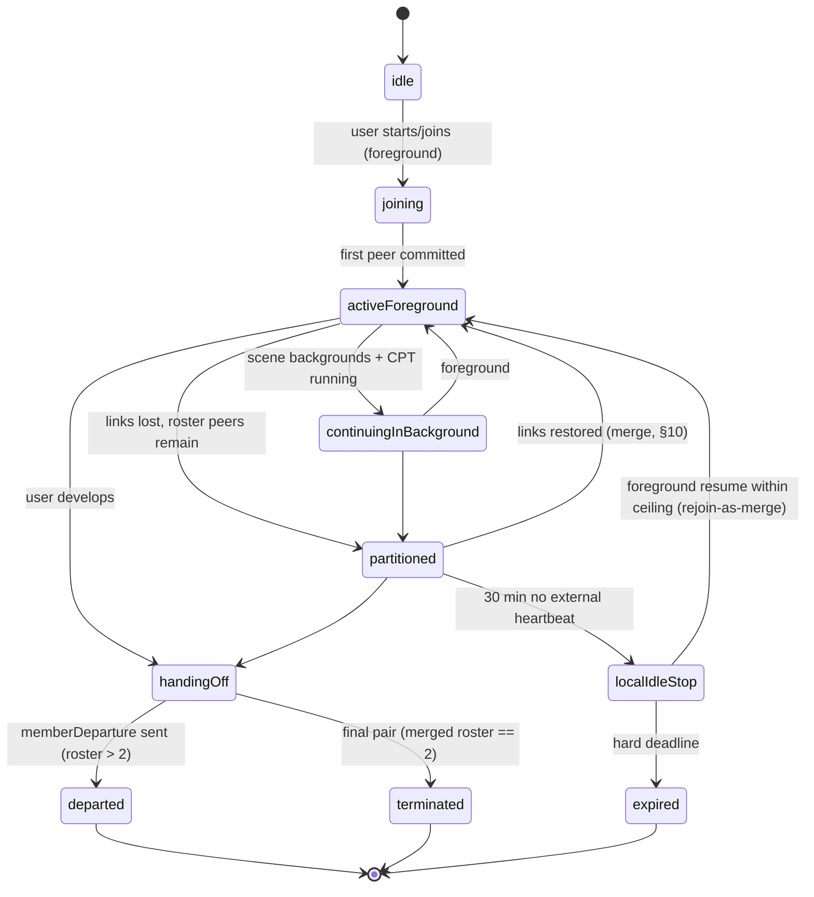

# ProximityKit Network Migration & Partition-Tolerant Mesh — Implementation Plan v2

**Date:** 2026-08-27
**Supersedes:** the first-pass "Background Mesh Continuation" plan (chat draft, 2026-08-27) and extends
[Docs/Proximity-Mesh-Redesign-2026-07-10.md](Proximity-Mesh-Redesign-2026-07-10.md)'s radio-consolidation direction.
**Primary migration reference:** [TN3213 — Moving from Multipeer Connectivity to Network framework](https://developer.apple.com/documentation/technotes/tn3213-moving-from-multipeer-connectivity-to-network-framework)
**Feasibility artifacts:** `App/Fernlet/Proximity/Feasibility/NetworkMeshFeasibilityProbe.swift`,
[Docs/Mesh-Network-Feasibility-Runbook.md](Mesh-Network-Feasibility-Runbook.md),
`Tests/FernletTests/MeshNetworkFeasibilityTests.swift`.

---

## 1. Purpose and scope

Migrate ProximityKit's transport layer from MultipeerConnectivity to Network.framework (QUIC, new
`NetworkConnection`/`NetworkListener`/`NetworkBrowser` API per TN3213), and in the same program make the
friend mesh **partition-tolerant**: logical membership survives socket loss, process death, and mesh
splits; content converges when split groups reunite; a user-started session can continue in the
background via `BGContinuedProcessingTask`.

In scope: all four MC radios (friend mesh, presence, recipe share, coach service constant), sequenced —
friend mesh first, MC retirement last. The companion `BGAppRefreshTask` (widget/companion refresh) rides
along as an independent phase. Out of scope: the iMessage extension, Lock Screen widget redesign,
HeartDrop (CloudKit away-hearts — unchanged), and the Coach app itself.

### Corrected platform facts this plan is built on (verified against live docs 2026-08-27)

| Fact | Consequence |
|---|---|
| MC is deprecated in **iOS 27 / Xcode 27**, not iOS 26 ("Xcode 27 deprecates the entire Multipeer Connectivity framework" — TN3213). No warning in the current SDK. | Migration is right and unhurried. Phases can land incrementally; the other radios can trail the mesh without deadline pressure. |
| `BGContinuedProcessingTask` **requires progress reporting**; "the system prioritizes the termination of tasks that reflect minimal or no progress." Every documented use is finite. Indeterminate progress is undocumented. | The background phase (P8) needs a monotonic progress strategy and a soak gate proving it survives hours. See §15.3. |
| Background availability of peer-to-peer Wi-Fi / Bonjour under a continued task is **undocumented in both directions** (TN3213 contains zero occurrences of "background"). Wi-Fi Aware is the only Apple-documented background p2p path. | P8 carries its own hardware gate; infra-Wi-Fi is the expected working case, AWDL-in-background the expected degraded case. Wi-Fi Aware gets a bounded evaluation (§15.4). |
| Force-quit cancels a continued task **with no expiration callback** (documented). | Durable-before-acknowledge is a hard rule in P5. No cleanup may depend on the callback. |
| The Info.plist identifier must be the **wildcard** (`MBO.Fernlet.mesh-continuation.*`, mandatory notation), but **runtime registration and submission use concrete per-mesh identifiers** — wildcard *registration* asserts on current builds (runbook finding). | Register `MBO.Fernlet.mesh-continuation.<meshID>` at mesh start, immediately before submit. Re-validate per SDK release. |
| `BGAppRefreshTask` gives ≤ 30 s, opportunistic. | Correct for P10 (companion refresh) and nothing else. |

### Owner-confirmed policy (previously mislabeled as existing behavior)

- The **30-minute idle timeout** and **6-hour session ceiling** are **new policy additions**, joining the
  existing 200-photo and 500-message caps. Today a live session is unbounded; after P3 it is not.
- **Membership events are wanted** — signed departure/termination/epoch-change records, and rotation
  driven by membership change (fixing the confirmed gap where a voted-out member keeps the group key
  for up to 15 minutes because `applyApprovedRemoval` never rotates).
- **Session-state persistence is an approved, documented policy reversal.** The "deliberately NOT
  Codable" invariant on session types is being deliberately replaced; §17.3 lists every doc guard,
  wipe-wall row, and boundary-test update owed in the same commits.
- **Moderation during partition requires a roster quorum** (owner decision, 2026-08-27): removal needs a
  strict majority of the *current roster*, so a minority partition can never moderate. §10.4.
- **The feasibility spike's purpose** was to prove device↔simulator connection before touching
  ProximityKit — that lane is the standing dev loop (P0 closes it out); the *background* hardware gates
  move into P8 where they belong.

---

## 2. Verified ground truth (what the code actually is)

From the 2026-08-27 three-agent audit (details in memory note `mesh-background-plan-review-2026-08-27`):

- **Transport leak:** `MultipeerTransport.send(_:to:mode: MCSessionSendDataMode)` is the only reason
  `ProximityCoordinator.swift` and `MultipeerTransport.swift` import MC. Five shipping files touch MC
  APIs at all; the real blast radius is `MultipeerPeer.underlying: MCPeerID` threaded through ~40
  signatures, and `PeerSlot.id == peer.id` couples QR-ceremony and admission bookkeeping to the
  per-discovery UUID minted in `MeshMultipeerSession.peer(for:)`.
- **Four radios**, each its own `MeshMultipeerSession`: `fernlet-friend` (mesh), `fernlet-near`
  (presence, deliberately **ephemeral** MCPeerID for unlinkability), `fernlet-recipe`, `fernlet-coach`.
  `PeerChannelTransport` is consumed by MeshNetworkManager, PresenceManager, and
  ProximityRecipeShareManager. The `pauseDiscovery`/`resumeDiscovery` contract (invite-while-paused is
  dropped loudly) is load-bearing for the recipe radio.
- **Membership = sockets:** `onPeerDisconnected → removeSlot` unconditionally; committed peers get no
  retry (reconnect is pre-commit only, 3 attempts); `stopSearching()` clears slots, group key, and
  messages; `sessionID` is minted per process; nothing about a session persists.
- **Epoch machinery exists**: lowest-fingerprint coordinator election, 20 s beacon, 45 s liveness,
  15-minute timer rotation, `meshKeyRotation`/`meshKeyAck`/`meshRotationSync` payloads, per-slot
  `joinedEpoch`, `epochLog` (cap 8), removal voting (`meshRemovalProposal`/`meshRemovalSecond`),
  signed admission (`meshAdmissionRequest`/`Grant`/`Token`). It is time-driven only.
- **Crypto/identity is transport-clean:** IdentityService, envelopes, verification, trust vault, and
  UWB ranging (`RangingProvider` exchanges opaque `Data` tokens inside the signed intro) have zero MC
  types. The QR ceremony keys on slot UUIDs, not MC identities.
- **Eleven payload handlers** ride the friend radio behind the `ProximityCapability` handshake,
  including the 13+ chat age gate enforced at advertise/send/receive.
- **`sessionGoodbye`** is one generic signed byte for both "I'm leaving" and "session over", with a
  frozen English display literal (`"Session ended"`) inside the signed bytes.
- **Persisted today:** trust vault (via snapshot), photo-wall cache + prefs, activity ledger, heart
  ledgers/outbox/dedup/prekeys, moderation ledgers, `FernletPeerID.archive`. **Not persisted:** every
  piece of live-session state, by documented design.
- **App-layer gating:** ProximityKit registers no lifecycle observers (except the heart
  ProtectedSidecar). `ContentView` starts/stops discovery and presence on scene/tab changes. A
  transport that survives backgrounding will not be stopped by anything ProximityKit owns.
- **Probe status:** discovery, deterministic dial tie-breaker, QUIC streams + datagrams, and a strong
  TLS-exporter channel binding (signed transcript over meshID ‖ epoch ‖ both signing keys ‖ both
  nonces ‖ exporter hash, using the real keychain identity under the domain-separated
  `fernlet.mesh.probe.channel-introduction.v1` purpose) all work. Gate table unfilled; locked/LPM/soak
  uninstrumented; `maxConnections = 2`; **`MeshNetworkFeasibilityTests.swift` does not compile** (two
  errors); three Info.plist keys ship unconditionally in Release; probe strings missing from the string
  catalog; the TLS-exporter label is a bare string.

---

## 3. Design invariants (new, stated once, enforced everywhere)

1. **Membership ≠ connectivity.** A socket is a delivery opportunity. Membership changes only via
   signed records (admission, departure, removal, termination) or ceiling expiry — never via link loss.
2. **Partition tolerance by construction.** All durable mesh state is a **union of signed immutable
   records** (grow-only sets keyed by unique IDs): admissions, departures, removals, termination,
   content manifests, chunks, receipts. Merging two views = set union + deterministic re-derivation.
   Connectivity affects *latency*, never *correctness*. Anything that cannot be union-merged (the live
   control key, slot rankings, transcript order) must be **derivable** from the merged record sets.
3. **Content encryption is independent of the group key.** Every routed item gets its own content key,
   wrapped per recipient X25519 identity, under a signed manifest with an immutable destination set.
   The group key protects live control traffic only. (This is what makes splits harmless — see §10.)
4. **Bounded everything** (Power of 10): roster, partitions, epochs, chunks, cache bytes, retries,
   inventory sizes, vote windows — every structure in this plan carries an explicit cap.
5. **Admission is foreground-only.** Background operation may reconnect and sync *existing authenticated
   members of the current unexpired mesh*; it never admits, never rediscovers old meshes, and relaunch
   never silently reconnects — the foreground UI offers resume.
6. **Durable before acknowledged.** No custody or receipt is emitted for state that would not survive a
   force-quit (no expiration callback exists to save you).
7. **Fail-closed sealed sidecars.** Loaded / absent / deferred(protected-data) / corrupt are distinct;
   deferred is never treated as empty and overwritten.
8. **Tokens never localize.** All new wire vocabulary is frozen English tokens; display text is forked
   from day one. `sessionGoodbye` is frozen/parked per the EnumDecodeCompat pattern, never reused.

---

## 4. Target architecture



---

## 5. Phase P0 — housekeeping and spike closure — **BUILT** (2026-08-29)

Small, unblocking, land first. Every item below is done except one, called out honestly in item 5:
the device↔simulator lane still has no hardware result, because no session that has touched this
plan has had a physical iOS 26.5 device. The runbook now has somewhere to record it.

1. ~~**Fix the compile blocker.**~~ **BUILT** — landed earlier, in `c29da7b`'s test-debt repair.
   `MeshNetworkFeasibilityTests.swift` calls `displayName(peerToPeerIncluded:)` and never references
   `includesPeerToPeer`; the test target builds clean.
2. **Register crypto labels: BUILT.** Seven entries added to `FernletCryptoPurpose`, taking the
   registry from 47 to 54, each carrying a `///` comment that says what it is for and that it is
   reserved rather than in use:
   - `Signature.meshChannelIntroductionV1` — `fernlet.mesh.channel-introduction.v1`, `.lengthPrefixed`
   - `Signature.meshRoutedManifestV1` — `fernlet.mesh.routed-manifest.v1`, `.lengthPrefixed`
   - `KeyDerivation.meshProbeTLSExporterV1` — `fernlet.mesh.probe.tls-exporter.v1`, moved out of the
     probe, which now reads the constant instead of a bare string literal
   - `KeyDerivation.meshTLSExporterV1` — `fernlet.mesh.tls-exporter.v1`
   - `KeyDerivation.meshRoutedContentKeyWrapV1` + `AEAD.meshRoutedContentKeyWrapV1` — the two halves
     of P5's per-recipient content-key wrap, mirroring the shipped `meshGroupKeyWrap` pair
   - `AEAD.meshRoutedItemV1` — the routed item's own content-key seal

   **Two judgement calls to know about.** The framing on the two signature purposes is a
   *reservation*: nothing has signed under either spelling, so P2/P5 may still change it — but they
   must change the serializer and the registry together, which is exactly the pairing that broke in
   `91c3956`. And `AEAD.meshRoutedItemV1` is one entry beyond what P0 literally asked for: a wrap
   purpose with no item purpose would leave P5 to invent the second spelling alone, which is how
   copy-paste collisions enter a registry.

   `CryptographicDomainSeparationTests.allDomains` grew the matching seven rows, so the all-pairs
   uniqueness and key-distinctness sweeps now cover them, and
   `MeshNetworkFeasibilityTests.probeAndProductionMeshLabelsAreSeparateDomains` pins the property the
   probe/production split exists for: the spike can never derive the shipping build's exporter secret.
3. **Info.plist decision: BUILT** — recommendation accepted, keys kept. §4c of
   [No-Tracking-Wall.md](No-Tracking-Wall.md) still described the proximity layer as
   MultipeerConnectivity + NearbyInteraction over `_fernlet-*`. It now tabulates all three local-only
   paths (MC, NearbyInteraction, the DEBUG QUIC probe) with their service types, gives each of the
   three plist keys a row saying why it ships in Release for a probe that does not, and names the
   `NWConnection` → `NetworkConnection` marker gap as deliberate-and-scheduled (§7.4) rather than
   leaving it to be discovered.
4. **String catalog: the probe's strings landed, but the gate is still RED — and it was already red
   before this round.** `Scripts/sync-string-catalogs.sh --check` reports every SPM module clean
   (ProximityKit included, 63 stringsdata) and `App/Fernlet/Localizable.xcstrings` **stale**, over
   nine keys the current source no longer produces:

   `- %@`, `--`, `…`, `· %lld servings`, `%@ - %@`, `%@ – %@`, and three sentence keys about photo
   deletion, "logged to today", and the System appearance setting.

   All nine are present in the file **as committed at `f4fa541`**, and the sync's output is a pure
   function of the source — so the check fails on the committed tree, independent of anything this
   round did and independent of the uncommitted churn another session has in that file. Nothing in
   P0 or P1 adds a user-facing string; the staleness is leftover from an earlier round that deleted
   UI without re-syncing.

   **Deliberately not fixed here.** The fix is one write-mode `Scripts/sync-string-catalogs.sh` run,
   which rewrites exactly the file a concurrent session was actively editing when this round started
   — the one file this round's launcher names as off-limits. It is a one-command fix on a quiet tree
   and belongs to whoever owns that file next.
5. **Runbook closure: STRUCTURE BUILT, one lane still owed to hardware.** The gate table had only
   *Check* and *Required result* columns — nowhere to record what happened. It is now two lanes with
   **Result** and **Date** columns:
   - **Lane A (device↔simulator).** Discovery, QUIC connect, control stream, datagram, and on-radio
     channel binding read **"Not yet run"**, because they have not been. No session that has touched
     this plan has had a physical iOS 26.5 device, and the probe's own discovery policy makes a
     simulator↔simulator run impossible by design (each side refuses a simulator peer). The three
     rows the radio-free suite genuinely proves — off-radio channel-binding rejection, dial policy,
     plist configuration — carry a real Pass and date, listed *beside* the empty ones so the gap is
     legible instead of papered over.
   - **Lane B.** The locked / background / Low Power Mode / soak / battery / force-quit / partition
     rows read **"Deferred to P8 — see plan §15.x"**. A blank cell reads as untested; a deferred cell
     reads as scheduled.

   The runbook's opening "do not begin the transport-abstraction phase until the gate has an approved
   result" is superseded, and now says so: MC deprecation is iOS 27, and P1/P2 have unconditional
   value. **Owner action: Lane A is one sitting with a phone.**
6. **Probe upkeep: BUILT.** `maxConnections` is 4 — the runbook's four-device step was impossible at
   2 — and the cap's own event string interpolates the constant instead of saying "two". The P8
   counters are `bytesSent` / `bytesReceived` (every control frame and datagram now routes through
   four counted wrappers, so the numbers are exact rather than estimated), `connectCount` with
   first/last timestamps, `reconnectCount` with its timestamp, and thermal-state / Low Power Mode
   readings.

   Two deliberate shapes. The **counters are fields, not ring entries**: the ring holds 80 events and
   a six-hour soak fires 720 heartbeats, so a counter kept in the ring would measure nothing. And
   **power state is recorded on CHANGE only**, sampled at the connect, re-dial and heartbeat paths
   P8 correlates against — a steady soak costs one line, a throttling one shows exactly when. All of
   it lands in the copied diagnostic report, which is the only way numbers leave a device the
   developer cannot attach a debugger to; `theDiagnosticReportCarriesTheP8GateCounters` pins that.
7. **Docs: BUILT.** The FileIndex / ProximityFunctionIndex entries for the Feasibility directory
   landed with the spike; the runbook now cross-links this plan from its Status section and states
   which of its rows gate what.

Acceptance: full gauntlet green (`power-of-10-scan.py`, `spm-wall-check.sh`, S3 + no-tracking +
localization boundary tests, doc coverage), runbook gate table has no empty cells.

---

## 6. Phase P1 — transport neutrality — **BUILT** (2026-08-29)

Goal: remove MC types from the shared protocol surface with **zero behavior change**, so P2 can slot in
beside MC and the other three radios keep working untouched.

**Result:** no `MultipeerConnectivity` symbol survives outside
`Transport/MeshMultipeerSession.swift` and `Transport/MCPeerIDStore.swift`. `ProximityCoordinator`,
`MeshNetworkManager`, `PresenceManager` and `ProximityRecipeShareManager` no longer import the
framework at all. The whole existing proximity suite — 25 suites — passes unchanged through the new
abstraction over the MC adapter, and two golden vectors pin the one field that could have moved a
signed byte.

### 6.1 The thing the sketch above got wrong: `id` is not an identity

The target surface as drafted has `PeerHandle` carrying `id` and `displayHint`, with the transport's
routing token kept private. That is right about the routing token and **wrong about `id`**, and
building it as drafted would have deleted a load-bearing check with no compile error and no test
failure.

Seven sites across the three radio managers were written as
`$0.peer.id == peer.id || $0.peer.underlying == peer.underlying`. The disjunct is not defensive
padding. `MeshMultipeerSession.peer(for:)` mints a **fresh UUID on every cache miss**, and the cache
is evicted when a peer is lost while holding no channel — and, more importantly, is simply absent
for an inbound invitation from a device the transport is not currently tracking, because
`advertiser(_:didReceiveInvitationFromPeer:)` calls `peer(for:)` *before* `prepareChannel`. So
`a.id == b.id` implies "same device", but "same device" does **not** imply `a.id == b.id`. `id` is a
false-negative-only test; `MCPeerID` equality was the total one.

The rationale lived in `Docs/CODE_REVIEW_2026-06-12.md` finding #19 ("Committed peer slots leak when
browser lostPeer fires before session .notConnected"), which was deleted from the tree in `cee2a31`.
No surviving comment explains it — the ones that exist ("the SAME peer re-inviting is always let
through") read as an `id` question — and **no test covered it**: every test peer is built with its
own fresh `MCPeerID`, and two separately constructed `MCPeerID`s are never equal, so the disjunct
could have been deleted outright and the suite would have stayed green.

What it costs when the match is missed, per site: a slot that is never removed on disconnect keeps
its seat against `maxTotalSlots` and its coordinator is never cancelled, so `end()` never runs —
ranging is not invalidated, the foreground Live Activity anchor is orphaned until the system's time
cap, and no `.sessionEnded` audit is written; a heart connection leaks one of four slots with an
in-flight send that never surfaces its failure; and a reconnecting recipe partner is refused by the
cap it already occupies, with the radio staying paused because reopening is keyed on record eviction.

So the built surface adds one type and one method:

```swift
public nonisolated struct PeerEndpointKey: Hashable, Sendable { /* opaque, process-local */ }

public func isSameEndpoint(as other: PeerHandle) -> Bool { id == other.id || endpoint == other.endpoint }
```

`isSameEndpoint(as:)` is now the single spelling of the "same device?" question; the seven sites call
it and the MC→QUIC swap touches one line instead of seven. `MeshMultipeerSession` keeps a private,
bounded (FIFO, cap 64) `MCPeerID ↔ PeerEndpointKey` mapping that is deliberately **not** pruned
alongside `peerMap`: `MCPeerID` equality is unaffected by our cache, so pruning would narrow the
identity test rather than preserve it. It is memory-only, per session instance, and links nothing the
presence radio's ephemeral-`MCPeerID` posture does not already link — so it owes no wipe-wall row.

### 6.2 Deviations from the sketch, and why

- **`PeerHandle` keeps `discoveryInfo` and `advertisedFingerprint`.** Dropping them would not have
  been neutral: five keys are read off a peer in shipping (`sid`, `v`, `t`, `name`, `fp`), including
  the deterministic single-inviter rule that once deadlocked the mesh, the presence friend-matching
  tag set, and the recipe-share recipient label. All five are Fernlet's own vocabulary, not
  MultipeerConnectivity's, so they survive a transport swap unchanged.
- **`displayHint` is renamed but is not yet purely a hint.** Two readers use it for more than
  display, and the doc comment names both rather than letting the new name assert something false:
  `ProximityCoordinator.shouldInviteDiscoveredPeer` uses `displayName < peer.displayName` as the
  last-resort inviter tie-break when neither side advertises a session id, and `PresenceManager`
  compares it against its own ephemeral names to filter its own ghost advertisements. Re-homing both
  is P2/P9 work (§7.2, §17.1); doing it here would have been a behaviour change.
- **`PeerTransportError` was renamed too**, though the sketch does not name it — it is the payload of
  `PeerTransportState.failed`, so leaving it would have left an MC-named type on the neutral surface.
- **`MultipeerServiceType`, `MCPeerIDStoring`, `FileMCPeerIDStore` and `MockMultipeerTransport` keep
  their names.** The first three are genuinely MC-shaped and retire with MC in P9 —
  `FileMCPeerIDStore` in particular is a named row in the privacy-wipe ledger, which is the worst
  place to take an unplanned rename. The mock is 78 references across 16 test files for no behavioural
  gain; renaming it would bury the real diff.
- **The sketch's naming collides with itself** — it calls both the protocol and the test fake
  `PeerTransport`. Resolved: the protocol is `PeerTransport`, the fake is `FakePeerTransport`.

### 6.3 What landed

| | |
|---|---|
| New | `Transport/PeerHandle.swift` (`PeerHandle`, `PeerEndpointKey`), `Transport/PeerTransport.swift` (`PeerTransport`, `PeerTransportState`, `PeerPendingInvite`, `InboundPeerFrame`, `PeerTransportError`, `PeerDeliveryMode`), `Transport/MCPeerIDStore.swift` (split out unchanged) |
| Changed | `MeshMultipeerSession` holds the only `MCSessionSendDataMode` mapping (`.bestEffort → .unreliable`) and the only `MCPeerID` lookup; the three radio managers and the coordinator dropped `import MultipeerConnectivity` |
| Tests | `PeerHandleIdentityTests` (the endpoint rule, previously untested), `FakePeerTransportTests`, `PeerHandleWireGoldenTests` |
| Fake | `Mocks/FakePeerTransport.swift` — `VirtualClock` + `FakePeerNetwork` + `FakePeerTransport`: scriptable connect/disconnect/latency/partition/heal, n-way splits, and **no wall-clock sleeps anywhere**. Time moves only when a test advances it, so a §16.2 scenario either settles deterministically or fails visibly. Mid-flight frames re-check reachability at arrival, so a partition opened after a send still drops the frame; healing never replays what was dropped, because convergence is the application's job (§10.3). |

### 6.4 Findings for the owner — real, and deliberately NOT fixed here

Each of these is a behaviour change, which P1's neutrality contract forbids. They are named so P2
does not inherit them silently.

1. **`shouldAdmitChannel` and `handleChannelReady` disagree about identity** in
   `ProximityRecipeShareManager`. The first uses the endpoint test, the second is `id`-only
   (`guard !connections.contains(where: { $0.peer.id == channel.peer.id })`). A re-minted reconnect
   is therefore *admitted* by the first and *appended as a second connection record* by the second —
   breaking the hard two-device cap from the inside. Same split exists in mesh
   (`MeshNetworkManager` :2051, :2548) and presence.
2. **`locallyKickedPeerIDs` and `peerRetryCount` are keyed by `peer.id`** beside a slot lookup that
   uses the endpoint test. Review finding #19 called this out explicitly and it was never closed:
   the slot lookup survives an identity churn, the kick/retry bookkeeping next to it does not.
3. **`PeerSlot.id == peer.id` propagates the unstable handle into trust bookkeeping** — the QR
   ceremony's `pendingQRVerifications`, `outstandingAdmissionRequestBySlot`, photo-send tracking,
   shop-catalog dedupe. A QUIC transport that mints a fresh id on reconnect changes that behaviour,
   and the verification tests drive slot ids directly so they would not catch it.
4. **`advertisedFingerprint` is always `nil` in shipping.** `"fp"` is published only by
   `ProximityCoordinator.discoveryInfo(for:mode:)`, which is handed to
   `PeerChannelTransport.startAdvertising` — an empty no-op. So the fingerprint-mismatch gate is
   vacuous today, and the intro/ack/heartbeat envelopes ship `recipientFingerprint: nil`, which the
   envelope format defines as *broadcast*, so the recipient-binding check never binds on them. **A P2
   transport that actually delivers a TXT `fp` would activate all of that at once** — a behaviour
   change disguised as a port, and one that moves signed bytes. `PeerHandleWireGoldenTests` pins both
   the bound and the broadcast vectors so the flip is loud when it happens.
5. **`meshID`, `meshName` and `memberCount` are advertised and never read** by any peer
   (`MeshNetworkManager` :1976-1978). A faithful port carries three dead keys into the new TXT
   record; dropping them passes every test while changing what a passive Bonjour scanner sees.
6. **Five coordinator branches are unreachable in production** — `PeerChannelTransport` only ever
   emits `.idle` / `.connected` / `.disconnected`, so `handleDiscoveredPeers`,
   `shouldInviteDiscoveredPeer`, `acceptPendingInvite` and the two awaiting-acceptance arms are
   driven by the mock alone. The live inviter decision is `MeshNetworkManager.shouldInitiateInvite`,
   covered by two tests. P2's dial policy needs its own symmetry test rather than inherited
   confidence — this comparison deadlocked the mesh once already.

### 6.5 Root fix considered and deferred

The churn exists only because the endpoint→UUID mapping shared a dictionary with the one discovery
prunes. Splitting them so `peer(for:)` returns a *stable* `id` for the life of a session would make
`id ==` a true identity test, fix findings 1–3 for free, and collapse `isSameEndpoint(as:)` to a
single comparison. It is a behaviour change, so it is not P1 — but it is the cheapest place to close
findings 1–3 together, and P2 is the natural home. **Privacy constraint if it is done:** the map must
stay session-scoped and cleared at teardown; the presence radio's whole posture is a per-start
random, never-persisted identity, and a persisted map would both weaken that and owe a wipe-wall row.

Work items:

```swift
public enum PeerDeliveryMode { case reliable, bestEffort }

public struct PeerHandle: Hashable, Sendable {
    public let id: UUID              // stable per discovery, == PeerSlot.id (preserves QR/admission keying)
    public let displayHint: String   // advertised instance name, display only — never identity
    // transport-opaque routing token lives inside the owning transport, keyed by id
}

public protocol PeerTransport: AnyObject {
    func send(_ frame: Data, to peer: PeerHandle, mode: PeerDeliveryMode) async throws
    func disconnect(_ peer: PeerHandle) async
    func pauseDiscovery()            // preserved contract: invite-while-paused fails loudly
    func resumeDiscovery()
}
```

Work items:
- Replace `MCSessionSendDataMode` in `MultipeerTransport` with `PeerDeliveryMode`; map inside
  `MeshMultipeerSession` (`.reliable → .reliable`, `.bestEffort → .unreliable`). This alone drops the
  MC import from `ProximityCoordinator.swift` and `MultipeerTransport.swift`.
- Introduce `PeerHandle` and migrate the ~40 `MultipeerPeer` signature sites. `MeshMultipeerSession`
  keeps its `MCPeerID ↔ id` map private. `FileMCPeerIDStore` stays (P9 retires it).
- Rename the protocol family to neutral names (`PeerTransportState`, `PeerPendingInvite`,
  `InboundPeerFrame`); keep the MC conformer as the only implementation.
- Deterministic fake transport for tests: in-memory `PeerTransport` with scriptable connect/disconnect/
  latency/partition schedules — this fake is the foundation of §16's partition tests, so build it well
  (injectable clock, no wall-clock sleeps, per the load-sensitive-flake lessons).
- Wire payloads, capability handshake, sealing, framing: untouched.

Acceptance: entire existing proximity test suite green through the neutral abstraction over the MC
adapter; no wire change (byte-identical frames verified by a golden test).

---

## 7. Phase P2 — NetworkMeshSession (the TN3213 mapping) — **BUILT** (2026-09-01)

A second `PeerTransport` conformer used only by `MeshNetworkManager`. The other radios stay on MC until P9.

**Result:** `NetworkMeshSession` ships beside `MeshMultipeerSession` — Bonjour listener and browser
over `_fernlet-mesh2._udp`, one authenticated QUIC tunnel per peer, an exporter-bound signed channel
introduction with twelve named rejections, and per-transfer streams beside the long-lived control
stream. `MeshNetworkManager` picks its radio through a `MeshTransportSession` seam; **a Release build
can only answer MC**. Two Simulators on one Mac now run the *shipping* mesh over real QUIC (runbook
Lane C): the rejection matrix was driven 6/6 against an accepted baseline, six app flows crossed in
both directions, and a verified pair holds one tunnel for a 170-second run with heartbeats flowing
over datagrams both ways. `NetworkMeshSession.swift` names no MultipeerConnectivity type, so P1's
containment permit list did not widen by one entry.

§§7.1–7.4 below are the sketch, kept as the specification. §7.5 records what landed, §7.6 where
reality moved the design and why, §7.7 what was deliberately left undone, and §7.8 what the phase
proved about the testing lanes — which is the largest thing P2 changed about the phases after it.

### 7.1 Concept mapping (TN3213)

| MC concept (current use) | Network.framework replacement |
|---|---|
| `MCNearbyServiceAdvertiser` | `NetworkListener` over `.bonjour(name:type:txtRecord:)`, type `_fernlet-mesh2._udp` |
| `MCNearbyServiceBrowser` | `NetworkBrowser(.bonjour(type, includeTxtRecord: true))` |
| Invitation handshake + pause contract | Dial policy: deterministic tie-breaker (probe's `localServiceName < candidate` rule), listener `newConnectionLimit`, explicit app-layer accept gate before any app frame; `pauseDiscovery` = stop browser + set limit 0 |
| `MCSession` (one object, N peers) | One authenticated QUIC `NetworkConnection` per directly reachable peer, owned by a session actor |
| `.reliable` sends | QUIC streams: one long-lived **control stream** per connection (identity, membership records, manifests, receipts, rotation) + independent per-transfer streams for photo chunks |
| `.unreliable` sends | QUIC datagrams (heartbeats; ranging chatter stays on the intro/control path as today) |
| `MCSessionState` | Connection state feeds *presence*, never membership (P3 owns membership) |
| MC "encryption required" | TLS 1.3 + the probe's exporter-bound signed introduction, productionized (§7.2) |

### 7.2 Productionizing the probe's security

- Replace the trust-all `certificateValidator` and the hardcoded DEBUG identity: each device mints an
  **ephemeral per-mesh self-signed P-256 TLS identity** at session start (never persisted, never reused
  across meshes — TLS identity is not Fernlet identity). Authentication comes solely from the signed
  channel introduction: transcript = purpose ‖ version ‖ meshID ‖ epochRef ‖ both signing pubkeys ‖
  both nonces ‖ TLS-exporter hash, Ed25519-signed by both sides under
  `fernlet.mesh.channel-introduction.v1`, verified against the trust vault / current roster. If the
  exporter secret is ever unavailable on a future SDK, the documented fallback is signing over both
  peers' TLS certificate fingerprints (decide only if forced; note in the runbook).
- Reject before any app frame: unknown identity, non-roster member, hard-departed/removed member,
  ended/foreign meshID, introduction failure, or replayed nonces (per-session nonce cache, bounded).
- ALPN `fernlet-mesh-v1`; explicit length framing stays `SealedPayloadFraming` (wire2), and the QUIC
  receive-window/frame caps move in lockstep with `maxInboundWireBytes` exactly as the MC comment
  demands today.
- Interface policy: `peerToPeerIncluded(true)` on device (per TN3213, with Apple's performance caveat
  acknowledged), **`prohibitedInterfaceTypes = [.cellular]` always** — the serverless/no-internet claim
  becomes enforced, not aspirational. Simulator lane: infra only (probe's TXT asymmetry pattern).
- Bonjour instance name: **random per session** (not derived from stable identity — an improvement over
  the archived MCPeerID: no cross-session tracking surface; identity is proven cryptographically).

### 7.3 Session actor duties

Connection set (cap = roster cap 8, §9), per-connection state machine, dial retry (3 attempts, 2 s,
matching today), duplicate-tunnel suppression via the tie-breaker, endpoint cache for direct re-dial
(so reconnection never depends on background Bonjour — feeds P8), heartbeat datagrams (30 s), and
surfacing `InboundPeerFrame`s upward unchanged.

### 7.4 No-tracking wall extension (same commit as the transport)

`NWConnection`/`NWBrowser` are banned markers today; the new API names pass through a gap. Extend
`NoTrackingBoundaryTests`' marker list with `NetworkConnection`, `NetworkListener`, `NetworkBrowser`,
`NWListener`, `NWParameters`, and permit exactly the ProximityKit transport files (and the DEBUG probe),
updating [No-Tracking-Wall.md](No-Tracking-Wall.md) §4c/§5 in the same commit. The wall stays meaningful
instead of accidentally porous.

Acceptance: mesh flows (admission, QR ceremony, photos, chat, hearts, shop, moderation, capabilities,
age gates) pass on the QUIC transport on the device↔simulator lane and on 2 physical devices;
`spm-wall-selftest.sh` and the extended no-tracking tests green.

**Acceptance as judged, 2026-09-01.** Met on a lane the sketch did not know existed and did not
predict: **simulator↔simulator**, two instances of the shipping app on one Mac (§7.8). Six flows —
slot commit, capabilities, chat, photos, shop, and both halves of the 13+ chat age gate — were
observed crossing in both directions, and the whole rejection matrix P2 can reach was driven against
an accepted baseline. Three named flows were **not** met and are recorded rather than papered over:
hearts and moderation (app-state preconditions, §7.7 finding 2) and stranger admission (P3's
question, finding 3). The two-physical-device half is item 11 and is still owed; the walls
(`spm-wall-selftest.sh`, the extended no-tracking family, Power of 10, doc coverage) were green at
every landing below, and so was the `FernletTests` suite.

### 7.5 What landed

| # | Work | SHA |
|---|---|---|
| 0 | **Sim↔sim experiment: CONNECTED.** Two Simulators complete Bonjour discovery, QUIC/TLS and the signed introduction on one Mac — multi-node testing needs no hardware | `926a791` |
| 3 | **§6.5 root fix taken.** `SessionPeerIdentity` minted once per peer, session-scoped, cleared at teardown; §6.4 findings 1–3 closed with it | `b8d7a5a` |
| 3b | RecipeShare + Presence ready paths recognize a peer the way their own gates do | `2a03800` |
| 3c | `sendHeart`'s outbound gate recognizes an existing connection by endpoint, not `id` | `8c258b5` |
| 3d | **The id-vs-endpoint family CLOSED** — 14 sites, with the exhaustive per-site audit table in the commit message. Do not re-audit it | `2f273a9` |
| 4 | Dial tie-breaker pinned exhaustively before any QUIC code — 18 tests, both sides of every pair; a late TXT only ever *withdraws* dial permission, so double-dial is possible pre-TXT and deadlock is not | `ce91f5d` |
| 5 + 6 | `NetworkMeshSession` skeleton — the whole §7.3 duty list in one slice, 47 tier-1 tests — and the no-tracking wall's **second** marker family (`localLinkMarkers` + `permittedLocalLinkFiles`, disjoint from the HTTP family by test) | `5835b52` |
| 7 | Signed channel introduction productionized: 12 named rejections, each a teardown; exporter label `KeyDerivation.meshTLSExporterV1`; `MeshIntroductionAuthority` seam minted | `48b0c5c` |
| 8 | Transport selection in the manager. `FERNLET_MESH_TRANSPORT=quic` is DEBUG-only and read once per launch; Release can only answer MC; the manager *is* the introduction authority; the manager's invite path finally reachable at tier 1 | `099727d` |
| 9 | Rejection matrix **6/6 plus an accepted baseline, observed on the real radio** (runbook Lane C) | `7357110` |
| 13 | A verified pair converges to one tunnel — tier-1 repro red before the fix, and item 9's "two tunnels" reading corrected to churn (Lane C cannot form the duplicate) | `96337a3` |
| 14 | The test-hook wall learns the `FERNLET_MESH*` / `FERNLET_PROBE*` families, per-family floors; a planted Release-reachable read trips it by name | `7ff49fc` |
| 15 | Churn root-caused: QUIC's `max_idle_timeout` ≈ the heartbeat interval. **And the datagram record inverted — datagrams work; the recorded zero was a wrong-object accessor** | `a9597d3` |
| 10 | Six app flows observed over QUIC; per-transfer photo streams; the **contiguous-write fix** for control-stream desync | `596bcf8` |
| — | Hygiene: the heartbeat flake test observes its condition instead of racing it | `3ca3ddb` |

| | |
|---|---|
| New (ProximityKit) | `Transport/NetworkMeshSession.swift`, `MeshChannelIntroduction.swift`, `MeshLinkTable.swift`, `MeshLinkAdvertisement.swift`, `MeshHeartbeatSchedule.swift`, `MeshTransferStreamTable.swift`, `EphemeralMeshTLSIdentity.swift`, `MeshTransportSelection.swift`, `MeshTransportDebugHooks.swift` |
| New (app target, DEBUG) | `Proximity/Feasibility/MeshRejectionMatrixHarness.swift`, `MeshFlowDriver.swift` — the Lane C drive mechanism |
| Changed | `MeshNetworkManager` owns a `MeshTransportSession` rather than a concrete `MeshMultipeerSession`, and conforms to `MeshIntroductionAuthority`; `MeshMultipeerSession` gained the two forwarding methods and one deliberately empty one |
| Tests | `NetworkMeshTransportTests` (the skeleton, the introduction, advertisement, heartbeat schedule and convergence suites), `MeshDialPolicyTests`, `MeshTransportSelectionTests`, `Mocks/FakeMeshTransportSession.swift` |

### 7.6 Deviations from the sketch, and why

- **The §6.5 root fix was taken first, before any QUIC code** (§19.4's first decision, answered yes).
  `SessionPeerIdentity` mints one identity per peer for the life of a session, so `id` is a true
  identity test and §6.4 findings 1–3 closed together. It **inverted a documented design intent**:
  the old `stop()` deliberately preserved the endpoint map ("an owner would stop recognizing a
  device"), but all three owners now drop every peer-keyed record in the same teardown, so
  preserving identity across `stop()` protected nothing.
- **`startRadios(discoveryInfo:)`, not `start`.** `MeshMultipeerSession` already owns
  `start(serviceType:discoveryInfo:)` with a defaulted service type, so a same-named protocol
  requirement would have read as direct recursion (Power of 10 rule 1) for no gain. The service type
  became each radio's own affair — which is also what a second radio on a *different* Bonjour type
  needs: the owner never picks one.
- **One `MeshTransportHandlers` value, not five settable protocol properties.** The two radios keep
  their hooks under their own names and types (MC's channel hook is typed to `PeerChannelTransport`,
  QUIC's to `NetworkPeerChannel`), so a settable protocol property would have needed a getter no
  conformer could honestly answer. `wire(_:)` takes the whole set and each conformer forwards it to
  whatever it actually keeps. The invitation gate defaults **closed**: a radio with no
  `shouldAcceptInvitation` refuses, exactly as MC's advertiser does today (`?? false`).
- **Inbound tunnels park as *pending* until a verified `sid` ranks them.** §7.3 said "connection set,
  cap 8"; an inbound QUIC connection arrives with no advertisement and therefore no key to file it
  under. It is booked against a separate `maxPendingInboundTunnels` bound, swept at a ten-second
  introduction deadline, holds **no roster slot**, and is promoted by
  `admitVerifiedInbound(_:pendingKey:)` onto the key its verified `sid` resolves to — or onto its own
  connection key when nothing resolves. A peer that connects and then says nothing costs a pending
  seat for ten seconds, never a seat against the roster cap.
- **The manager itself is the `MeshIntroductionAuthority`.** The sketch left the roster lookup
  unhomed. `MeshNetworkManager` conforms directly — it is already the holder of mesh id, epoch,
  roster and signing key — and the radio receives it through
  `MeshTransportSession.attachIntroductionAuthority(_:)`. **A nil authority refuses every tunnel**,
  the only fail-closed default available. MC's conformance is deliberately an *empty* method: that
  radio authenticates inside `ProximityCoordinator`'s signed identity introduction over an
  already-established link, and holding a reference it never reads would be the misleading half.
- **The QUIC idle timeout is declared, at 3× the heartbeat, on both parameter sets.** Left at the
  framework default it sat near 30 s — the same number as `MeshHeartbeatSchedule.intervalSeconds` —
  so QUIC reaped every tunnel a moment before its first beat was due, silently, with nothing refused
  and no budget spent (item 15). `idleTimeoutMilliseconds` is now
  `intervalSeconds × missedBeatsBeforeIdleReap`, and it is set on **the listener as well as the
  connection**, because QUIC negotiates the minimum of the two advertised values and a defaulted
  listener would pull it straight back under the interval. Dead-peer detection did not weaken, it
  moved to where it belonged: the app's heartbeat detects, QUIC's timer backstops three beats later.
  The same commit stopped a failed heartbeat *write* from ending a tunnel — a datagram that will not
  go now latches the beat onto the control stream, and only a beat the reliable stream also refuses
  ends anything.
- **Every frame is one contiguous write.** `sendFramed` originally wrote the length prefix and the
  payload as two awaited sends. Every frame on a tunnel shares one control stream and
  `MeshNetworkManager` fires its envelopes as independent tasks, so two of them suspending at the gap
  between the sends left the peer reading one frame's header followed by another frame's first four
  bytes — `invalidFrameLength`, tunnel dead, within a second of a slot committing. One buffer per
  frame closes it: concurrent sends may be ordered either way but never interleaved. Latent since
  item 5, and invisible until item 10, because item 15's stable tunnel never sent an app frame.
- **The TXT record carries `sid` and withholds `fp`** (§19.4's other two decisions). `sid` is what
  `shouldInitiateInvite` ranks, and the DEBUG probe's TXT carries none — it ranks Bonjour service
  names — so copying the probe's advertisement verbatim would have degraded the production tie-break
  to *both sides dial*: one duplicate tunnel per pair, every pair, with nothing failing. `fp` is
  neither published **nor believed inbound**, because accepting a fingerprint claim this build does
  not make itself would turn an unverified peer-supplied string into a fatal-mismatch lever;
  publishing it activates §6.4 finding 4's vacuous gates and moves signed bytes, so it stays a wire
  decision with a golden vector attached. `MeshLinkAdvertisement` is deliberately **one** bounded
  function serving both directions — asymmetry between publish and believe is exactly how a peer gets
  a field into a handle this build would never advertise.
- **The conformer never emits `.discovered`.** Discovery reaches the manager through
  `onPeerDiscovered` and the invite decision stays `MeshNetworkManager.shouldInitiateInvite`, exactly
  as on MC. So §6.4 finding 6 is *unchanged*, not closed: the coordinator's five discovery branches
  remain mock-driven, and §7.7 finding 4 is the live consequence of leaving them that way.
- **Two things the sketch did not ask for.** Photos got their own per-transfer QUIC streams beside
  the control stream (§7.1 named them; item 10 built them and observed both directions through both
  acceptors — an odd stream id is server-initiated, an even one client-initiated). And every tunnel
  end now names a cause: `MeshTunnelEndReason`, six frozen tokens, permanent `os.log` rather than a
  debug hook. A live tunnel that ended used to log **nothing**, and that silence is what let churn
  masquerade as duplication for an entire investigation — on a device, where there is no console to
  mirror, the disconnect path is exactly where silence costs most.

### 7.7 Findings for the owner — real, and deliberately NOT fixed here

1. **The `sid` that drives duplicate-tunnel suppression rides an unsigned hello field.** §7.2's
   transcript covers purpose ‖ version ‖ meshID ‖ epochRef ‖ both signing keys ‖ both nonces ‖
   exporter hash — it does not cover `MeshChannelHello.sessionID`. Binding it means a transcript v2,
   which moves signed bytes: an owner call, not a port detail. **Cost:** a peer that is *already a
   verified roster member* can misdirect the dedup of its own link by claiming a `sid` that ranks
   against a different browsed advertisement. It cannot reach another pair's links, and the fallback
   when a claim resolves to nothing is admit-both, which is safe. Documented on the field itself.
2. **Hearts and moderation were never exercised over QUIC.** Both gate on *mutual*
   `ProximityTrustVault` rows — app state written by completing `pendingFriendReview` on both devices
   in an **earlier** session — and the flow driver drives one session. This is an app-state
   precondition, not a transport limit; the `moderation` capability itself crossed in every
   capability list observed. They land in P6. **Cost:** two flow types ride an app path over QUIC
   that nothing has exercised until then.
3. **Stranger admission over QUIC is deferred to P3 membership (§8).** An empty roster makes every
   peer a stranger and the introduction refuses the tunnel before any app frame — matrix row 1,
   working as designed. MC remains the admission path meanwhile. **Cost:** the QUIC radio can only
   reconnect existing members; first meetings stay on MC until P3 gives the transport something to
   admit a stranger *into*.
4. **`ProximityCoordinator.shouldInviteDiscoveredPeer` still points the opposite way to the
   manager.** The coordinator returns `sessionID < remoteSID`; `MeshNetworkManager.shouldInitiateInvite`
   returns `localSessionID > peerSessionID`. It is dormant for one reason only: **no conformer emits
   `.discovered`**, so nothing drives the coordinator's discovery arm in production (§6.4 finding 6).
   **Cost:** nothing today — and a mutual deadlock the instant any conformer ever does emit it, which
   is precisely the failure that cost this mesh once already. Align the two **before** wiring any
   transport's discovery to the coordinator, not after.
5. **The epoch gate at introduction is deliberately soft.** Equal **or one side empty** — a joining
   peer holds no group key yet, so strict equality would make admission impossible; two different
   non-empty epochs are `.divergentEpoch`. **Cost:** an empty-epoch claim is evidence of nothing, so
   the gate contributes nothing on a first connection. P3 §8.4's merge rules are what make it
   strict-able; flagged in source at the comparison.
6. **The cross-key double-dial collapse is proven at tier 1 only.** Reaching the double-dial window
   needs a peer discovered **before** its TXT resolves; two Simulators browsing over infrastructure
   Wi-Fi receive the TXT with the browse result, so the `sid` ranks immediately and only one side
   dials. **Cost:** `MeshTunnelConvergence` is held by 14 tier-1 tests and an on-radio *control* run,
   but never exercised on a radio. Producing a late TXT is physical-radio behaviour, so this is a
   **Lane B (hardware) row** — the one P2 residual that genuinely needs physics.
7. **The `x509-self-signature` escape hatch is the first crypto hatch since the standardization
   round.** An X.509 self-signature has no Fernlet domain to name: the transcript is a DER
   TBSCertificate whose bytes the format fixes, so a Fernlet prefix would make the certificate
   unparseable. The census moved 3→4 files and 6→7 hatches, and `Crypto-Domain-Separation.md` was
   updated in the same commit. **Cost:** none technically — but the value of that census is that
   every entry was looked at by a person, so it wants the owner's eyes **as a policy act**.
8. **QUIC is not the default, and MC still ships.** `FERNLET_MESH_TRANSPORT=quic` is DEBUG-only and
   read once per launch; a Release build can only answer MC. **Cost:** none — this is the P2 boundary
   working exactly as designed (§18: "P9 after P2 is proven"). The cost arrives later, as the field
   evidence P9 needs and P2 could not produce.

### 7.8 What P2 proved about the testing lanes

The largest thing this phase changed is not in the transport. **Multi-node testing (3, 4, 6 nodes)
runs on one Mac, with no hardware and no human at all.**

- **Item 0 (`926a791`).** `MeshProbeDiscoveryPolicy` refused a Simulator→Simulator dial on a
  rationale that only ever justified the *device→Simulator* refusal. Relaxed behind a DEBUG toggle,
  two Simulators complete Bonjour discovery, QUIC/TLS and the signed, exporter-bound introduction in
  both directions — they share the host's network stack, so the peer resolves to a routable address
  rather than the host-only link-local one.
- **Lane C is the drive mechanism, and it exists.** `FERNLET_MESH_TRANSPORT`, `FERNLET_MESH_MATRIX`
  (+ `_LABEL` / `_MESH_ID` / `_MEMBERS`), `FERNLET_MESH_FLOWS`, `FERNLET_MESH_CONSOLE_LOG` and the
  `FERNLET_MESH_CHAOS*` hooks drive the **shipping** mesh across Simulators from `simctl` alone.
  Every variable is DEBUG-only, read once per process, **off when absent**, and compiled out of
  Release; the chaos hooks can only ever damage this side's own introduction or add to this side's
  own barred set, so neither can admit a peer that would otherwise be refused. Do not rebuild it.
- **Datagram-borne work is back on this lane (item 15, `a9597d3`).** The earlier "datagrams do not
  negotiate" reading was a wrong-object accessor — `usableDatagramFrameSize` read off the parent
  connection rather than the flow's metadata — and the probe threw on it *before ever sending one*.
  Heartbeats now demonstrably ride datagrams in both directions with that number still reporting
  zero. The assumption that datagram features need hardware is **struck**. The lesson generalizes:
  a negative read off an accessor is not a negative observed on the wire.
- **P8 is explicitly unaffected.** §14/§15 are background, lock, radio physics, battery, thermal and
  OS policy; a Simulator answers none of it (`BGTaskScheduler` returns error 1 there at all). This
  lane pulled work **down** out of P3–P6, not out of P8 — those gates stand exactly as written.

---

## 8. Phase P3 — durable session context, roster, and membership events — **BUILT** (2026-09-02)

**Testing lane (re-tiered 2026-09-01, §7.8).** This phase does **not** need a drawer of phones.
Records, derived roster and the state machine are tier 1 on `FakePeerNetwork` with a virtual clock;
everything that wants ≥ 3 *real* nodes — a departure gossiped by a third member, admission across a
live roster, a rotation crossing two tunnels — runs 3–6 Simulators on one Mac through the Lane C
harness (`FERNLET_MESH_TRANSPORT` / `_MATRIX` / `_FLOWS` / `_CONSOLE_LOG` plus the chaos hooks).
Datagram-borne behaviour is on this lane too: item 15 struck the "datagrams need hardware"
assumption. Physical devices are owed only what §15 lists.

**Result:** membership is a set of signed records and the roster is **derived** from them on every
read — `admitted − departed − removed` — on every node, joiners included. `MeshSessionContext` is
sealed at rest by `MeshSessionStore` under `KeyDerivation.meshSessionContextV1`, on a per-instance
disk root *and* keychain service, with a five-state load whose `LoadToken` makes a save behind a
refusal structurally impossible. Five frames ride the wire — `member-admission.v1`,
`member-departure.v1`, `member-removal.v1`, `terminated.v1`, `inventory-digest.v1` — each verified
against an admitted signing key *before* insertion, never after. `MeshEpochRef` is a Lamport counter
with a **derived** `epochID`, the introduction's epoch gate is now strict, and rotation fires on the
15-minute timer ∪ any derived-roster change ∪ any ledger merge, which closes the confirmed
voted-out-member-keeps-the-key-for-15-minutes gap. `MeshIntroductionAuthority` answers from the
derived roster, so matrix row 3 (`barredMember`) is the shipping authority's own answer rather than
a chaos hook's. Thirteen integrated acceptance scenarios and a 3687-test suite are green;
`spm-wall-check.sh` passed. On Lane C a **pair** of Simulators proved admission, rotation, clean
departure and removal over a real QUIC tunnel with the derived roster on both sides. **The
three-node lane did not converge at the time of writing** — three Simulators formed a spanning star
— so everything needing a third *real* node was deferred behind it. **That was fixed immediately
after the phase closed (``871b7ee``, §8.7 finding 1): three Simulators now form a full mesh 3/3,
with `derived=3` on every node, one epoch head agreed across two tunnels, and a clean departure
accepted by both survivors.** Read §8.7 finding 1 and §21.2 for what that unblocks.

§§8.1–8.4 below are the sketch, kept as the specification. §8.5 records what landed, §8.6 where
reality moved the design and why, §8.7 what was deliberately left undone, and §8.8 the acceptance
evidence.

### 8.1 MeshSessionContext (persisted, sealed)

```swift
struct MeshSessionContext: Codable {           // sealed sidecar; see §17.3 for the policy-reversal paperwork
    let meshID: UUID
    let protocolVersion: Int
    let createdAt: Date                        // signed into the mesh descriptor at creation
    let hardDeadline: Date                     // createdAt + 6 h — absolute, identical on every member
    var admissions: [SignedAdmissionRecord]    // grow-only; cap 16
    var departures: [SignedDepartureRecord]    // grow-only; cap 16
    var removals:   [SignedRemovalRecord]      // grow-only (completed removals only); cap 16
    var termination: SignedTerminationRecord?
    var epochHeads: [MeshEpochRef]             // current branch head(s); cap 8
    var lastExternalHeartbeat: Date?
    var developedLocally: Bool                 // set at development; permanent rejoin bar
    var routingInventorySummary: InventoryDigest
}
```

- **Roster is derived, never stored**: `admitted − departed − removed` (termination ends everything).
  Everything else (connected set, coordinator, quorum, "final pair") derives from roster + live links.
- **The group control key is NOT persisted** — it stays memory-only exactly as today. After process
  death, resume performs a reconnect + fresh membership-driven rotation (§8.3); persistence of the
  control key is never needed because content doesn't depend on it (invariant 3).
- Storage: new `MeshSessionStore` sidecar in ProximityKit, sealed with a keychain-backed key (new role
  beside `friendWall`), file protection `.completeUntilFirstUserAuthentication`, four-state load
  (loaded/absent/deferred/corrupt), **per-instance disk root** with a grep-wall test à la
  `PhotoDirectoryIsolationTests` (the shared-disk-root flake family must not grow a new member).
- Only the current, unexpired, undeveloped context is recoverable; expiry or development deletes it.

### 8.2 State machine



Rules (unchanged from v1 where good, sharpened where partition-aware):
- Losing sockets never ends membership or clears content. An authenticated external heartbeat resets
  the 30-minute idle timer; heartbeat acks stay immediate.
- **`localIdleStop` ends local *participation* (radios, CPT), not membership.** Within the ceiling the
  foreground UI may offer resume; resume re-authenticates and enters the merge path (§10) — idle-lapse
  and partition are deliberately the same mechanism. The 30-minute timer is a resource policy; the
  6-hour ceiling is the membership death.
- The ceiling is enforced against `hardDeadline` (absolute, signed at creation, ±120 s skew tolerance)
  AND a local monotonic guard.
- A developed or terminated mesh can never be rejoined (`developedLocally` + termination record).
  Relaunch never auto-reconnects; force-quit → foreground resume offer only.

### 8.3 Membership events and membership-driven rotation

New frozen wire tokens (display text forked separately; `sessionGoodbye` frozen/parked, still parsed
from legacy builds as "departure, legacy" during the transition, never emitted by new builds):

- `fernlet.mesh.member-departure.v1` — signed by the leaver: {meshID, member fingerprint, at,
  custody-handoff summary}. Delivered to every reachable member at departure; **re-gossiped by every
  holder on every later connect** (grow-only record), so it propagates transitively (§10.5 example).
- `fernlet.mesh.terminated.v1` — signed by a final-pair member: {meshID, at, roster-at-signing}.
  Receivers validate against their *merged* roster: if their roster > 2 the record downgrades to a
  departure of the signer (safe: a partitioned member who believed the mesh was a pair only removes
  themself).
- `fernlet.mesh.inventory-digest.v1`, plus P5's manifest/chunk/receipt tokens.
- Rotation reuses the existing `meshKeyRotation`/`meshKeyAck`/`meshRotationSync` family, extended with
  a `cause` token (`timer` | `membership` | `merge`) and the new `MeshEpochRef`.

**Rotation triggers become: 15-minute timer ∪ any roster change ∪ any merge.** This closes the
voted-out-member-keeps-key gap: `applyApprovedRemoval` (and departure processing, and liveness
eviction) immediately triggers rotation by the current coordinator. Removed/departed members are
excluded from the new epoch's key distribution and rejected at the transport (§7.2).

### 8.4 Epochs that survive divergence

```swift
struct MeshEpochRef: Codable, Hashable {
    let counter: UInt32                // Lamport-style; mint = max(seen) + 1; cap 4096
    let epochID: UUID                  // unique per minted epoch
    let coordinatorFingerprint: String
}
```

- The group key is bound to `epochID`. Members hold a bounded keyring: current + ≤ 3 predecessors, each
  predecessor valid ≤ 5 minutes after supersession (covers in-flight control frames; the existing
  `pendingRotationClosingEpoch` grace generalizes to this).
- Acceptance of a rotation: signed by an authenticated roster member who is the deterministic
  coordinator (lowest fingerprint) of *the roster set they present*, and `counter >` local counter.
  Divergent same-counter epochs (two partitions each rotated) never need mutual acceptance — they
  coexist until a merge mints a strictly greater successor. Epoch continuity is **not** required;
  identity + roster validation is the authority (a member returning from a long partition at counter 5
  syncs forward to 9 without being "stale").
- **Replay protection moves off epochs**: routed content carries unique IDs + meshID + expiry and
  dedups by ID (P5); only live control-frame key selection uses epochs. (Today's epoch-gated photo
  manifests would wrongly reject cross-partition content; that gating is retired with the old path.)
- Bounds: ≤ 24 timer rotations per branch per ceiling × roster ≤ 8 branches → counter cap 4096 is
  generous; keyring 4; epoch log rolling 32 (diagnostic only, continuity never required).

Acceptance (P3): unit tests for every state edge; disconnect ≠ removal; idle-lapse resume; ceiling at
both bounds; rotation on removal/departure/merge with old-key rejection after grace; context
load/deferred/corrupt matrix; legacy `sessionGoodbye` interop.

### 8.5 What landed

| # | Work | SHA |
|---|---|---|
| 1 | **Records and the derived roster, pure.** Four record kinds in dedup-keyed, capped, grow-only sets under a total order; `MeshMembershipLedger` is the four sets; `MeshDerivedRoster` recomputes `admitted − departed − removed` on every read, plus coordinator, quorum and final-pair. Union-merge is commutative, associative and idempotent **including the caps**. No storage, transport, clock or signing | `cd8ea71` |
| 2 | **The sealed `MeshSessionStore`** — five-state load, per-instance disk root *and* keychain service (`MeshSessionStorageScope`), `MeshSessionStoreIsolationTests` as the grep-wall, and the §17.3 paperwork it owed: doc guards, a `PrivacyWipeCoverage.md` disposition row, a delete-all leg that takes file and key together | `8166071` |
| 3 | **Membership event wire tokens** on `CanonicalByteWriter`, goldens derived independently of the serializer; `MeshMembershipRecordVerifier` is the verify-then-insert door (quorum re-derived on the receiver's merged roster); legacy `sessionGoodbye` parsed, never emitted, grep-walled | `700605c` |
| 3b | **`member-removal.v1`** — the fourth membership frame, wrapping the quorum-signed record item 1 modelled and item 3 already pinned bytes for. No signed bytes added, no golden moved; the target is excluded from `MeshRotationPolicy.recipients` and learns by key exclusion | `25e9c6c` |
| 4 | **`MeshEpochRef` + `MeshEpochKeyring` + `MeshEpochAcceptance`**, and the introduction gate goes strict. `MeshFrameReplayWindow` moves replay protection off epochs; `MeshSessionContext` schema → 2 (`epochHeads` narrows to `[MeshEpochRef]`) | `374b1cc` |
| 5 | **Membership-driven rotation** through one entry (`requestRotation(cause:)`), a frozen `cause` token, a 2 s coalescing window ranked `merge > membership > timer`, the new epoch head sealed **before** the key is distributed or acked, and the signed departure emitted before teardown | `ddcc717` |
| 6 | **The §8.2 state machine** — ten states, eighteen events, one pure function per state, every non-edge a named rejection — plus `MeshSessionCeiling` at both bounds, `MeshSessionRestore` (5 load states → 7 outcomes) and the save cadence on the one writer seam | `3daf364` |
| 7 | **`MeshIntroductionAuthority` answers from the derived roster.** Founders self-admit at `startNewMesh`; joiners arm at the admission grant, send `inventory-digest.v1`, and rebase through `MeshLedgerAdoption`; `.terminationVerified` wired through the §8.3 downgrade | `295e48f` |
| 8 | **The acceptance battery** — thirteen integrated scenarios in four suites, one per §8.4 acceptance line, none disabled, no product defect found | `ed3c193` |
| 0 | **Three-Simulator bring-up: DID NOT CONVERGE.** A spanning star, N−1 edges, the hub landing on a different node each run (3/3). Two silent nil-exits in `admitVerifiedInbound` now log at `notice`; runbook gains "Lane C — THREE nodes" | `c619d1f` |
| 9 | **Pair membership over a real QUIC tunnel.** Harness founder/joiner/leave/remove seams; 4/4 scenarios proven; one delivery finding; runbook gains "Lane C — pair membership" | `2f6fd42` |

| | |
|---|---|
| New (ProximityKit) | `Mesh/MeshMembershipRecords.swift`, `MeshDerivedRoster.swift` (`MeshMembershipRecordSet`, `MeshMembershipLedger`), `MeshMembershipEvents.swift`, `MeshMembershipRecordVerifier.swift`, `MeshSessionContext.swift`, `MeshSessionStore.swift`, `MeshSessionKeyStore.swift`, `MeshEpochRef.swift`, `MeshEpochAcceptance.swift`, `MeshEpochKeyring.swift`, `MeshFrameReplayWindow.swift`, `MeshRotationPolicy.swift`, `MeshSessionStateMachine.swift`, `MeshSessionCeiling.swift`, `MeshSessionRestore.swift`, `MeshLedgerAdoption.swift` |
| Changed | `MeshNetworkManager` holds the ledger, the keyring and the store, and grew the four seams everything after it uses — `emitMembershipEvent(_:)`, `mergeMembershipLedger(_:)`, `commitVerifiedRecord(rollingBackTo:type:)`, `persistSessionContext(addingEpochHead:)`; `MeshChannelIntroduction` (strict epoch gate); `CryptographicPurpose`, `PayloadType`, `MeshPayloads`, `CanonicalSignatureSerializer` (the frames and their purposes); `MeshSessionTypes` + `SessionMessageStore` (§17.3 doc guards); `ProximityHost.meshSessionStorage`; `FernletStore` (delete-all leg); `NetworkMeshSession` + `MeshTransportDebugHooks` (notice-level inbound refusals, DEBUG membership echoes) |
| Harness (app target, DEBUG) | `MeshFlowDriver`, `MeshRejectionMatrixHarness`: `FERNLET_MESH_ROLE`, `FERNLET_MESH_LEAVE_AFTER`, `FERNLET_MESH_REMOVE_AFTER`, the `[mesh-flow] membership` audit line, and the `armFounderLedgerForHarness` / `requestAdmissionForHarness` / `seedRemovalRecordForHarness` seams |
| Tests | `MeshMembershipRecordsTests`, `MeshSessionStoreTests`, `MeshSessionStoreIsolationTests`, `MeshMembershipEventWireTests`, `MeshEpochModelTests`, `MeshRotationTriggerTests`, `MeshSessionStateMachineTests`, `MeshIntroductionAuthorityTests`, `MeshP3AcceptanceTests`, plus rows in `CryptographicPurposeBoundaryTests`, `CryptographicDomainSeparationTests`, `PrivacyWipeCoverageTests`, `NetworkMeshTransportTests` |
| Docs | `PrivacyWipeCoverage.md`, `ProximityFunctionIndex.md`, the ProximityKit DocC landing page, and two new runbook sections |

### 8.6 Deviations from the sketch, and why

- **`epochID` is derived, not drawn.** §8.4 declares `let epochID: UUID  // unique per minted epoch`.
  A drawn id is unique but *unshareable*: every member of a branch would have to be told the id, and
  the introduction has no field to carry it. `epochID` is instead SHA-256 over
  `meshID ‖ counter ‖ coordinatorFingerprint`, so every member of a branch computes the same ref
  with **zero wire change**, and two partitions still differ, because their lowest-fingerprint
  coordinators cannot be the same member. The canonical string form rides the introduction's
  existing 96-character `epochRef` field, so no golden vector moved.
- **The transcript `sid` move was deferred, and nothing signed moved with it** (§20.5's first
  decision). §20.5 argued P3 was the cheap moment to move the transcript once, because `epochRef`
  was becoming real. It became real *inside the existing field* instead, so a transcript v2 bought
  nothing that P3 needed and would have spent an owner decision (§18 decision 7) and every golden
  vector. **No golden vector moved in this entire phase.** §7.7 finding 1 stands exactly as written.
- **The store's key row is deliberately NOT a `KeychainPrivateMediaKeyProvider.Role`.** §8.1 said
  "new role beside `friendWall`". The media-key roles survive delete-all by design; a session
  context must not. It is a sibling custody key row under its own service
  (`com.fernlet.mesh-session`, `AfterFirstUnlockThisDeviceOnly`) with its own wipe row, so "beside
  `friendWall`" describes where it sits, not what it is.
- **The load has five states, and `refused` is the fifth.** §8.1 said four (loaded / absent /
  deferred / corrupt); §20.2 said the fifth consideration had to be designed in rather than
  discovered. It is a state, not a consideration: `MeshSessionSealRefusal` names what it refused, and
  the `LoadToken` a writer needs is an associated value of `loaded`/`absent` **only**, so a caller
  holding `refused`/`deferred`/`corrupt` structurally cannot call `save`. Durable-before-acknowledged
  (§3.6) is enforced by the type system rather than by a comment.
- **Termination is derived, not applied at merge.** §8.1 says "termination ends everything". Applying
  a termination *into* the ledger at merge time would destroy commutativity — the answer would depend
  on record arrival order. `MeshDerivedRoster` therefore evaluates the termination record at derive
  time, which keeps union-merge associative and makes §8.3's downgrade (a terminator on a roster > 2
  becomes that signer's departure) a property of the derivation instead of a mutation.
- **Caps are keep-earliest-k, chosen so merging survives them.** §9 says "16 each" and stops there. A
  cap that drops the *newest* record makes the merge order-dependent and lets a flood of junk crowd
  out a real removal; keep-earliest-k under the records' own total order is the only rule under which
  `A.merging(B) == B.merging(A)` still holds *at* the cap. `MeshMembershipRecordVerifier` is the
  other half — a record must verify against an admitted key before it can occupy a slot at all.
- **The ceiling is an edge from every live state, not just `localIdleStop`.** §8.2's diagram draws
  `localIdleStop --> expired`. A session that hits the 6-hour deadline while `activeForeground`,
  `partitioned` or `continuingInBackground` must expire there too; drawing it only off the idle stop
  would have made the deadline evadable by staying busy. `MeshSessionCeiling` guards both bounds — a
  monotonic budget clamped to 6 h and the signed absolute with 120 s skew — so a backward clock jump
  cannot extend a session and a forged far-future deadline still buys at most 6 h.
- **A joiner's bootstrap root is its *admitter's* key, not the founder's.** §8.1 assumes a ledger a
  node already holds. A joiner holds exactly one key it has authenticated: the one that signed its
  admission token. `MeshLedgerAdoption.adopt` therefore re-verifies a whole offered ledger from that
  provisional root and rebases only if the result admits the admitter under the exact key the token
  named. One round trip (`inventory-digest.v1`, answered once per peer per session, bounded by
  `maxReGossipFrames` = 16 × 3 + 1), and no new signing domain.
- **Five frames, not §8.3's three.** §8.3 names `member-departure.v1`, `terminated.v1` and
  `inventory-digest.v1`. Item 1 needed record kinds for admissions and removals, and once a record
  kind exists its wire token, `PayloadType` case and crypto purpose must share **one** frozen
  spelling or the vocabulary wall fails — so `fernlet.mesh.member-admission.v1` and
  `fernlet.mesh.member-removal.v1` were minted to match, and each is additive (no golden moved).
  Without them a joiner could never be handed the record that admits it.
- **The rotation `cause` token rides an *unsigned* payload.** §8.3 says the family is "extended with
  a `cause` token". `meshKeyRotation` has no canonical serializer and no prior golden — it is
  unsigned *inside* the signed envelope — so adding the field moved nothing and cost one new vector.
  The cause is therefore a coalescing/diagnostic input, not an authorization: what authorizes a
  rotation is `MeshEpochAcceptance` (deterministic coordinator of the presented roster, strictly
  greater counter), exactly as §8.4 specifies.
- **The lane the phase was re-tiered onto delivered pairs, not 3–6 nodes.** §8's testing-lane
  paragraph promised 3–6 Simulators for anything needing real nodes. Item 0 found that three
  Simulators form a **spanning star** — N−1 edges, the hub varying between runs — so item 9 was
  re-planned onto a pair and given the harness seams the star had shown were missing
  (`FERNLET_MESH_ROLE`, `_LEAVE_AFTER`, `_REMOVE_AFTER`, `armFounderLedgerForHarness`,
  `requestAdmissionForHarness`, `seedRemovalRecordForHarness`). Everything a pair can carry was
  carried; the rest is §8.7 finding 1.

### 8.7 Findings for the owner — real, and deliberately NOT fixed here

1. **~~Three Simulators form a spanning star, not a mesh~~ — FIXED in ``871b7ee``** (was ledger item
   0b, `c619d1f`). It was **not** a transport defect. `isSessionOpen` carries the mesh-wide "this
   mesh admits new **members**" rule and was being read as the gate on opening a **link at all**, at
   three sites in `MeshNetworkManager`: `handlePeerDiscovered` (outbound), `shouldAcceptInvitation`
   (the QUIC radio's `invitationGate`, inbound) and `channelAdmission` (the seat decision).
   `handleMeshDescriptor` re-derives `isSessionOpen` from the *gossiped* descriptor's mode, so on a
   `.closed` mesh — the Lane C seeded shape, and what a user gets by closing a real mesh — the first
   committed peer's descriptor latched it false on every node, and from that instant the node
   neither dialed, accepted, nor seated anybody, its own co-members included. Whichever node had
   both edges in flight before that merge kept two tunnels and became the hub; a pair was never
   affected because its only edge predates any descriptor. The fix is one property,
   `mayLinkToDiscoveredPeers` (`isSessionOpen || currentMesh != nil`) at those three gates: a closed
   mesh refuses new members where membership is decided (the members-only introduction, MC's
   identity introduction, the admission prompt), and stops refusing links. **Three Simulators now
   form a full mesh 3/3** — see the runbook's "Fixed (0b)" subsection, which also records `derived=3`
   on all three, a rotation minted by a non-founder crossing two tunnels, and a clean departure
   accepted by **both** survivors. Findings 1's dependants are unblocked: §10.5's third-member
   propagation is now reachable, and finding 6's `FERNLET_MESH_CHAOS_BARRED` retirement is no longer
   blocked on this.

   **A security review of the change returned COMMIT WITH FIXES, and the fixes are in it.** The
   relaxation is only safe where the transport is members-only, which MC — the shipping default —
   is not, so the membership decision is *also* taken where MC knows the identity:
   `maySeatVerifiedPeer(signingPublicKey:)` in `checkCoordinatorStates`, before `onSlotConnected`
   sends the descriptor, the photo manifest or the vouch list; and `broadcastMeshDescriptor` /
   `sendMeshDescriptor` now refuse an uncommitted slot (the descriptor is plaintext and names every
   member's fingerprint, display name and both public keys). The re-propose sweep gained a
   never-refilled per-endpoint budget (`MeshLinkTable.maxReproposalsPerEndpoint` = 6) so an owner
   that keeps refusing a seat cannot sustain a connect/refuse/re-dial loop, and it defers while any
   inbound introduction is in flight. Full write-up in the runbook's "What the security review of
   the 0b change changed". **One item is owed before QUIC ships:** `browsed peers=` logs nearby
   Bonjour instance names at `.notice`/`.public` — fine while the radio is DEBUG-only, not fine
   after.
2. **A clean departure can be lost in the teardown that follows it (`2f6fd42`).**
   `leaveSessionAfterNotifyingPeers()` awaits `sendMembershipEvent(.meshMemberDeparture)` — which
   returns when the frame reaches the transport, not the peer — and then stops the transport. On Lane
   C the survivor got it in 2 of 3 runs. The durability rule is honoured (the record is sealed before
   the frame goes out) and a departed member is not silently a member forever (it holds no admission,
   so a rejoin is refused), but on the losing run the *immediate* consequences do not happen at all:
   the roster does not shrink and the `.membership` rotation that re-keys without the departed device
   never fires. **Cost:** a re-key that should have excluded a leaver can be skipped, until some other
   record teaches the survivor. Fixing it is a transport change — a delivery ack or a bounded re-send
   — or a merge-path recovery in P4/P5. **Owner decides which (§21.3).**
3. **First-meeting stranger admission still has no path on the QUIC radio.** §7.7 finding 3 expected
   P3 to close this; it does not. The transport is **members-only by construction**:
   `MeshChannelIntroductionExchange.receive` refuses a foreign mesh id and a signing key the roster
   does not name, before any app frame — so a founder holding a one-member derived roster refuses a
   would-be joiner's tunnel, and the joiner has no other door. P3 gave the transport something to
   admit a stranger *into*; it did not give a stranger a way to ask. **Cost:** MC remains the
   first-meeting admission path, and Lane C reaches the grant flow only through the harness's seeded
   two-member descriptor. A real answer is a bounded pre-admission channel (or MC until P9) — a
   design decision, not a port detail.
4. **`.developed`, `.backgrounded` and `.foregrounded` have no shipping caller.** The three state
   events exist, transition correctly and are covered by the totality sweep, but nothing in the app
   raises them: development and scene lifecycle are **P7's** app-layer run policy (§13). **Cost:**
   nothing today — the states are unreachable in production, so the ceiling and idle-lapse paths are
   driven only by `enforceSessionCeiling`/`evaluateIdleLapse`, which are on-demand with no timer.
   P7 must wire both the events and a poller; until then the 30-minute idle rule is a rule nobody
   calls on a schedule.
5. **`MeshFrameReplayWindow` is built and not wired (`374b1cc`).** Per-sender frame-id dedup that
   refuses at its cap, with the epoch-independence §8.4 requires. It is wired in **P5**, where routed
   content is what an attacker would replay. **Cost:** today's replay protection is still the live
   control path's key selection, which is exactly what §8.4 says must not carry it — harmless while
   only control frames exist, and a gap the moment routed content does.
6. **`FERNLET_MESH_CHAOS_BARRED` survives, now only for ≥ 3-node quorums.** Item 9 drove matrix row
   3 (`barredMember`) with the hook **unset**, off the shipping derived roster, using
   `seedRemovalRecordForHarness` — which bypasses the quorum arithmetic and nothing else. **Cost:**
   the hook is still reachable in DEBUG and still a test-hook-wall entry. It can only add keys to
   *this* side's own barred set, so it cannot admit a peer that would otherwise be refused; retiring
   it needs a real ≥ 3-node quorum, so it is blocked on finding 1.
7. **§17.3's `PrivacyInfo` / privacy-copy paragraph is owed to P3 and was not written.** Every other
   §17.3 row landed in the commit that reversed the invariant — the doc guards (`8166071`), the
   wipe-wall disposition row and delete-all wiring (`8166071`), and the DocC landing page (each
   item). The user-facing paragraph — serverless + E2EE, nearby Fernlet devices may briefly hold
   ciphertext they cannot read, background continuation uses local network and battery and iOS may
   end it, content clears by development/session rules — was not. **Cost:** none mechanically (P3
   adds no collected data type, no new network destination and no new required-reason API, so
   `App/Fernlet/PrivacyInfo.xcprivacy` is unchanged and correct), but it is a **debt of P3's, not of
   P4's**, and its real deadline is the first TestFlight build. Carry it as an owner item; do not let
   P4 absorb it silently.

### 8.8 Acceptance evidence

§8.4's acceptance line, item by item, is `ed3c193` — thirteen scenarios on the *integrated*
`MeshNetworkManager` over `FakeMeshTransportSession` + `FakePeerNetwork`, none disabled, no product
defect found:

| Suite | Scenarios |
|---|---|
| `MeshP3SessionAcceptanceTests` | every §8.2 edge through `applySessionEvent` (a 19-row table); disconnect ≠ removal on both sides of a drop; idle-lapse resume as a merge with **both** divergent heads sealed; the ceiling at both bounds across both clock jumps |
| `MeshP3RotationAcceptanceTests` | rotation on removal, on departure and on merge, with the old key alive inside the ≤ 5-minute grace and dead after it |
| `MeshP3RestoreMatrixAcceptanceTests` | all seven restore outcomes, with a file-system spy proving `deferred`/`refused`/`corrupt` run no writer |
| `MeshP3InteropAcceptanceTests` | legacy `sessionGoodbye` closes the link and never the membership; the goodbye grep-wall; three-node convergence with a departure reaching the member that missed it (§10.5 at tier 1); nothing acknowledged while the store refuses to seal |

- **Full `FernletTests`: 3687 tests green** (`ed3c193`); ≈ 11.4 min on this Mac.
- **`Scripts/spm-wall-check.sh`: passed** (`ed3c193`).
- **Lane C, pair membership (`2f6fd42`, runbook "Lane C — pair membership"): 4/4 over real QUIC.**
  `iPhone 17` founder + `iPhone 17 Pro` joiner. Admission across a live **derived** roster
  (`ledger=present derived=2` on both — `ledger=present` is what distinguishes it from every earlier
  Lane C run, which converged only the gossiped descriptor); rotation crossing the tunnel (an
  identical epoch head on both nodes, the founder named as coordinator inside the ref, so the key
  itself crossed); clean departure accepted as `member-departure.v1` with the roster 2 → 1, `barred`
  1 and a `.membership` rotation to epoch 2 (intermittent — §8.7 finding 2); removal ejecting the
  peer at its next introduction as `barredMember` from the shipping authority with
  `chaosBarred=none`.
- **Lane C, three nodes (`c619d1f`, runbook "Lane C — THREE nodes"): the criterion is NOT met.** A
  departure by one node was seen by the hub only, because a star has no third edge to see it over.
  Recorded, not fixed (§8.7 finding 1).

---

## 9. Roster and capacity bounds

The mesh is small by design and every partition structure inherits it:

| Bound | Value | Source |
|---|---|---|
| Roster cap (admitted, lifetime of mesh) | **8** | new; comfortably above today's `maxTotalSlots = 5` + self |
| Concurrent QUIC connections | roster − 1 ≤ 7 | §7.3 |
| Partition branches trackable | ≤ roster (everyone alone) | §8.4 |
| Admission/departure/removal records | 16 each | §8.1 |
| Session photos / texts | 200 / 500 (existing) | unchanged |
| Routed logical items | 1024 | P5 |
| Relay cache | 256 MiB, 256 KiB chunks | P5 |

---

## 10. Phase P4 — partition and merge (the split-brain design) — **BUILT** (2026-09-03)

The scenario driving this phase (owner, 2026-08-27): four devices split into two groups of two, both
groups keep sharing photos and messages, keys may rotate while split, then everyone reunites — and the
same must generalize to larger meshes with more (and nested) splits.

**Testing lane (re-tiered 2026-09-01, §7.8).** The §16.2 scenario matrix stays tier 1 on the fake
fabric — randomized bounded schedules under a fixed seed belong nowhere else. What changed is the
corroboration: the shapes worth watching over *real* QUIC (2/2, 3/1, and one nested re-split
mid-merge) now run **3–6 Simulators on one Mac** through the Lane C harness, driven from `simctl`,
rather than waiting on four phones. §15.2's physical partition walks stay on the list, but as the
last confirmation rather than the only evidence.

### 10.1 Why splits are safe by construction

Because of invariants 2 and 3, a partition is not an error state — it is normal operation with fewer
reachable custodians:

- **Content** created during a split is manifest-signed with the destination set = *full roster at
  creation time* (not the connected set). Members of the other partition are simply destinations whose
  delivery is pending. Content keys are wrapped per recipient identity, so nothing about content
  depends on which partition (or which group-key epoch) it was created in.
- **Control keys** diverging is harmless: each partition's key only protects that partition's live
  control traffic. There is no shared secret that must remain globally consistent.
- **Membership records** are signed and grow-only, so views can only differ by *missing* records, never
  by *conflicting* ones — and missing records are supplied by union on merge.

### 10.2 What each partition does while split

- Derives its own coordinator (lowest fingerprint **present**), runs its own 15-minute rotation, its
  own liveness — all scoped to the branch.
- Marks unreachable roster members `temporarilyDisconnected` (presence state, not a record). Liveness
  eviction while split is **local presence only** — reversible, never a membership record.
- Continues photos/text/hearts normally; new items enqueue for the absent destinations in the routed
  store (P5).
- The idle timer does *not* fire while any external member heartbeats — a live partition of ≥ 2 stays
  alive. A partition of one hits `localIdleStop` after 30 minutes (§8.2) and resumes-as-merge later.

### 10.3 Merge (any reconnect is a merge; there is only one path)

Reconnect between any two members — after a blip, a partition, an idle lapse, or a process restart —
runs the identical sequence. One mechanism, deliberately: **reconnect ≡ merge ≡ relay drain.**

```mermaid
sequenceDiagram
    participant A as member (branch A)
    participant B as member (branch B)
    A->>B: QUIC + signed channel introduction (§7.2)
    B->>A: verify identity ∈ merged roster, not departed/removed, mesh current
    A->>B: membership records + epoch heads (union exchange)
    B->>A: membership records + epoch heads
    Note over A,B: both derive merged roster; hard records win over soft presence
    Note over A,B: deterministic coordinator of merged view mints epoch counter = max+1, cause = merge
    A->>B: InventoryDigest (manifest IDs held, receipts held)
    B->>A: InventoryDigest
    A->>B: missing manifests/chunks/receipts (P5 drain, bounded)
    B->>A: missing manifests/chunks/receipts
    Note over A,B: transcripts/photo sets re-derived; gates re-applied on ingestion
```

Ordering and dedup on ingestion:
- **Photos**: union by manifest ID, hash-validated on reassembly, then the existing review flow.
- **Texts**: union by message ID into the routed inbox; the visible transcript is re-derived in total
  order `(claimedSentAt clamped to ±10 min of first-seen, senderFingerprint, messageID)`. Age gate and
  moderation run at ingestion exactly as the existing rebuild path does.
- **Hearts**: union by gift ID; final receipt still only at foreground decrypt + ledger commit; the
  ledger's existing dedup/cooldown arbitrates duplicates that crossed the split.
- N-way merges need no special case: merges are pairwise and union is associative/commutative/idempotent,
  so any partition tree (6 devices in three groups, nested re-splits mid-merge) converges as links form.
  Property test in §16 asserts exactly this.

**Direct answers to the driving questions:**
- *How do the messages and photos combine?* By ID-keyed union + deterministic re-derivation; nothing is
  overwritten because nothing conflicting can exist (only missing).
- *What if rotation happened while split?* Both branches rotated independently; both old keys die at
  merge when the merged coordinator mints a strictly-greater epoch. No content is affected because no
  content ever used those keys.
- *Larger meshes, more splits?* Same machinery, bounded by roster ≤ 8; convergence is a property of the
  union-merge, not of any particular topology.

### 10.4 Moderation under partition — roster quorum (owner decision)

- Removal requires **⌊|roster|/2⌋ + 1 distinct signed votes** (the proposal counts as the proposer's
  vote; the target cannot vote), where roster is the *current merged derived roster* at evaluation time.
- Votes are signed records referencing a proposal ID; a proposal expires **5 minutes** after issuance
  (bounded window — quorum is meant to be live, not archaeological). A **completed** removal (quorum
  reached) becomes a permanent `SignedRemovalRecord` and union-merges like any record; an incomplete
  proposal simply expires and leaves no trace in the roster.
- Consequences, per the owner's example: roster 4 → quorum 3 → a 2/2 split can moderate **nobody**; a
  3/1 split can remove the isolated member (votes are valid for absent targets — an abuser who walks
  away can still be removed, and the record ejects them at their next connection attempt). Roster 2 →
  quorum 2 with the target abstaining → removal is structurally impossible; the final pair ends the
  mesh instead. After a departure shrinks roster 4 → 3, quorum drops to 2 and a connected pair regains
  moderation power.
- Self-bans/blocks (persisted moderation ledgers) are unchanged and additive.

### 10.5 Departure propagation — worked example (owner's)

Roster {A, B, C, D}; split into {A, B} and {C, D}. B develops and leaves: B's signed
`memberDeparture` reaches A (the only reachable member). Everyone now behaves by their view — A knows
roster 3, C/D still assume 4. A later walks over and connects to C: the introduction's record exchange
(§10.3) hands C the departure record; C gossips it to D. All three converge on roster {A, C, D},
quorum 2, without B ever meeting C or D. If B had left while completely alone, the record could not
propagate — the residual is that C/D carry a phantom member until the ceiling; this is accepted and
bounded (no dead-drop side channel for mesh state).

### 10.6 Termination and development under partition

- Development in a split with merged roster > 2 is a departure (§8.3) with the bounded 15 s handoff to
  the *reachable* members — custody transfers to them preserve delivery to the other branch post-merge.
- A "final pair" is judged on the **merged derived roster**, not the connected pair (a 2/2 split of a
  4-roster is not two final pairs). A wrongly-issued termination downgrades to the signer's departure
  at every receiver whose roster is larger (§8.3) — the failure mode costs one member, never the mesh.
- Genuine final pair, partner unreachable at development: the terminator ends locally; the partner's
  idle-stop/ceiling closes their side; on foreground they are offered development of what they hold.

Acceptance (P4): deterministic fake-transport suites for §16.2's scenario matrix; the convergence
property test; quorum arithmetic table-driven tests (rosters 2–8 × partition shapes); the two worked
examples above encoded verbatim as tests.

### 10.7 What landed

**Result:** a partition is presence and a merge is one code path. `MeshBranchView` derives the branch
from (derived roster, reachable set, self) and copies `memberCount` / `quorumThreshold` /
`isFinalPair` through unchanged, so a split can neither shrink the roster nor make a branch a final
pair; `mergeReconnected(_:entry:)` is the single front door onto P3's `mergeMembershipLedger(_:)`,
and a blip, a partition heal, an idle lapse and a process restart all arrive through it. Two branches
that each rotated while split coexist until the merged view's coordinator mints `max + 1` with
`cause = .merge`. Removal is a signed proposal plus signed votes, re-tallied on the **receiver's**
merged roster. Content unions by ID with the gates re-run at ingestion, and a delivery destination is
the full roster at creation with reachability as a delivery *state*. §16.2's matrix runs under a
fixed seed on `FakePeerNetwork` and found three shipping defects, two of them fixed here.

| # | Work | SHA |
|---|---|---|
| 1 | **Partition detection + branch-local operation.** `MeshBranchPresence.swift`: `MeshBranchView`, `MeshMemberPresence`, and `MeshPartitionDetector.verdict(previous:current:)` as a pure edge detector (`linksLost` → `partitioned`; a full heal → `linksRestored`; a deepening split or partial heal raises nothing). `evaluatePartition(reachable:now:)` is on-demand in the `enforceSessionCeiling` idiom. Proves `temporarilyDisconnected` is presence: nothing `Codable`, no record, no quorum move | `e48ab81` |
| 2a | **One merge path.** `MeshMergeEntry` (blip / partitionHeal / idleLapseResume / processRestart) records which door and nothing branches on it; the union rides the existing inventory digest and bounded re-gossip, so no wire byte moved. Two fail-opens closed on the way: a relaunched member held **no ledger at all**, and a merge delivering this device's own removal did not eject (`applyMergedRosterVerdict` now runs before the rotation); a third, smaller fix beside them — presence went stale after a merge, so `refreshBranchViewAfterMerge` re-derives the branch view | `bf81039` |
| 2b | **Merge residuals.** Head overflow counted at the writer *after* the seal (`mesh.sessionContext.epochHeadsDropped`) via `MeshMergeOffer.foldedHeads`; `MeshMergeExchangeTests` drives the real signed digest end-to-end across two managers on one `FakePeerNetwork`; blip-merge opens only for a peer already in the derived roster, so reconnect ≡ merge while admission ≠ reconnect | `9225748` |
| 2c | **Merge-window deadlock, found by 9a** (seed `0x308d0d414707d80`, shape 2/2). `receiveInventoryDigest`'s mismatch answer now runs `reGossipRecords(to:)` **then** `sendEpochHeads(to:)`, one Task, fixed order. No new frame, no golden, schema stays 2. Proves the property test earned its keep: a genuine shipping merge bug none of items 2–8's targeted tests reached. Matrix whole at 48/48, assertions unchanged | `ab89d8c` |
| 2d | **Window closes on the FIRST matching digest**, found by 9b on 4/2/2 — one record lands outside the window and rotates `.membership` instead of `.merge`. State converges, nothing commits twice; the safe fix changes what a window *means*. **Deferred by name**, four cells, guard-pinned (§10.9) | — |
| 3 | **Coexist → one head.** `presentedRotationRoster().min()` mints `successor` at counter = max+1, `cause = .merge`; `rotationBasisHead` counts from the highest known head and `unresolvedEpochHeads` stops a reconciled merge re-minting. New additive frame `fernlet.mesh.epoch-heads.v1` on the signed, unsealed membership broadcast; the `divergent` introduction verdict becomes `.reconcile(local:peer:)`, so two rotated branches can open the tunnel the merge runs over | `6d6cd34` |
| 4 | **§10.5 verbatim.** Tests only — `reGossipRecords(to:)` already carried departures. The owner's worked example on `MeshDepartureRig` (one `ProximityCoordinator` per link), the path proved from the fabric's per-frame sender handle; plus the missed-departure recovery and the residual (B leaving alone leaves a phantom member nothing invents a record for) | `ac3bddf` |
| 5 | **Quorum under partition.** `SignedRemovalProposal` (`fernlet.mesh.removal-proposal.v1`) binds proposalID → (mesh, target, proposer); `SignedRemovalVote` (`fernlet.mesh.removal-vote.v1`) re-binds the target. In-memory `MeshRemovalQuorum`, quorum re-derived at verdict on the merged roster, completion mints `member-removal.v1` through one shared `mintAndFileRemoval`. Table-driven over rosters 2–8 × shapes. The legacy *unsigned* two-party removal the UI still calls is untouched beside it (§10.9) | `91fcaef` |
| 6 | **Termination under partition.** `MeshDevelopmentPlan` decides the ending from the merged derived roster and the custodians from the branch view, with the 15 s window as a deadline plus an outcome; the connected-peer count is not a member of the type, so §10.6's forbidden read is unavailable at any call site. Two real gaps closed: a genuine final pair could never terminate, and nothing gated issuance | `fa1becd` |
| 7 | **Content merge.** `MeshContentSet<Item>` (dedup by ID, one total order, keep newest k, caps reused) + `MeshContentLedger` (three unions ⇒ N-way needs no special case) + `MeshContentGates` as a **view filter over an unmutated union**. Transcript order = `claimedSentAt` clamped to ±10 min of a receiver-local first-seen, then sender, then ID. Proves a forged stamp cannot jump the queue by more than ten minutes | `6bdc73b` |
| 8 | **`MeshDeliveryTarget`.** Its only initializers take a `MeshDerivedRoster` (destinations = members − self) and nothing removes a destination, so the wrong construction is unrepresentable. Stored state is the three-rung chain `pending → custodied(by:) → delivered`, merged per destination by max; `departed` is derived at read. Proves reachability is a delivery state, never a destination state | `7febf40` |
| 9a | **Convergence property test.** `MeshScheduleRandom` (SplitMix64, inout), root seed `0x00F32B1C00090002` + seven successors, `MeshScheduleBounds` all asserted and none a knob; five invariants in `MeshConvergenceInvariants`; heal = a spanning walk using each pair once, because re-gossip answers once per peer per session. Rosters 3–4 × 2/1, 2/2, 3/1: 46 of 48 cells green, two deferred by name; found 2c | `52051cc` |
| 9b | **The matrix whole.** Rosters 6 and 8 as 3/3 and 4/2/2 plus `MeshResplitPlan`'s nested re-split mid-merge, with the head cap asserted live. Shipping defect fixed, one party wider than 2c: `askOneReconnectedPeer` sends one digest and one heads frame to a peer seated *after* the window opened (ten of sixteen 4/2/2 cells had counted the post-merge epoch from different heads permanently). 76 + 8 green, 4 deferred | `c48bf4c` |
| 10 | **The P4 acceptance battery.** `MeshP4AcceptanceTests`: nine serialized suites, 24 tests, one per §10 clause, each a self-contained scenario on the shipping seams so CI can gate one line per clause. §10.4's four named consequences now asserted at the **manager seam** as well (three had been derived-roster value-seam only); the concurrent-vote gap closed as `2q > n`; deferrals named and bounded and the fixed seed walled | `73e9755` |

**Wire.** Three additive frames across two commits, each with its full trio in the same commit —
frozen token, `PayloadType` case, crypto purpose + domain-separation inventory row, canonical bytes,
an independently derived golden, and a framing-transcript case in
`CryptographicPurposeBoundaryTests.canonicalSerializerTranscriptsMatchTheirDeclaredFraming`:
`fernlet.mesh.epoch-heads.v1` (`6d6cd34`) and `fernlet.mesh.removal-proposal.v1` /
`fernlet.mesh.removal-vote.v1` (`91fcaef`). **No existing golden moved in this entire phase**
(`goldenRemovalHex` and `goldenInventoryHex` are asserted unchanged), `MeshSessionContext` stayed at
**schema 2**, and no new persisted surface means no new wipe row.

| | |
|---|---|
| New (ProximityKit) | `Mesh/MeshBranchPresence.swift`, `MeshMergeOffer.swift`, `MeshRemovalQuorum.swift`, `MeshDevelopmentPlan.swift`, `MeshContentMerge.swift`, `MeshContentIngest.swift`, `MeshDeliveryTarget.swift` |
| Changed | `MeshNetworkManager` (items 1–3, 2c, 5, 6 and 9b: the merge front door, epoch heads, the quorum entry points, the termination gate, the late-reconnect ask; its `distributeRotation` lost `closingEpoch`, and the `MeshKeyRotationPayload.newEpoch` it writes now carries the *planned* counter because receivers re-derive the ref from it — the payload type itself is unchanged); `MeshEpochAcceptance`, `MeshMembershipEvents`, `MeshMembershipRecordVerifier`, `MeshChannelIntroduction` + `NetworkMeshSession` (the `.reconcile` verdict), `CanonicalSignatureSerializer`, `CryptographicPurpose`, `PayloadType`; `SessionMessageStore` + `ProximityHeartLedger` (two caps became `nonisolated` — the only shipping change item 7 made); `MeshFlowDriver` + `MeshRejectionMatrixHarness` (the tier-2 note that a pair now emits `terminated.v1`) |
| Test seams (ProximityKit, DEBUG) | `rotationRosterForTesting`, `epochCoordinatorFingerprintForTesting`, `rotationBasisHeadForTesting`, `presentedEpochHeadsForTesting`, `epochRefForTesting(counter:coordinatorFingerprint:)`, `consumePendingRotationForTesting()`, `reGossipDiagnosticsForTesting` — accessors in the existing test-seams section; **no env hook added** |
| Tests | `MeshPartitionDetectionTests`, `MeshMergePathTests`, `MeshMergeExchangeTests`, `MeshEpochReconciliationTests`, `MeshDepartureRecoveryTests`, `MeshQuorumPartitionTests`, `MeshTerminationPartitionTests`, `MeshContentMergeTests`, `MeshDeliveryTargetTests`, `MeshConvergenceSchedule` + `MeshConvergencePropertyTests`, `MeshP4AcceptanceTests`, plus rows in `CryptographicPurposeBoundaryTests`, `CryptographicDomainSeparationTests`, `MeshMembershipEventWireTests`, `MeshEpochModelTests`, `NetworkMeshTransportTests` |
| Docs | `ProximityFunctionIndex.md` and the ProximityKit DocC landing page, in the same commit as each item that added a shipping type (items 1, 2a, 2b, 3, 5–8); `ab89d8c` updated the landing page alone |

**The gauntlet, item by item:** 3687 at the P3 boundary (`ed3c193`) → 3708, 3716, 3719, 3732, 3738,
3761, 3774, 3804, 3815, 3824, 3825, 3835, **3859** (`73e9755`) — every item green at its own landing,
with `power-of-10-scan.py` at 0 violations and `doc-coverage-scan.py` at 0 throughout.

### 10.8 Deviations from the sketch, and why

- **§10 never says what *notices* a partition, and P4 added no timer.**
  `evaluatePartition(reachable:now:)` is on-demand, in the `enforceSessionCeiling` / `evaluateIdleLapse`
  idiom, and no shipping code raises it yet — **P7 wires the poller** (§8.7 finding 4). Inventing a
  scheduler here would have duplicated P7's seam and given the split-brain design a second clock to reason
  about.
- **When the merged view's coordinator is in neither branch, the lowest fingerprint *present* mints.**
  §10.3 says only "deterministic coordinator of merged view mints epoch counter = max+1", and never
  says who mints when that member is in neither branch. `presentedRotationRoster()` intersects the
  roster with the branch's present set while partitioned, so the answer falls out of §10.2's branch
  rule rather than being a new one. It converges because counters only rise and `coexist` is legal in
  the interim, and it never blocks a two-member reconnect on an absent member.
- **`temporarilyDisconnected` is not persisted; `MeshSessionContext` stayed at schema 2.** §10.2 says
  "presence state, not a record" and leaves durability open. Nothing in `MeshBranchPresence.swift` is
  `Codable`: sealing a reversible local judgement would make it durable and reintroduce exactly the
  shape signed records exist to avoid.
- **Departure delivery waits for P5; P4 built the recovery instead** (§21.3's default; §8.7 finding 2).
  An ack or a bounded re-send is a `NetworkMeshSession` change, and P5's relay is the mechanism that
  exists for "a frame the peer did not get". `ac3bddf` asserts the recovery a merge owes anyway — a
  survivor that missed a departure learns it at the next merge — and asserts the residual with it.
- **A merge re-runs the ingestion gates** (§21.3's default). `MeshContentGates` is a view filter over
  an unmutated union rather than a mutation, so a merged item and a live one get identical verdicts
  and a branch's approval buys no free pass.
- **Head cap 8 is an assertion, not a knob** (§21.3). `MeshEpochHeadFold.droppedCount` names the
  overflow instead of `prefix`-ing silently, `writeSessionContext` records the drop only after the
  seal succeeds — a refused seal dropped nothing — and 9b asserts the cap live under a nested
  re-split, where §9's "everyone alone" bound is tightest.
- **The proposal and the vote are two records, hyphenated, and live only in memory.** §10.4 says
  "votes are signed records referencing a proposal ID"; it does not say how many records that is.
  Two, because one signature cannot bind proposalID → (mesh, target, proposer) *and* be re-castable
  by other members — if any vote could establish the binding, a hostile vote on someone else's
  proposal ID naming a different target would tally against the wrong member. Hyphens match the
  frozen family (the legacy *unsigned* dotted `removal.proposal.v1` family is a different one, §10.9).
  §10.4's five-minute expiry is measured from the receiver's `firstSeenAt`, with the signed
  `issuedAt` only a ±10 min replay bound, so no forged stamp can extend or kill a window; expiry
  deletes rather than tombstones.
- **The `divergent` introduction verdict had to become an admission, not a refusal.** §10.3 draws the
  merge as though the tunnel already exists. It did not: two well-formed unequal heads answered
  `divergent` and the transport refused the tunnel, so two branches that had both rotated could not
  connect to merge **at all**. `.reconcile(local:peer:)` is admitted only when
  `MeshIntroductionAuthority.mayReconcileDivergentEpochs` says a merge can run (default false, fail
  closed), and only over QUIC, which is members-only before any app frame; every identity, roster,
  mesh-ID, malformed-hello and replay refusal is unchanged.
- **The responder's merge window is deliberately not closed on "answered".** The obvious companion to
  2c's fix is to clear `awaitingResumeMerge` when a device answers a digest. It is not taken: all 48
  cells converge on the heads alone, and the open window is what routes a later re-gossip through the
  one merge path instead of the live-record path, where each record would rotate `.membership`. The
  cost is a liveness residual, recorded rather than traded away (§10.9).
- **The battery runs the fixed-seed corner; the 80-cell space stays where it was built.** §10's
  acceptance line asks for "deterministic fake-transport suites for §16.2's scenario matrix".
  Re-running all 80 cells inside `MeshP4AcceptanceTests` would have doubled a 25.5 s property run for
  no new information, so the battery runs the root seed on all five shapes plus the nested re-split
  through the same runner and checker, and asserts the larger matrix's *properties* — whole at 76/80,
  deferral pinned at 4, every cell replaying byte-identically — in `MeshP4DeferralAcceptanceTests`
  and `MeshP4DeterminismAcceptanceTests`.
- **The content-merge rules are pure values; nothing is wired into `MeshNetworkManager`.** §10.3
  writes ordering and dedup as if there were a store to apply them to. **P5 owns the routed store and
  the drain, P6 the feature routing**, so P4 built the vocabulary and tested it against the shipping
  caps and the existing heart ledger's dedup and five-minute cooldown. One naming note: §10.3's "gift
  ID" had no counterpart in the shipping heart surfaces — item 7's projection names the union key
  `MeshMergedHeart.giftID`, and `recordReceivedHeart(id:senderDisplayName:senderFingerprint:)` is the
  dedup the clause means.
- **`MeshDeliveryTarget` is not `Codable`.** §10.1 defines the destination set and says nothing about
  who stores it; persistence is P5's decision, with its own wipe row. The type therefore carries no
  encoding, no `keyEpoch`, no branch and no partition of origin — and `departed` is derived at read
  rather than stored, because a fourth stored state would let a departure overwrite a `delivered`
  under the max-merge.

### 10.9 Findings for the owner — real, and deliberately NOT fixed here

1. **The merge window closes on the FIRST matching digest** (ledger item 2d, found by `c48bf4c`).
   `concludeMerge()` clears `awaitingResumeMerge` the moment one peer's inventory digest matches
   local inventory. Between two devices that *is* convergence; across eight it is not — a device
   re-forming a full mesh asks every peer at once and the answers come back over several pumps, so a
   later re-gossip lands **outside** the window, takes the live-record path, and asks for a
   `.membership` rotation instead of the merge's. It reaches **4 of §16.2's 80 cells** (`fourTwoTwo`
   × {quorum, short} × seeds `0x308d0d414707d80`, `0xace07337d1bd4fcc`), which still run under
   `aDeferredCellConvergesAndFailsOnlyOnTheNamedDefect`, pinned at 4 by the deferral guard.
   **Cost:** a label on one member's rotation cause — the state converges, roster and heads are
   identical at every member, nothing commits twice. The safe fix, closing only once *every asked
   peer* has matched, changes what a window **means** and carries finding 2's liveness risk, so it
   belongs to the window's own redesign under P5's `reconnect ≡ merge ≡ relay drain`.
2. **The merge window's liveness residual** (`ab89d8c`). 2c deliberately does **not** close the
   responder's window on "answered" — the open window is what routes a later re-gossip through the
   one merge path — so a responder can end a scenario still `awaitingResumeMerge`, and
   `openBlipMergeIfReconnected` guards on `!awaitingResumeMerge`, so it opens no further blip
   exchange for that session. **Cost:** bounded — `askOneReconnectedPeer(_:)` still asks a peer
   seated later, `abandonMergeExchange()` clears it on a re-split, `resetSessionStateMachine` with
   the session. If it must ever close, the safe rule is "answered **and** the peer's next digest
   matched", never "answered" alone.
3. **A merged record is not pushed onward proactively.** Every caller of `sendInventoryDigest` fires
   only as a link opens — `beginMergeExchange(entry:)` and `askOneReconnectedPeer(_:)` on a
   reconnect, `handleAdmissionGrant`'s reply on a join — so a member already linked to a third hands
   that third a departure only at the third's *next* merge exchange: §10.5's "C gossips it to D" is
   true and reconnect-gated. Beside it, `reGossipedToFingerprints` answers once per peer per session
   and `abandonMergeExchange()` does **not** reset it (only `leaveMesh`, `prepareMembershipLedger`
   and `armJoinerLedger` do), so a re-plan after a re-split must prefer pairs the first heal never
   used. **Cost:** latency, never correctness; a proactive push belongs in P5's routed store.
4. **The UI still calls the legacy UNSIGNED two-party removal.** `DisposableCameraView` calls
   `proposeRemoval(of:)` and `secondRemoval(_:)`, which ride `fernlet.mesh.removal.proposal.v1` /
   `fernlet.mesh.removal.second.v1` (**dots**) — unsigned, quorum hard-coded at two
   (`handleRemovalSecond` completes on one seconder whatever the roster size), reading `Date()` for
   a 60-second window — and `removedMemberFingerprints` remains the interim exclusion authority. The
   signed family (`fernlet.mesh.removal-proposal.v1` / `removal-vote.v1`, **hyphens**;
   `proposeSignedRemoval(of:now:)` / `voteOnSignedRemoval(_:now:)`, `91fcaef`) sits beside it with
   no UI caller. **Cost:** two mechanisms, one ignoring §10.4's arithmetic on every roster > 2.
   Retiring the legacy path changes what the moderation sheet does — the owner's call.
5. **Cap × forged stamp at a full `MeshContentSet`.** The union laws survive the cap because "keep
   the newest k under a fixed total order" composes — *provided* two copies of one ID agree on their
   ordering keys. The only field they can differ on is receiver-local `firstSeenAt`, and it reaches
   `orderingInstant` only for a clamped claim, i.e. a forged stamp
   (`MeshMergedMessage.orderingInstant` is `clamped(claimedSentAt, around: firstSeenAt)`). On a
   **full** set that is the single shape where an inner merge could drop the copy an outer merge
   keeps. **Cost:** at most one forged item's position differs at the cap; never a genuine one. P5's
   routed store owns first-seen and settles it.
6. **Two independent completions on one target are asserted, never *scheduled*.**
   `MeshQuorumPartitionTests.independentCompletionsConvergeOnOneRemoval` proves independent
   completions dedup to one removal record per member, and item 10's
   `noTwoBranchesOfOnePartitionCanBothReachQuorum` proves `2q > n` for rosters 2–8 against the
   shipping derivation, and `twoIndependentCompletionsOnOneTargetDedupToOneRemoval` runs the dedup at
   the manager seam (both `MeshP4LedgerCommitAcceptanceTests`), while
   `MeshConvergenceInvariants.quorumArithmetic` re-derives §10.4's threshold at every member — but
   the generator plans exactly one removal per cell. **Cost:** the property test does not exercise
   concurrent proposals; the dedup-by-member law and the arithmetic do. One extra cell closes it, or
   P5's own suite.
7. **The three `keyEpoch` gates each reject other-branch content, and are left strict.** All in
   `MeshNetworkManager.swift`: `handlePhotoManifest`'s `.filter { $0.keyEpoch >= localJoinedEpoch }`
   (~line 5864), `handleFriendPhotoEnvelope`'s `key.epoch == photo.keyEpoch` (~line 4018), and
   `handleEncryptedMetadata`'s `wrapper.keyEpoch == currentGroupKey?.epoch` (~line 6339). A
   reconciling tunnel carries the signed, unsealed membership and epoch frames, but sealed
   `meshEncryptedMetadata` between two branches stays dropped until the merged coordinator mints.
   **Cost:** other-branch content is invisible until the mint. Per §21.5 they retire **with** the
   path P5 replaces — not loosened in place, and not here.
8. **Neither acceptance battery is CI-gated.** `.github/workflows/s3-wall.yml` names the four boundary
   suites and the key-custody trio (`KeyCustodyBoundaryTests`, `ColumnCryptoDeviceBindingTests`,
   `SealedBackupFormatPinTests`, lines 186–188, the workflow's last step today) and no mesh acceptance
   suite at all. Nine `-only-testing:FernletTests/MeshP4*AcceptanceTests` lines — one per §10 clause,
   recorded as the owner action in `73e9755`'s message, one per suite in `MeshP4AcceptanceTests.swift` —
   are owed after that step, and P3's `MeshP3*AcceptanceTests` are not gated either. **Cost:** both
   batteries are cited as this plan's acceptance and run only when somebody runs the suite by hand.
9. **§18.2's partition UX copy is still the owner's, and P4 built none.** `MeshMemberPresence`
   (`present` / `temporarilyDisconnected`) is a **frozen English token** — logged verbatim, compared
   as a `rawValue` — so display copy forks separately as a `LocalizedStringKey`. One fact the copy
   has to respect: `applyVerifiedTermination()` calls `leaveSession()`, so "what they hold" after an
   ending is the **sealed context**, not the in-memory ledger. **Cost:** none mechanically; P4 is
   the first phase with a partition to describe, and it describes it to nobody.
10. **Tier-2 items 11–14 are corroboration owed on the owner's sim fleet, not the tier-1 gate.** A
    real 2/2 and 3/1 split on four sims (`STAGGER=1`, re-harvest identities); a real quorum removal
    on ≥ 3 nodes, which is what retires `FERNLET_MESH_CHAOS_BARRED`; §10.5's re-gossip on the radio
    (a leaver with no tunnel to one survivor); and `MeshLedgerAdoption`'s non-founder rebase, which
    needs a `MeshFlowDriver` change because `driveFounder` admits everybody. **One lane behaviour
    changed under items 11–13:** since `fa1becd` a two-node Lane C run with
    `FERNLET_MESH_LEAVE_AFTER` emits `terminated.v1`, not `member-departure.v1` (a genuine final
    pair now takes the termination edge); three-node runs are unaffected. **Cost:** §16.2 is green
    at tier 1 at 76 of 80 cells — finding 1 holds the other four — and no partition shape has yet
    been seen on a radio.
11. **Three P4 values are built with no shipping caller**, the shape of §8.7 findings 4 and 5:
    `MeshPartitionDetector` / `evaluatePartition(reachable:now:)` (nothing raises it until **P7**
    wires the poller — it is on-demand in the `enforceSessionCeiling` / `evaluateIdleLapse` idiom,
    with no timer), `MeshContentSet` / `MeshContentLedger` / `MeshContentGates` (**P5/P6**
    ingestion) and `MeshDeliveryTarget` (**P5**'s routed store). **Cost:** none today — proven at
    tier 1, unreachable in production until the phase that consumes them raises them.
12. **Two quorum residuals, both deliberate.** `evaluateRemovalQuorum(_:now:)`
    (`MeshNetworkManager.swift`, ~line 2169) fires on proposal and vote arrival only, never on a roster
    change — a proposal one vote short does not complete when a departure lowers the threshold, it expires
    — and `MeshRemovalQuorumRejection.proposalExpired` (`MeshRemovalQuorum.swift`, the case at ~line 214)
    is unreachable at its one return site (`cast`, ~line 431), because `cast` calls `prune(at:)` before
    the index lookup, so a late vote answers `.unknownProposal`. **Cost:** a stale proposal must be
    re-proposed after a roster move (§10.4's window is live, not archaeological); one rejection case
    survives as a guard.

### 10.10 Acceptance evidence

§10's acceptance line and §16.2, clause by clause, is `73e9755` — nine serialized suites, 24 tests,
each a self-contained scenario on the shipping seams so CI can gate one line per clause:

| Suite | Scenarios |
|---|---|
| `MeshP4ScenarioMatrixAcceptanceTests` | the root seed on all five §16.2 shapes (rosters 3/4/6/8) plus the nested re-split, through the same runner and invariant checker; the shape list asserted closed at five |
| `MeshP4ConvergencePropertyAcceptanceTests` | one 3/3 schedule healed two valid ways, identical digests |
| `MeshP4QuorumAcceptanceTests` | §10.4's four named consequences at the **manager seam** — a 2/2 of four removes nobody, a 3/1 removes the isolated member, roster 2 is impossible, 4 → 3 restores a pair |
| `MeshP4WorkedExampleAcceptanceTests` | §10.5 verbatim; §10.6's final pair judged on the merged roster, with the downgrade |
| `MeshP4EpochAcceptanceTests` | coexist → one head at max+1 with `cause = .merge`; the superseded key readable in grace and dead after; cap 8 with the ninth named |
| `MeshP4ContentAcceptanceTests` | three unions across 4/2/2 in six link orders; gates filter the view and never the union |
| `MeshP4LedgerCommitAcceptanceTests` | one rotation kind per heal, one record per event, nothing left queued; two independent completions dedup to one removal; no two branches of one partition can both reach quorum (`2q > n`, rosters 2–8) |
| `MeshP4DeferralAcceptanceTests` | the honesty clause: the matrix whole at 76 of 80, the deferral count pinned at 4, each deferred cell run on the other four invariants with the defect asserted to be exactly one member's `.membership` label, and 2c's cell at full strictness |
| `MeshP4DeterminismAcceptanceTests` | the root seed and its derived family, all 80 cells replaying byte-identically, and a grep-wall over both convergence files banning every system RNG, `Date`, shuffle and random call |

- **The battery: 24 tests green, 12 s alone** (`73e9755`).
- **Full `FernletTests`: 3859 tests green** (`73e9755`), on the third invocation after one interrupted
  run and one instance of the known runner hang.
- **§16.2's matrix: 80 declared** (5 shapes × 2 quorum preferences × 8 seeds), **76 run + 8 nested
  re-split green, 4 deferred by name and bounded** (2d). Property suites run in 25.5 s alone, so no
  seeds were pruned.
- **Determinism:** root seed `0x00F32B1C00090002` in `MeshConvergenceSeeds.root`, the family of eight
  re-derived by the generator's own SplitMix64, and
  `neitherConvergenceFileConsultsASystemRNGOrAWallClock` as the grep-wall.
- **`Scripts/spm-wall-check.sh`: passed** at `6d6cd34` and `91fcaef` — the two items that touched the
  wire vocabulary.
- **Owed, and not run: tier 2.** Ledger items 11–14 (a real 2/2 and 3/1 split on four Simulators, a
  real quorum removal on ≥ 3 nodes — the run that retires `FERNLET_MESH_CHAOS_BARRED` (§8.7 finding
  6) — §10.5's re-gossip on the radio, `MeshLedgerAdoption`'s actual rebase) are corroboration on the
  owner's sim fleet, recorded as owed rather than as the gate.
- **CI gate owed to the owner:** nine `-only-testing:FernletTests/MeshP4*AcceptanceTests` lines in
  `.github/workflows/s3-wall.yml`, after the key-custody step (lines 186–188, the workflow's last step
  today), in the same form as the boundary suites; `73e9755` records the ask, and the nine suite names
  are the `@Suite`s in `MeshP4AcceptanceTests.swift`. P3's `MeshP3*AcceptanceTests` are not CI-gated
  today either.

---

## 11. Phase P5 — encrypted store-and-forward routing

**Testing lane (re-tiered 2026-09-01, §7.8).** Custody, receipts, dedup, backpressure and the drain
are tier 1. The questions that are genuinely about a real radio — chunk pacing at 256 KiB, whether a
large transfer starves the control stream, and therefore whether relay increment 2 is needed at all —
run over **real QUIC between 3–6 Simulators on one Mac** via the Lane C harness, including datagram
traffic (item 15 struck the assumption that datagrams need hardware). P2 already moved photo chunks
on per-transfer streams across that lane in both directions.

Carried from v1 with partition duties added. Structures (all bounded, all signed by the **origin**;
relays forward the origin's exact signed objects, never re-sign):

- `MeshRoutedManifest` — item ID, type token, content hash, size, immutable destination set (full
  roster at creation), expiry (= mesh `hardDeadline` + 20-minute development grace), per-recipient
  `MeshRecipientKeyWrap`s (X25519 wrap of the random content key; purposes registered in P0).
- `MeshChunk` (≤ 256 KiB, explicit index/count, per-chunk hash), `MeshCustodyReceipt` (relay has
  durable ciphertext), `MeshRecipientReceipt` (destination-final), `MeshInventoryDigest` (ID lists,
  bounded by the 1024-item cap — no probabilistic structures needed at this scale).
- Acknowledgement stages (unchanged from v1): photos/text final on durable recipient storage; **hearts
  final only after foreground decrypt + ledger commit**; control immediate. Custody ≠ delivery in every
  UI surface.
- Backpressure: at the 256 MiB / 1024-item caps, refuse new custody with a bounded, user-visible
  delivery failure. Nothing grows silently.
- Locked device: ciphertext-only custody; decryption and canonical-store mutation wait for unlock;
  four-state sidecar; identity-key keychain protection is never weakened for background decryption.
- Partition duty: the routed store is the *source* for §10.3's drain — delivery targets are
  "destinations lacking a `MeshRecipientReceipt`", which is partition-agnostic by construction.
- Unknown type tokens are rejected, not forwarded; every future routed type declares size cap,
  destination semantics, relay-retention, final-ack condition, and expiry at registration.

Relay scope note: v1's general A–B–C live chunk relaying is **staged**. Increment 1 ships
origin-retains + custody-transfer-on-departure (the load-bearing case — §10.6); live third-party relay
of in-flight chunks (hop count ≤ roster, TTL) is increment 2, gated on device measurements showing it
is actually needed at roster ≤ 8 on shared Wi-Fi.

---

## 12. Phase P6 — feature routing

**Testing lane (re-tiered 2026-09-01, §7.8).** Photos already crossed on per-transfer QUIC streams,
in both directions, between two Simulators on one Mac (P2 item 10) — so this phase's observation lane
is that one, at 3–6 nodes, through the Lane C harness. **Hearts and moderation did not cross**, for
an app-state reason rather than a transport one (§7.7 finding 2): both need mutual trust-vault rows,
which need a *second* session — commit, end, complete `pendingFriendReview` on both sides, reconnect.
Scripting two sequential sessions across two Simulators is this phase's first real job, and it is
still a sim-lane job; no hardware is implied by it.

- **Photos**: existing `resizedForFriendSharing()` (1400 px / q0.82) → content-key encrypt → chunk →
  manifest to full roster → reassemble + hash-check → existing review flow. Unfinished ciphertext
  survives process death; `maxIncomingPhotoBytes`/pixel bounds enforced at reassembly exactly as the
  store does today.
- **Temporary text**: `SessionMessageStore` stays the memory-only UI projection; the sealed routed
  inbox beneath it is the durable truth. Foreground/unlock: decrypt, validate, re-derive transcript
  (§10.3 ordering), re-apply age gate + moderation, clear everything per development/session rules.
- **Hearts**: sealed ciphertext custody in background; ledger commit, cooldown, dedup, closeness at the
  foreground final-receipt point. Mesh hearts remain a separate seam from `HeartDropService` (shared
  `ProximityHeartLedger` with per-path semantics is preserved; a routed gift whose recipient never
  foregrounds before mesh end **survives locally sealed until expiry** — v1's spec gap, closed).

---

## 13. Phase P7 — app-layer lifecycle gating seam

Today `ContentView` owns start/stop by scene/tab; ProximityKit deliberately observes nothing. Background
continuation breaks that ownership. Options reviewed:

| | Design | Verdict |
|---|---|---|
| **A — app-owned run policy (recommended)** | New app-target `ProximityRunPolicy`: the single translator from (scenePhase, tab, lock/duress state, protected data, age gates, delete-all, CPT state) → per-radio `RunState` (`run` / `foregroundOnly` / `stop`), pushed into each manager via one `apply(_:)` seam. `ContentView` stops calling managers directly and feeds the policy instead. `MeshContinuationCoordinator` *feeds* its state in (task running/refused/expired) rather than gating radios itself. | One decision point; ProximityKit stays UIKit-free and testable; matches the composition-root pattern. **Adopt.** |
| B — ProximityKit self-observes | Managers watch scenePhase/notifications internally. | Couples the SPM module to UIApplication, reverses the no-lifecycle-observers design, hurts every test. Reject. |
| C — coordinator intercepts | CPT coordinator keeps the mesh alive while ContentView keeps stopping it. | Two owners for one radio; stop-vs-keepalive ordering races are precisely the bug class to avoid. Reject. |

Policy matrix (the load-bearing rows): user-started mesh + CPT granted → mesh `run` in background,
discovery/admission `foregroundOnly` (invariant 5), presence + recipe `stop` on background (unchanged
behavior); CPT refused → mesh `foregroundOnly` with the UI explaining background continuation is
unavailable; delete-all / below-age / duress → `stop` + teardown. Table-driven tests over the full
input product.

---

## 14. Phase P8 — background continuation (`BGContinuedProcessingTask`)

App-target `MeshContinuationCoordinator`, owning: concrete-ID registration at mesh start
(`MBO.Fernlet.mesh-continuation.<meshID>`; plist wildcard already present), `.fail` submission on the
user's start/join action once the first peer commits, the 6-hour and 30-minute clocks, endpoint-cache
reconnection (never background Bonjour re-browse as the primary path), routed-store draining,
progress + title/subtitle updates, expiration/cancel handling, and exactly-once completion into one
idempotent shutdown (probe's `completeBackgroundTask` pattern, already right).

**Progress strategy (needs the §15.3 soak to confirm):** progress must advance monotonically or the
system kills the task — so the unit is **elapsed session time toward the ceiling** (monotonic by
construction), with title/subtitle carrying the human truth: `Fernlet mesh` / `N friends connected`
(count = roster members with fresh authenticated heartbeats, excluding self; hardcoded in the probe
today, dynamic here). This supersedes v1's "show no time-derived info" rule — the owner accepted the
timers as policy, and a monotonic bar is what the API's documented termination rule demands. The
30-minute idle stop also gives the task an honest finite shape: it is never "idle forever" — it is
either progressing, syncing, or ending.

The custom `ProximityForegroundAnchor` Live Activity is suppressed for continued meshes (no duplicate
UI); its once-per-launch orphan reaper stays.

Failure honesty: iOS can end the task under pressure regardless; the UI copy and privacy text say so.
Degraded ladder (pre-decided, per §15.3 results): full background mesh → background on infra-Wi-Fi only
→ foreground-only with opportunistic sync on reunite (which P4 makes automatic).

---

## 15. Hardware gates (P8 entry criteria — the honest successors to the spike)

The device↔simulator lane proved the transport (P0 closes it). These remain, on 2–4 physical devices:

**Unaffected by the 2026-09-01 re-tier (§7.8).** The simulator↔simulator lane pulled multi-node work
*down* out of P3–P6; it takes nothing out of here. Every gate below is background, lock, radio
physics, battery, thermal or OS policy, and a Simulator answers none of it — `BGTaskScheduler`
returns error 1 there at all, so the sim lane can never speak to P8's rows. These entry criteria
stand exactly as written. Two P2 residuals join them: **item 11** (AWDL path, Local Network
permission prompt) and the Lane B row "at most one connection per peer pair", which needs a late TXT
and therefore a physical radio (§7.7 finding 6).

**15.1 Radio matrix:** established QUIC connection surviving background+lock; re-dial via cached
endpoint while backgrounded; fresh Bonjour browse while backgrounded (expected to fail — record it);
each × infra-Wi-Fi and AWDL. Plus Low Power Mode on/off (undocumented — empirical answer required)
and memory-pressure kills.

*First hardware observation (2026-09-02, DEBUG probe, one sample):* iOS ended a user-started
continued-processing task ≈ **46 s** after it started, shortly after the app was backgrounded, with
the fail-immediately strategy and no progress reported on the task. It does **not** answer the
"survives background+lock" row: the probe tears its own tunnel down when the task ends, so this gate
needs a variant that keeps the tunnel and keeps logging past expiry. Runbook, *Lane A — owner runs
2026-09-02 (heartbeats on hardware; the continued-processing budget)*.

**15.2 Partition walks:** the §10 scenarios physically — 2/2 split with traffic both sides, walk back
together, verify convergence + single post-merge rotation; 3/1 with a removal vote; departure-carried-
by-third-member (§10.5 verbatim).

**15.3 Progress soak:** 3 h and 6 h sessions with elapsed-based progress under normal use of the phone;
the gate is "the task survives while progress advances slowly." If it does not, the degraded ladder in
§14 activates and this plan's P8 scope shrinks to foreground + opportunistic — everything else stands.

**15.4 Wi-Fi Aware evaluation (bounded, 2 days):** the one Apple-documented background p2p path
("foreground and background states… BackgroundTasks API"), whose pairing requirement maps naturally
onto the existing QR ceremony. Establish: hardware floor vs the app's device floor, whether
`NetworkConnection` rides over it, battery profile. Outcome is a recommendation, not a dependency.

Results land in the runbook's gate table with dates; the probe's new counters (P0.6) supply the numbers.

---

## 16. Testing and release gates

**16.1 Unit/protocol (fake transport, injected clocks — no wall-clock waits):** neutral transport
behavior + golden wire frames; QUIC framing/bounds/malformed input; channel-binding transcripts
(byte-exact vectors); reject unknown/departed/removed/old-mesh peers; disconnect vs departure;
idle-lapse resume; ceiling at both clocks; rotation on removal/departure/merge + keyring grace expiry;
chunk dedup/TTL/caps/backpressure; custody vs final receipts; heart foreground-commit rule;
locked/deferred/corrupt sidecars; exactly-once task completion; run-policy matrix; legacy
`sessionGoodbye` interop; wipe-wall + delete-all resurrection checks for every new sidecar.

**16.2 Partition suite (the new investigation, automated):** scenario matrix = roster {3, 4, 6, 8} ×
partition shapes (2/2, 3/1, 3/3, 4/2/2, nested re-split mid-merge) × events during split (photos,
texts, hearts, timer rotation ×2, removal vote with/without quorum, departure, idle-lapse, final-pair
attempt) → assert: merged state identical on every member (**convergence property test** over
randomized bounded schedules with a fixed seed), exactly one post-merge epoch at every member, quorum
arithmetic per §10.4, no content loss, no duplicate ledger commits.

**16.3 Physical matrix:** §15 plus the v1 list (2/3/6 devices, screen off/locked, force-quit one peer,
restart + explicit resume, incomplete handoff, protected-data-unavailable launch, large photo with
concurrent heart/text traffic).

**16.4 Repository gates every phase:** existing suites; `Scripts/power-of-10-scan.py`;
`Scripts/spm-wall-check.sh`; S3 + extended no-tracking + localization + doc-coverage tests; the new
background-refresh import wall (P10 may not import mesh/AI/HealthKit/CloudKit implementation modules);
warnings-as-errors. Docs updated in the same commits: FileIndex, ProximityFunctionIndex,
No-Tracking-Wall, privacy copy, this plan's checkboxes.

---

## 17. Phase P9/P10 and paperwork

**17.1 P9 — remaining radios and MC retirement:** recipe share → QUIC request/response streams
(preserving pause/resume semantics); presence → QUIC with the **ephemeral posture reproduced** (fresh
TLS identity + randomized instance name per 900 s presence epoch — no stable name, matching today's
ephemeral MCPeerID intent); coach service constant per the Coach-app decision (§18). Then delete
`MeshMultipeerSession` and `FileMCPeerIDStore` (with delete-all/wipe rows retired), drop the eight
`_fernlet-*` MC Bonjour types from the plist, remove the MC import — done before the Xcode 27
toolchain move. Note that `MultipeerPeer.underlying` is **already gone** (P1 replaced it with
``PeerEndpointKey``), so P9's deletion list is two files plus the plist, not a signature sweep; and
`TransportNeutralityBoundaryTests`' permit list is the exact inventory of what is left to delete.

**17.2 P10 — companion `BGAppRefreshTask`:** as v1 §8 — `MBO.Fernlet.companion-refresh`, `fetch`
background mode, schedule at handle+background, handler limited to: acquire the existing store safely →
roll day → recompute deterministic companion → diff snapshot → publish via WidgetBridge → reload
timelines only on change → complete once. Never: mesh, HealthKit, CloudKit force-sync, Foundation
Models, store creation while protected data unavailable. One correction to v1: `FernletStoreAccess` is
already a single process-global cache shared by UI and App Intents — the move out of
`ExchangeIntentService.swift` into a small lifecycle service is hygiene that lets the refresh handler
share it, not a fix for a competing-stores bug. (Also delete the dead `install(store:)` path found in
the audit.)

**17.3 Documented policy reversal (owner-approved) — same-commit paperwork:**
- Rewrite the "deliberately NOT Codable" / "memory-only, never persisted" doc guards on
  `MeshSessionTypes`, `SessionMessageStore` (projection stays memory-only; state the sealed inbox
  beneath), and the `MeshGroupKey` doc (still never persisted — unchanged and now load-bearing).
- Wipe-wall disposition rows + delete-all writer wiring for: `MeshSessionContext`, `MeshRoutedStore`,
  endpoint cache, and any new UserDefaults key.
- `PrivacyInfo`/privacy copy: serverless + E2EE; nearby Fernlet devices may briefly hold ciphertext
  they cannot read; background continuation uses local network + battery and iOS may end it; content
  clears by development/session rules.
- Module DocC landing pages for ProximityKit (+ any new module) re-describe the invariants;
  `doc-coverage-scan.py` stays at zero.

---

## 18. Order, dependencies, and open decisions

```
P0 ──► P1 ──► P2 ──► P3 ──► P4 ──► P5 ──► P6 ──► P8 (gated by §15)
                       │                    ▲
                       └────────► P7 ───────┘        P9 after P2 is proven
P10 independent (after the small FernletStoreAccess move)
```

Critical path: **P2 transport → P3 membership → P4 partition → P5 routing**. P4 before P5 is
deliberate: routing's delivery targets are defined in partition terms, so the merge semantics must be
settled first. P7 can start once P3's states exist. P10 and P0 can interleave anywhere.

**Open decisions for the owner:**
1. Progress display: accept elapsed-toward-ceiling as the bar (recommended, §14)?
2. Partition UX: surface "N friends out of range — will sync when you reunite" or stay silent
   (recommended: the subtitle count only)?
3. Roster cap 8 and the 5-minute removal-vote window — confirm values.
4. Coach radio disposition in P9 (retire with the rest vs hold for the Coach-app decision).
5. Wi-Fi Aware evaluation (§15.4): run it during P2, or only if §15.1's AWDL rows fail?
6. Plist keys shipping in Release now (P0.3 recommendation: yes, documented).
7. Bind the introduction's `sid` into the signed transcript — a transcript v2, which moves signed
   bytes (§7.7 finding 1). P3 is where `epochRef` becomes real, so if the transcript moves it should
   move once.
8. The `x509-self-signature` escape hatch — the first crypto hatch since the standardization round,
   technically sound and wanting review **as a policy act** (§7.7 finding 7).

---

## 19. P2 handoff — written at the P1 boundary, 2026-08-29

**Spent at the P2 boundary, 2026-09-01.** Kept as the record of what P2 was handed and what it was
told to decide — every decision §19.4 poses was taken, and §7.6 says which way and why. **§20 is the
live handoff.** §19.5 is the exception: it was always a P3/P5 constraint, and it is carried forward
verbatim into §20.2 rather than left here to be found by accident.

P0 and P1 are **BUILT** (§5, §6). This section is what a fresh session needs to start P2 and nothing
more; the sections above are the authority for *what* to build.

### 19.1 What P2 inherits

- A framework-free transport surface: `PeerTransport`, `PeerHandle`, `PeerEndpointKey`,
  `PeerDeliveryMode`, `PeerTransportState`, `PeerPendingInvite`, `InboundPeerFrame`,
  `PeerTransportError`. A second conformer needs **no change** to any of them.
- `MeshMultipeerSession` and `MCPeerIDStore.swift` are the only two files that may name a
  MultipeerConnectivity type, and `TransportNeutralityBoundaryTests` fails the build if a third does.
  Add `NetworkMeshSession.swift` beside them; do not widen that permit list to reach it.
- A deterministic fabric — `VirtualClock` + `FakePeerNetwork` + `FakePeerTransport` — with
  connect/disconnect/latency/partition/heal and n-way splits, and **no wall-clock sleeps**. Write P2's
  session-actor tests against it, not against timers.
- Two golden vectors (`PeerHandleWireGoldenTests`) that fail if a peer field starts or stops reaching
  the signed envelope bytes. Treat a failure there as a wire-format decision, never as a test to
  re-pin without thinking.

### 19.2 Prerequisites this session did not have

1. **Two physical iOS 26.5+ devices.** P2's acceptance is mesh flows on the QUIC transport on the
   device↔simulator lane *and* on two physical devices. Lane A of the runbook is still empty
   (§5 item 5) — **fill it before writing QUIC code**, because a red Lane A during P2 is indis-
   tinguishable from a P2 bug, and the probe already exists to answer it in one sitting.
2. **TN3213 open alongside.** §7.1's mapping table was written against it and should be re-read
   rather than trusted from memory; the API is new enough that details move between revisions.
3. **The §7.2 decisions, which are still decisions, not facts.** Specifically: the ephemeral per-mesh
   self-signed P-256 TLS identity (minted at session start, never persisted, never reused across
   meshes — TLS identity is not Fernlet identity), and `prohibitedInterfaceTypes = [.cellular]`
   always, which turns the serverless claim from aspiration into enforcement. Both need the owner's
   explicit yes before they are load-bearing.

### 19.3 Do these first, in this order

1. **Close the marker gap in the same commit as the first QUIC file** (§7.4). `NWConnection` and
   `NWBrowser` are banned markers today; `NetworkConnection` / `NetworkListener` / `NetworkBrowser`
   are not, so the new API passes through a hole. Extend `NoTrackingBoundaryTests`' marker list,
   permit exactly the ProximityKit transport files plus the DEBUG probe, and update
   [No-Tracking-Wall.md](No-Tracking-Wall.md) §4c/§5 — §4c already names this gap as scheduled, so
   the paperwork is half written.
2. **Register the channel-introduction transcript against its declared framing.** The purpose exists
   (`Signature.meshChannelIntroductionV1`, `.lengthPrefixed`) but nothing signs under it yet. When
   P2's serializer lands, add its case to `CryptographicPurposeBoundaryTests`' framing test in the
   same commit. That pairing — declared framing vs. what the serializer emits — is exactly what broke
   in `91c3956` and surfaced as ~200 unexplained failures rather than one named cause.
3. **Give the dial policy its own symmetry test.** The MC inviter tie-break deadlocked the mesh once
   (documented at `MeshNetworkManager` :1993-2004) and is covered by two tests today. Do not inherit
   confidence from the existing suite: five of the coordinator's discovery branches are unreachable
   in production and are driven by the mock alone (§6.4 finding 6).

### 19.4 Decide before writing the session actor

- **Whether to take the §6.5 root fix.** Making `peer(for:)` return a stable `id` for the life of a
  session would fix §6.4 findings 1–3 together and collapse `isSameEndpoint(as:)` to one comparison.
  It is a behaviour change, which is why P1 did not take it, and P2 is the natural home — but if P2
  instead mints a *fresh* id per QUIC reconnect, findings 1–3 get **worse**, because reconnection
  becomes routine rather than exceptional. Decide deliberately; do not let the QUIC session's
  endpoint-cache design settle it by accident.
- **Whether the QUIC TXT record publishes `fp`.** It would activate the fingerprint-mismatch gate and
  the envelope recipient-binding that are vacuous today (§6.4 finding 4) — probably desirable, but it
  moves signed bytes, so it is a wire decision with a golden vector attached, not a port detail.
- **What the new TXT record carries.** `meshID`, `meshName` and `memberCount` are advertised today and
  read by nobody (§6.4 finding 5). Carrying them forward preserves a passive-scanner surface nobody
  asked for; dropping them passes every test. Either is defensible; silence is not.

### 19.5 Cross-round constraint that reaches P3/P5, not P2

`ColumnCrypto` is a single generation (V3) and **refuses to seal** without a `DeviceBindingID`
(`SealedColumnStrictSealError.bindingUnavailable`, owner decision D4); the V2 and unprefixed read
paths are deleted and survive only as classification cases so a refusal can name what it refused.

Consequence for §8.1's sealed `MeshSessionContext` and §11's routed store: **they cannot be written
before first unlock.** The four-state sidecar model in invariant 7 needs a fifth consideration —
"seal refused" is distinct from "deferred because protected data is unavailable" — and background
custody must never assume it can seal. This meets the durable-before-acknowledged rule (§3.6) head
on: **if you cannot seal, you must not acknowledge.**

---

## 20. P3 handoff — written at the P2 boundary, 2026-09-01

**Spent at the P3 boundary, 2026-09-02.** Kept as the record of what P3 was handed and what it was
told to decide; §8 is now **BUILT**, and §8.5–§8.8 say what actually happened. **§21 is the live
handoff.** The pointers below say where each promise was kept — they do not rewrite what was written.

P0, P1 and P2 are **BUILT** (§5, §6, §7). This section is what a fresh session needs to start P3 and
nothing more; the sections above are the authority for *what* to build. §8 is the specification.

### 20.1 What P3 inherits

- **`MeshIntroductionAuthority` — the seam P3 is supposed to fill.** The QUIC radio asks its
  authority who this peer is, and `MeshNetworkManager` answers with mesh id, epoch reference, roster
  and signing key. **A nil authority refuses every tunnel**, so the fail-closed direction is already
  the default and P3 cannot accidentally open it by omission. Today the manager answers from live
  session state; P3's job is to answer from the *derived* roster of §8.1 — `admitted − departed −
  removed` — which is the same question with a durable answer.
  **Done, `295e48f`** (§8.5 item 7): `MeshNetworkManager.roster` is
  `MeshDerivedRoster.introductionRoster(additionalBarred:)`, and the descriptor fallback survives
  only for an empty ledger.
- **A soft epoch rule waiting for §8.4 to make it strict.** The introduction accepts equal epochs
  **or one side empty**, because a joining peer holds no group key yet and strict equality would make
  admission impossible; two different non-empty epochs are already `.divergentEpoch`. §8.4's
  Lamport-style `MeshEpochRef` and its merge rule are what let this tighten. It is flagged in source
  at the comparison — tighten it there, deliberately, rather than discovering it later.
  **Now strict, `374b1cc`** (§8.5 item 4): every non-empty `epochRef` must parse as a canonical
  `MeshEpochRef`, equality is whole-value, and a joiner goes through
  `MeshEpochAcceptance.introductionVerdict`. §7.7 finding 5 is closed.
- **Membership events unlock two things P2 could not reach.**
  - **The hard-departed rejection row.** `MeshIntroductionRejection.barredMember` exists and was
    driven on the radio, but only under a chaos hook: `MeshNetworkManager.roster` keeps `barred`
    empty on purpose, because it records removals by *fingerprint* and holds no signing key for a
    member it has dropped — so a genuinely removed member falls out of `members` and refuses as
    `unknownIdentity`. P3's `SignedRemovalRecord`s are what give `barred` real contents and make the
    branch the shipping authority's own answer instead of a test's.
    **Done, `295e48f` + `2f6fd42`** (§8.5 items 7 and 9): an admission record keeps the member's
    signing key, so `barred` names keys, and the row was driven on the radio with
    `FERNLET_MESH_CHAOS_BARRED` **unset**. The hook survives only for quorums (§8.7 finding 6).
  - **The hearts and moderation ceremonies.** Both gate on *mutual* trust-vault rows written by
    completing `pendingFriendReview` on both devices in an earlier session (§7.7 finding 2). P3's
    durable context is the first thing in this plan that makes "an earlier session" a concept the
    code can hold across a process death.
- **A sim↔sim multi-node lane for roster and membership tests.** 3–6 Simulators on one Mac, driven
  from `simctl` through the Lane C harness (§7.8) — roster convergence, departure gossip via a third
  member, and rotation across two tunnels are all reachable without hardware.
  **Partly true, `c619d1f` + `2f6fd42`** (§8.7 finding 1): a **pair** carries the derived roster,
  admission, rotation, departure and removal over real QUIC. Three Simulators form a spanning star,
  so departure gossip via a third member and a rotation across two tunnels are **blocked on 0b**.
- **A selectable transport.** `MeshTransportSession` + `FakeMeshTransportSession` mean the manager
  itself is now drivable at tier 1; the state machine of §8.2 should be pinned there, not on a radio.

### 20.2 The constraint that decides §8.1's shape — D4 sealing (carried from §19.5, verbatim in force)

`ColumnCrypto` is a single generation (V3) and **refuses to seal** without a `DeviceBindingID`
(`SealedColumnStrictSealError.bindingUnavailable`, owner decision D4); the V2 and unprefixed read
paths are deleted and survive only as classification cases so a refusal can name what it refused.

Consequences P3 must design *into* the store rather than discover in it:

- **A sealed `MeshSessionContext` cannot be written before first unlock.** Not "is slower", not
  "retries" — refused.
- **"Seal refused" is not "deferred because protected data is unavailable."** Invariant 7's four
  states (loaded / absent / deferred / corrupt) need the fifth consideration spelled out, and a
  refusal must name what it refused rather than collapsing into `absent` — an `absent` that is
  really a refusal is the shape that overwrites live data.
- **Durable before acknowledged (§3.6) meets it head on: if you cannot seal, you must not
  acknowledge.** Every custody receipt, every membership record accepted, every "joined" the UI
  shows must be behind a successful seal, because force-quit gives no expiration callback to save
  you afterwards.

### 20.3 The paperwork is part of this phase, not a follow-up

§17's bold line **"Documented policy reversal (owner-approved) — same-commit paperwork"** (item 17.3)
lists what P3 owes *in the commits that reverse the invariant*, not after them: the "deliberately NOT
Codable" / "memory-only, never persisted" doc guards on `MeshSessionTypes` and `SessionMessageStore`
(and the `MeshGroupKey` doc, which stays "never persisted" and becomes load-bearing by contrast);
wipe-wall disposition rows and delete-all writer wiring for `MeshSessionContext`, `MeshRoutedStore`,
the endpoint cache and any new `UserDefaults` key; the `PrivacyInfo` and privacy copy; and the
ProximityKit DocC landing page's invariants, with `doc-coverage-scan.py` still at zero. P3 is the
commit that reverses a documented design intent — the paperwork is the half that makes it a reversal
rather than a drift.

**Discharged except one row.** The doc guards, the wipe-wall disposition row and the delete-all
wiring landed in `8166071`; the landing page was rewritten as each item landed. The
`PrivacyInfo`/privacy-copy paragraph was **not** written — §8.7 finding 7 says what it costs and why
it is P3's debt rather than P4's.

### 20.4 Do these first, in this order

1. **Records and derived roster, pure and tier 1.** `admitted − departed − removed`, union-merge,
   the bounds from §9. No storage, no transport, no clock. Everything later is a consumer of this.
2. **Then the sealed store**, with the five-state load of §20.2, a **per-instance disk root** and a
   grep-wall test à la `PhotoDirectoryIsolationTests` — the shared-disk-root flake family must not
   grow a new member — plus the §17.3 rows in the same commit.
3. **Then membership-driven rotation** (§8.3), which is what closes the confirmed gap where a
   voted-out member keeps the group key for up to 15 minutes.
4. **Then point the introduction authority at the derived roster**, which is what makes matrix row 3
   the shipping answer (§20.1) and what lets the sim lane prove a removal ejects a peer at its next
   connection attempt.

### 20.5 Decide before writing the store

- **Whether the transcript takes `sid`** (§7.7 finding 1, §18 open decision 7). P3 is where
  `epochRef` stops being a placeholder, so if the signed transcript is going to move, moving it once
  — with the golden vectors updated deliberately — is much cheaper than twice.
  **Deferred past P3, and no golden vector moved** (§8.6): `epochRef` became real *inside* the
  existing 96-character field, so a transcript v2 bought P3 nothing. The `sid` binding is still
  owner-gated and still §18 decision 7; the touch list is in `374b1cc`'s report.
- **Whether the epoch gate goes strict** once §8.4's merge rule exists (§7.7 finding 5).
  **Yes, `374b1cc`**, at `MeshChannelIntroductionExchange.receive`.
- **Whether the QUIC TXT publishes `fp`** — still open, still moves signed bytes, still a wire
  decision with a golden vector attached (§19.4, unchanged by P2).

### 20.6 Still owed, and not blocking P3

- **Hardware:** the Lane A diagnostic report (loop item 1), AWDL + the Local Network permission
  prompt (item 11), and the double-dial collapse's Lane B row (§7.7 finding 6). None of them gate
  membership work.
- **A known-red gate that is nobody's current fault:** `sync-string-catalogs.sh --check` fails on
  nine stale keys that are present in the file as committed (§5 item 4). It is one write-mode run on
  a quiet tree. **Do not bisect it.**
- **`MeshTunnelConvergence` and the id-vs-endpoint family are closed** (`96337a3`, `2f273a9`). The
  second has an exhaustive per-site audit table in its commit message — re-auditing it is wasted
  time.

Every row above was still owed at the P3 boundary. §21.4 carries them forward, with what P3 added.

---

## 21. P4 handoff — written at the P3 boundary, 2026-09-02

**Spent at the P4 boundary, 2026-09-03.** Kept as the record of what P4 was handed and what it was
told to decide; §10 is now **BUILT**, and §10.7–§10.10 say what actually happened. **§22 is the live
handoff.**

P0, P1, P2 and P3 are **BUILT** (§5, §6, §7, §8). This section is what a fresh session needs to start
P4 and nothing more; **§10 is the specification**, and §16.2's scenario matrix is the acceptance.
P4 is partition and merge, built on `FakePeerNetwork` with a `VirtualClock` — **no hardware, and
(§21.2) no third real node either.**

### 21.1 What P4 inherits

- **A derived roster and a union-merge that is already the merge P4 needs.**
  `MeshMembershipLedger.merging(_:)` (`Mesh/MeshDerivedRoster.swift`) is commutative, associative and
  idempotent **including at the caps** — keep-earliest-k under the records' own total order, so a
  full set merges the same way an empty one does. `MeshDerivedRoster` recomputes
  `admitted − departed − removed` on every read and hands out the coordinator (lowest fingerprint),
  the ⌊|roster|/2⌋ + 1 quorum and the final-pair test. §10.3's "hard records win over soft presence"
  is therefore not a rule P4 writes; it is a consequence of records being the only durable thing.
- **`MeshEpochRef` with a *derived* `epochID`, and divergent-same-counter epochs already
  representable.** Two branches that rotate independently at counter 7 hold two distinct refs,
  because `epochID` is SHA-256 over `meshID ‖ counter ‖ coordinatorFingerprint` and their
  lowest-fingerprint coordinators cannot be the same member. `MeshEpochAcceptance.rotationVerdict`
  answers `coexist` for exactly that case, and `MeshEpochAcceptance.mergedHeads(_:adding:limit:)`
  keeps both in `MeshSessionContext.epochHeads` (cap 8) until a merge mints a strictly greater
  successor. **§10.3's "both old keys die at merge" is one `successor(coordinatorFingerprint:meshID:)`
  call away, not a design.**
- **Membership records that propagate by digest re-gossip — §10.5's mechanism, built.** On connect a
  node sends `fernlet.mesh.inventory-digest.v1`; a differing digest is answered **once per peer per
  session** with a bounded re-gossip of the frames it holds (`MeshNetworkManager.maxReGossipFrames`
  = `MeshMembershipBounds.maxRecordsPerKind × 3`, admissions first, then departures, removals,
  terminations). §10.5's worked example — A meets C, C gossips B's departure to D — is that path
  running twice. It has tier-1 coverage
  (`MeshP3InteropAcceptanceTests.aThreeNodeRosterConvergesAndADepartureReachesTheMemberThatMissedIt`)
  and no radio corroboration (§21.2).
- **`mergeMembershipLedger(_:)` — the P4 seam, already firing the right rotation.**
  `MeshNetworkManager.mergeMembershipLedger(_:)` verifies each offered record, inserts what survives,
  returns the `[MeshMembershipRecordRejection]` for the rest, and raises `requestRotation(cause:
  .merge)`. `.merge` outranks `.membership`, which outranks `.timer`, inside a 2-second coalescing
  window — so a merge that moves the roster mints **one** epoch, not one per record. Build §10.3's
  exchange on top of this call; do not add a second merge path.
- **`MeshLedgerAdoption` for a rebased joiner.** A joiner's bootstrap root is its **admitter's**
  signing key, not the founder's. `MeshLedgerAdoption.adopt` re-verifies a whole offered ledger from
  that provisional root and rebases only if the result admits the admitter under the exact key its
  token named. On a pair the admitter *is* the founder, so the rebase is a proven no-op and an
  unproven rebase — the first thing a third node exercises.
- **The state machine edges partition needs, unwired to anything that raises them.**
  `MeshSessionStateMachine` has `partitioned`, `linksLost`, `linksRestored` and `resumedAfterLapse`,
  ten states and eighteen events, one pure function per state, every non-edge a named rejection and a
  totality sweep proving no trap. §8.2's rule that **idle-lapse and partition are deliberately the
  same mechanism** is enforced there: `resumedAfterLapse` goes through the ledger merge and epoch
  acceptance (`coexist` is legal), never a fresh session.
- **A sealed restore path across process death.** `MeshSessionStore` (five-state load) +
  `MeshSessionRestore` (five loads → seven outcomes) + the one writer seam
  `persistSessionContext(addingEpochHead:)`. `deferred`/`refused`/`corrupt` start no session and run
  no writer, and `save` throws rather than half-succeeding — so "reconnect after a restart is a
  merge" (§10.3) has durable state to merge *from*. The group key is still never persisted: resume
  reconnects and rotates.
- **The acceptance handles item 8 left behind**, so P4's suites need no new fixtures:
  `MeshEpochFixtures` (`Tests/FernletTests/MeshEpochModelTests.swift`), `MeshSessionStoreFixtures`
  (`MeshSessionStoreTests.swift`), and the manager's own DEBUG seams
  `seedMembershipLedgerForTesting`, `seedEpochKeyringForTesting`, `rotateNowForTesting(cause:)`,
  `onMembershipEventSentForTesting`, `identityForTesting`. **One trap:** `.merge` outranks
  `.membership`, so a test that seeds a roster *via* the merge trigger cannot then observe a
  membership rotation — `seedMembershipLedgerForTesting` exists precisely to seed without spending it.
- **A quorum rule with an arithmetic P4 must respect.** ⌊|roster|/2⌋ + 1 distinct current voters,
  re-derived on the **receiver's** merged roster at evaluation time
  (`MeshMembershipRecordVerifier`) — which is what makes §10.4's table (roster 4 → a 2/2 split
  moderates nobody; a 3/1 split can remove the isolated member) a property of the shipping verifier
  rather than a doc.

### 21.2 The sim↔sim lane, as it actually is

§10's testing-lane paragraph promises "3–6 Simulators on one Mac" for the 2/2, 3/1 and nested
re-split shapes. **§8.7 finding 1 is FIXED (``871b7ee``), so this table has moved:** three Simulators
now form a full mesh, and the ≥ 3-node row below is proven rather than blocked.

| Ask | Status |
|---|---|
| A **pair** over real QUIC, carrying the derived roster | **Proven** (`2f6fd42`): admission, rotation crossing the tunnel, clean departure, removal ejecting at the next introduction — all with `ledger=present` on both nodes and `FERNLET_MESH_CHAOS_BARRED` unset |
| The harness seams a membership run needs | **Built and env-gated** (DEBUG, `FERNLET_MESH*` family): `FERNLET_MESH_ROLE=founder\|joiner`, `FERNLET_MESH_LEAVE_AFTER`, `FERNLET_MESH_REMOVE_AFTER`, `armFounderLedgerForHarness()`, `requestAdmissionForHarness()`, `seedRemovalRecordForHarness`, the `[mesh-flow] membership` audit line and the `[mesh-quic] membershipFrame` / `membershipRecord` echoes |
| **3 nodes** — a full mesh, the derived roster on three nodes, a rotation across two tunnels, a clean departure reaching **both** survivors | **Proven** (``871b7ee``, runbook "Lane C — THREE nodes → Fixed (0b)"): 3/3 runs reach `slots total=2 committed=2` on every node; `membership … derived=3` on every node; one `epochRef` agreed by all three, minted by the **non-founder** lowest fingerprint, so the key crossed two tunnels; `member-departure.v1` sent `recipients=all` and `accepted` by both survivors, each moving to `derived=2 barred=1` and rotating to epoch 2 |
| **≥ 3 nodes** — a 2/2 or 3/1 split, a departure learned by **re-gossip** rather than directly, a real quorum, `MeshLedgerAdoption`'s actual rebase | **Now reachable, not yet run.** The lane carries three nodes; these four asks need a run designed for them. The departure above was delivered *directly* over C's two tunnels (`recipients=all`), so §10.5's re-gossip path is still uncorroborated; the rebase needs a joiner admitted by a **non-founder**, which the harness's founder-admits-everyone driver does not produce |

So P4's tier-1 obligation is unchanged and complete on its own terms — `FakePeerNetwork` scripts
n-way splits and heals with no wall-clock sleeps, which is where randomized bounded schedules under a
fixed seed belong. P4 **can** now corroborate a three-node shape on the radio as well; plan tier 1
first regardless, and treat the three-sim run as evidence rather than as the acceptance gate.

**One lane caveat the fix introduced:** the harness's founder arms its ledger on its *first*
committed slot (`MeshFlowDriver.driveFounder`), which collapses the seeded descriptor to the founder
alone — so a third node whose tunnel is not already up when that happens is a stranger and is
refused. Launch the three sims ~1 s apart (`STAGGER=1` in the runbook's script), not 3 s, or the
third node never gets in.

Two lane facts worth not re-deriving: a removal does **not** cut a live tunnel — it refuses the next
introduction, per `MeshIntroductionAuthority` answering per introduction; and
`seedRemovalRecordForHarness` re-seeds the ledger rather than travelling `insertMembershipRecord`, so
it does not request a rotation (rotation-on-removal is tier 1, in `MeshRotationTriggerTests`).

### 21.3 Decisions with defaults — take them deliberately, at the start

| Decision | Default if the owner is silent | Why |
|---|---|---|
| ~~**Does P4 fix 0b as pre-work, or build on pairs only?**~~ **DECIDED AND DONE** — the owner called it, and it was fixed before P4 started (``871b7ee``). The reasoning below is kept only because it explains what P4 no longer has to weigh. | **Moot.** | It is a P2 transport defect and P4's real acceptance (§16.2's matrix, the convergence property test, §10.4's quorum table, §10.5's two worked examples) is tier 1 on the fake fabric, which is already green for three-node shapes. Spending P4's first iterations on a dial fan-out / silent-refusal bug risks the phase for corroboration, not correctness. **But P5 inherits it worse** — store-and-forward's delivery targets are defined in partition terms, and a relay drain across a real three-node split is the first thing that genuinely wants three radios. |
| **Departure delivery: a transport ack in P4, or wait for P5 store-and-forward?** | **Wait for P5, and make P4's merge path the recovery.** | §8.7 finding 2: the leave awaits the local write and then stops the transport. A delivery ack or bounded re-send is a transport change; P5's relay is the mechanism that exists for exactly "a frame the peer did not get". P4 should assert the recovery instead — a survivor that missed a departure learns it at the next merge — which is a §10.5 property it owes a test for anyway. **If the owner wants it sooner:** the cheap half is to await a flush (or a bounded re-send window) *before* `leaveSession()` stops the transport, which is a `NetworkMeshSession` change, not a membership one. |
| **Transcript `sid` binding (§18 decision 7, §7.7 finding 1)** | **Still owner-gated; still not taken.** | P3 declined it because `epochRef` became real inside the existing field and no golden vector moved. P4 moves no wire bytes either, so the decision keeps travelling — but note it gets *more* expensive with every phase that adds a frame. Touch list: `MeshChannelIntroductionTranscript`, `canonicalBytes`, `bind(channelBindingHash:)`, the purpose doc, the framing case and the distinctness table. |
| **Does a merge re-run ingestion gates, or trust the branch that accepted first?** | **Re-run at ingestion**, per §10.3 (age gate and moderation run on ingestion exactly as the existing rebuild path does). | Records union; *content* does not get a free pass because another branch approved it. Say so in the acceptance suite rather than leaving it implied. |
| **Epoch head cap 8 vs roster cap 8 under nested re-splits** | **Keep 8, and treat `mergedHeads`' limit as an assertion P4 tests, not a knob.** | §9 bounds partition branches by roster; a nested re-split cannot exceed everyone-alone. If a suite ever pushes past 8, that is a bug in the merge, not a small cap. |

### 21.4 Still owed by the owner, and not blocking P4

Carried from §20.6, plus what P3 added:

- **Hardware, unchanged and still not blocking:** the Lane A diagnostic report (P2 loop item 1), AWDL
  + the Local Network permission prompt (item 11), the double-dial collapse's Lane B row (§7.7
  finding 6), and **Lane D** — the production transport over Wi-Fi with the cable unplugged, which
  settles the reconnect-after-idle question and the run-3 device freeze at once (specified in the
  runbook, not yet run).
- **Item 11 has split (2026-09-02).** The **Local Network prompt half is observed granted** on the
  owner's phone — it browsed and found the Simulator, which it cannot do otherwise — so Lane D's
  permission row is now "confirm, not discover". The **AWDL half is still owed**: both ends of the
  2026-09-02 runs sat on the same infrastructure Wi-Fi (`en0`), and peer-to-peer being requested in
  the parameters is not evidence a peer-to-peer radio carried anything.
- **Lane D is still owed, and the cable is now an observed hazard, not a precaution.** In the
  2026-09-02 runs the second tunnel came up over the **USB** path (`anpi0`/`en8`) while the first had
  run over Wi-Fi, and the phone refused the duplicate dials arriving on the other path. Unplug the
  cable (Xcode → Devices and Simulators → **Connect via network**) before Lane D, and check
  afterwards that no ready line names a USB-side interface.
- **New from P3 — the three owner calls in the P3 ledger's "Blocked on owner":** 0b (the spanning
  star), departure-delivery durability, and the transcript-`sid` move. §21.3 gives each a default.
- **New from P3 — §17.3's `PrivacyInfo`/privacy-copy paragraph** (§8.7 finding 7). P3's debt, not
  P4's; nothing mechanical is wrong today, and the real deadline is the first TestFlight build.
- **Open decisions §18.1–§18.6 are untouched by P3**, and §18.2 (partition UX: "N friends out of
  range — will sync when you reunite", or the subtitle count only) is the one P4 will actually want
  an answer to, because it is the first phase with a partition to describe.
- **A known-red gate that is nobody's current fault:** `sync-string-catalogs.sh --check` fails on
  nine stale keys present in the file as committed (§5 item 4). One write-mode run on a quiet tree.
  **Do not bisect it.**
- **Closed; do not re-audit:** `MeshTunnelConvergence` and the id-vs-endpoint family (`96337a3`,
  `2f273a9`), and — new — the crypto-purpose/`PayloadType`/record-kind spellings, which are walled by
  `CryptographicPurposeBoundaryTests` and the vocabulary wall rather than by review.

### 21.5 What P3 learned that re-tiers P4–P6 further

- **§7.8's re-tier holds — for pair-shaped tests.** Everything the two-node lane proved in P2
  reproduces, and P3 added the whole membership flow to it: a derived roster, admission, a rotation
  whose key crosses a real tunnel, a signed departure and a removal that ejects at the next
  introduction, all off the shipping authority. That is a genuine tier-2 lane and it costs no
  hardware and no human.
- **Anything needing three *real* nodes is blocked until 0b, and P5 feels it worse than P4.** P4's
  acceptance is tier 1 by design; P5's relay drain across a split is the first thing that wants three
  radios at once. If 0b is going to be fixed at all, the cheapest place is **the end of P4 or the
  start of P5** — before P5's design is committed to a lane that cannot run it.
- **P7's seams already exist.** `.developed`, `.backgrounded` and `.foregrounded` transition
  correctly and are covered by the totality sweep; nothing raises them (§8.7 finding 4). P7 is
  therefore mostly *wiring* — the events plus a poller for `enforceSessionCeiling` /
  `evaluateIdleLapse`, which are on-demand today — and it can interleave earlier than §18's diagram
  suggests, because the state model it needed is already built and tested.
- **P5 inherits two things, one built and one retiring.** `MeshFrameReplayWindow` is built and not
  wired (§8.7 finding 5): per-sender frame-id dedup, refuses at its cap, knows nothing about epochs,
  which is the point. And the remaining `keyEpoch ==` gates in `MeshNetworkManager` — the photo
  manifest's `key.epoch == photo.keyEpoch`, the `keyEpoch >= localJoinedEpoch` filter, and the
  encrypted-metadata wrapper's `wrapper.keyEpoch == currentGroupKey?.epoch` — are what §8.4 says must
  retire *with* the old path: each would wrongly reject content created in the other branch of a
  split. Retire them with the path P5 replaces, not by loosening them in place.
- **Instrument before inferring — twice more.** Item 0's inbound refusals and item 9's membership
  echoes both existed only because "the frame never arrived" and "the frame arrived and was refused"
  read identically without them, and item 9's departure finding was undiagnosable until they landed.
  Any P4 lane run on real radios wants its own echo before its first run, not after its first
  mystery.

---

## 22. P5 handoff — written at the P4 boundary, 2026-09-03

P0–P4 are **BUILT** (§5, §6, §7, §8, §10). This is what a fresh session needs to start P5 and nothing
more; **§11 is the specification** and §10.3's sequence is the shape the drain plugs into. P5 is
`MeshRoutedManifest`, `MeshChunk`, `MeshCustodyReceipt` and the drain — custody ≠ delivery in every UI
surface, hearts final only after foreground decrypt + ledger commit, photos and text final on durable
recipient storage (§11).

### 22.1 What P5 inherits

- **`MeshDeliveryTarget` — the destination-set vocabulary, built for exactly this** (`7febf40`). Its
  initializers take a `MeshDerivedRoster` — there is no initializer taking a reachable set, a
  `MeshBranchView` or a bare fingerprint list: destinations are `members − self`, the **full roster at
  creation**, and nothing removes one. Per destination the state is the monotone chain `pending` →
  `custodied(by:)` → `delivered` over frozen `MeshDeliveryStateToken` spellings, regression refused by
  name. **`departed` is not stored** — it is derived at read against the current roster, since a fourth
  stored state would let a max-merge overwrite a `delivered`. `merging(_:)` is the per-destination max; a
  content-id or destination-set mismatch is refused, never unioned. It is **not `Codable`, on purpose**:
  P5 owns persistence, and that surface owes a `Docs/PrivacyWipeCoverage.md` row plus delete-all wiring
  **in the same commit**. For a fresh target `outstandingReachable(from:in:)` ==
  `MeshDevelopmentPlan.handoffTargets` and `outstandingUnreachable(from:in:)` ==
  `MeshBranchView.temporarilyDisconnectedFingerprints`, and `MeshDevelopmentPlan.handoffSummary` names the
  custodians with `handedOffItemCount: 0` — **that count is the single field P5 fills.**
- **The one merge path *is* the drain's model: reconnect ≡ merge ≡ relay drain** (`bf81039`, `9225748`,
  `6d6cd34`). `mergeReconnected(_:entry:)` is the named front door onto the unchanged
  `mergeMembershipLedger(_:)`; `MeshMergeEntry` (`blip` / `partitionHeal` / `idleLapseResume` /
  `processRestart`) records which door and **nothing branches on it**. The exchange rides the signed
  `fernlet.mesh.inventory-digest.v1` ask, the bounded re-gossip answer (`reGossipRecords(to:)`, capped by
  `maxReGossipFrames`, **once per peer per session**) and the additive `fernlet.mesh.epoch-heads.v1`
  frame; a peer seated after the window opened is asked one-off by `askOneReconnectedPeer` (`c48bf4c`).
- **The merge window is the piece P5 should expect to redesign.** `concludeMerge()` closes on the
  **first** matching digest, so across eight members a later re-gossip lands outside it and rotates
  `.membership` (2d, deferred by name: 4 of 80 cells, converging, nothing committed twice); and a
  responder that *answered* stays open for the rest of the session (P4 i11's liveness residual, bounded by
  `abandonMergeExchange` and a session reset). The drain gives "the exchange is finished" a second,
  content-shaped meaning: redesign it there, and never loosen "answered" into "closed" (see `ab89d8c`).
- **`MeshFrameReplayWindow`, built, unwired, deliberately epoch-independent** (§8.7 finding 5): per-sender
  frame-id dedup, `maxFramesPerSender` 64, refuses at its cap, knows nothing about epochs. **P5 is where
  routed content is what an attacker would replay** — wire it against manifest and chunk ids, never an
  epoch.
- **The three `keyEpoch` gates, to retire *with* the path P5 replaces** (P4 i8; all
  `MeshNetworkManager.swift`, lines current at `81a4b3d`): `handlePhotoManifest` line 5864 (the `keyEpoch
  >= localJoinedEpoch` filter), `handleFriendPhotoEnvelope` line 4018 (`key.epoch == photo.keyEpoch`),
  `handleEncryptedMetadata` line 6339 (`wrapper.keyEpoch == currentGroupKey?.epoch`). Each wrongly rejects
  content created in the other branch of a split. **Retire them with the path; never loosen them in
  place.** Item 3's companion fact (P4 i4): a *reconciling* tunnel carries membership and epoch frames —
  signed, unsealed, which is how `fernlet.mesh.epoch-heads.v1` crosses a divergent pair — but
  `meshEncryptedMetadata` between two branches stays **dropped** until the mint. That drop is P5's
  retirement too.
- **The content-merge rules the routed store must honour** (`6bdc73b`, pure values).
  `MeshContentSet<Item>` dedups by content ID under one total order and keeps the newest k against the
  three **existing** caps — `FriendPhotoLimits.maxManifestEntries`, `SessionMessageStore.maxMessages`,
  `ProximityHeartLedger.maxStoredHearts`; `MeshContentLedger.merging(_:)` is three set unions. Transcript
  order is `claimedSentAt` clamped to ±10 min of the receiver-local `firstSeenAt`, then sender, then id;
  `MeshPhotoReassembly` admits a manifest only on a digest match; hearts commit **once** through
  `ProximityHeartLedger`'s id-dedup and cooldown, `MeshHeartCommitOutcome.judgements` being the
  drain-idempotence assertion; `MeshContentGates` is a **view filter** over an unmutated union. **One
  residual is P5's:** at a *full* set two copies of one id can differ only on receiver-local first-seen,
  which reaches `orderingInstant` for a clamped (forged) stamp — the routed store owns first-seen, so that
  is where it closes.
- **A merged record is not pushed onward proactively — the first latency question the drain inherits.**
  Every caller of `sendInventoryDigest` fires only as a link opens (`beginMergeExchange` and
  `askOneReconnectedPeer` on a reconnect, `handleAdmissionGrant`'s reply on a join), so C — already linked
  to D — hands D a departure only at D's *next* merge exchange. §10.5's "C gossips it to D" is true but
  reconnect-gated; the cost is latency, never correctness, and P5's routed store is the candidate place to
  close it (§10.9 finding 3).
- **The rigs, and a tier 1 that now carries eight managers.** `MeshDepartureRig` is the general N-manager
  rig — **one `ProximityCoordinator` per link**, because the manager resolves an inbound frame's slot by
  coordinator identity; `MeshMergeExchangeTests` is the two-manager wire rig carrying real signed frames
  on `FakePeerNetwork`; `MeshReconcileFixtures`, `MeshQuorumFixtures` and `MeshContentFixtures` are the
  per-item drivers; `MeshScheduleGenerator` / `MeshConvergenceRun` / `MeshConvergenceInvariants` are the
  property harness over `MeshScheduleRandom` (SplitMix64, `inout`), seeded from
  `MeshConvergenceSeeds.root` = `0x00F32B1C00090002` under `MeshScheduleBounds` (bounds asserted, not
  knobs). The disciplines, each of which cost an iteration: `try service.ensureProvisioned()` and roster
  size as a **hard precondition** (unprovisioned instances share one placeholder fingerprint, so a roster
  silently dedupes); a **distinct identity per manager**, since `IdentityService()` is keyed on one
  process-wide keychain service; sample rotation-queue state **right after a synchronous pump, never after
  an `await`**; **distinct epoch counters per branch**; heals **ordered**, since re-gossip answers once
  per peer per session; a healed partition must be **re-formed as a full mesh with a second commit
  round**, because §10.2's branch scoping reads presence; `.merge` > `.membership` > `.timer` inside the 2
  s coalescing window, so a merge-seeded test cannot then observe a membership rotation
  (`seedMembershipLedgerForTesting` seeds without spending it); `MeshNetworkManager` holds its host store
  `unowned`, so an inline `makeTestStore()` traps the test process; `SWIFT_DEFAULT_ACTOR_ISOLATION =
  MainActor` means fixtures must be `@MainActor`; and the `test runner hung before establishing
  connection` flake hits the **first** invocation after each build — the retry is the acceptance, so
  budget two invocations (~13 min each) per gauntlet run.

### 22.2 The sim↔sim lane, as it actually is

**Unchanged by P4** — §21.2's table stands as written: three Simulators form a full mesh since 0b was
fixed (`871b7ee`), the pair row is proven over real QUIC, and the four ≥ 3-node asks (a 2/2 or 3/1 split,
a departure learned by re-gossip rather than directly, a real quorum, `MeshLedgerAdoption`'s actual
rebase) are reachable but **not yet run** — tier-2 items 11–14, owed, never the gate. One behaviour change
(`fa1becd`): a **two-node** Lane C run with `FERNLET_MESH_LEAVE_AFTER` now emits
`fernlet.mesh.terminated.v1`, not `fernlet.mesh.member-departure.v1`, because a genuine final pair finally
takes §8.2's `handingOff → terminated` edge (three-node runs unaffected). **P5 is the phase that most
wants this lane** — §21.5's relay drain across a real three-node split is now reachable — but plan tier 1
first, keep `STAGGER=1`, and re-harvest identities after any test run.

### 22.3 Decisions with defaults — take them deliberately, at the start

| Decision | Default if the owner is silent | Why |
|---|---|---|
| **Where a `MeshDeliveryTarget` is persisted, and its wipe row** | **Inside the routed store's own sealed surface**, encoded by P5 (the type stays non-`Codable`), with the `Docs/PrivacyWipeCoverage.md` disposition row and delete-all writer wiring in the **same commit**. | §17.3's paperwork rule and the wipe wall. A new persisted surface with no wipe row fails CI, and the delivery map is exactly "who this user was sending what to". |
| **Does the drain close the merge window?** | **Yes — redesign the window as part of the drain.** Closing only when *every asked peer* has matched is 2d's safe fix and it carries P4 i11's liveness risk with it, so the responder-side rule has to be "answered *and* the peer's next digest matched", never "answered" alone. | The current rule (first matching digest) predates having any content to drain. Changing it inside P4 would have altered what a window means with no drain to justify it. |
| **Departure delivery — P4's deferral comes due** | **Still no transport ack:** the merge path stays the recovery (asserted verbatim in `ac3bddf`), and the drain carries custody for *routed content*, not membership frames. | §10.5's residual — a member that leaves entirely alone — is accepted and bounded. If the owner wants the ack, the cheap half is still awaiting a flush before `leaveSession()` stops the transport, a `NetworkMeshSession` change. |
| **§18.2 partition UX copy** | **Owner's, and now on P5's path:** default is the subtitle count only, and **no new localized string** until the answer lands. | P5 is the first phase that must *show* a delivery state, so the copy question stops being hypothetical. Shipping copy without the answer means localizing twice. |
| **Retiring the legacy unsigned two-party removal** | **No — leave it frozen** beside the signed `removal-proposal.v1` / `removal-vote.v1` family. | Owner's: it changes what the moderation sheet does on a roster > 2. P5 touches neither path. |

### 22.4 Still owed by the owner, and not blocking P5

Carried from §21.4, with what P4 added:

- **Hardware, unchanged:** the Lane A report, Lane B's double-dial row (§7.7 finding 6), the **AWDL half**
  of item 11 (its Local Network prompt half is observed granted), and **Lane D — the production transport
  over Wi-Fi with the cable OUT**; check afterwards that no ready line names a USB-side interface
  (`anpi0`/`en8`).
- **The CI gate lines for both acceptance batteries.** Neither P3's `MeshP3*AcceptanceTests` nor P4's nine
  `MeshP4*AcceptanceTests` suites are gated in `.github/workflows/s3-wall.yml`; the nine `-only-testing:`
  lines go after the key-custody step (lines 186–188, the workflow's last step today); `73e9755` records
  the owner action, and the suite names are the nine `@Suite`s in
  `Tests/FernletTests/MeshP4AcceptanceTests.swift`.
- **Tier-2 items 11–14** on the sim fleet: a real 2/2 and 3/1 split, a real quorum removal on ≥ 3 nodes
  (retiring `FERNLET_MESH_CHAOS_BARRED`), §10.5 re-gossip on the radio, and `MeshLedgerAdoption`'s rebase
  behind a `MeshFlowDriver` change.
- **The legacy unsigned removal's retirement decision** (§22.3's last row): the UI still calls
  `fernlet.mesh.removal.proposal.v1` / `fernlet.mesh.removal.second.v1`, quorum hard-coded at 2, reading
  `Date()`. **Transcript `sid`** (§18 decision 7) stays owner-gated; P4 moved no existing golden (items 3
  and 5 each added a new frame with its own), and P5's routed frames make it dearer.
- **The one-line `sync-string-catalogs.sh` write** on a quiet tree (nine stale keys) — known-red, **do not
  bisect it**; and **the `HeartDrop` CloudKit record type is missing from the container**, owner-side
  schema rather than code.
- **§17.3's `PrivacyInfo` / privacy-copy paragraph** by the first TestFlight build — P5 makes it concrete,
  since nearby devices briefly holding ciphertext they cannot read *is* the drain. Also **downgrade
  `browsed peers=` from `.notice`/`.public`** before QUIC ships.
- **Closed; do not re-audit:** `MeshTunnelConvergence` and the id-vs-endpoint family (`96337a3`,
  `2f273a9`), and the crypto-purpose / `PayloadType` / record-kind spellings, walled by
  `CryptographicPurposeBoundaryTests` and the vocabulary wall rather than by review.

### 22.5 What P4 learned that re-tiers P5–P7 further

- **The seeded property test paid for itself on its first iteration, so P5's drain gets one from day
  one.** `52051cc` found the merge-window deadlock that `ab89d8c` fixed — a shipping merge bug none of
  items 2–8's targeted tests reached; `c48bf4c` found the late-reconnect strand that permanently stranded
  ten of sixteen 4/2/2 cells on different heads, and named 2d. **Three shipping merge defects — 2c and the
  late-reconnect strand fixed, 2d deferred by name — all out of randomized bounded schedules under a fixed
  seed.** The generator is reusable as it stands: every event is *one call into an existing seam*, so
  custody, a receipt or a drain step is a new case, not a new rig. Write that battery beside P5's first
  increment, not after it.
- **Tier 1 now carries up to eight managers on the fake fabric** — rosters 6 and 8 as 3/3 and 4/2/2 plus a
  nested re-split mid-merge, 76 cells of 80 green with 4 deferred by name, the property family in 25.5 s
  alone. A drain across a 4/2/2 with pending custody on both sides is a **tier-1** test, not a lane run.
- **P7 is still mostly wiring (§21.5), and now has a second consumer:** nothing in shipping code raises
  `evaluatePartition(reachable:now:)` or its `evaluatePartition(now:)` wrapper, so P7's poller feeds
  partition detection as well as the ceiling and the idle lapse.
- **The P8 boundary is unchanged.** Background continuation, battery and thermal remain irreducibly
  physical — hardware only, per §15. Nothing P4 built moves that line, and nothing P5 builds will.
