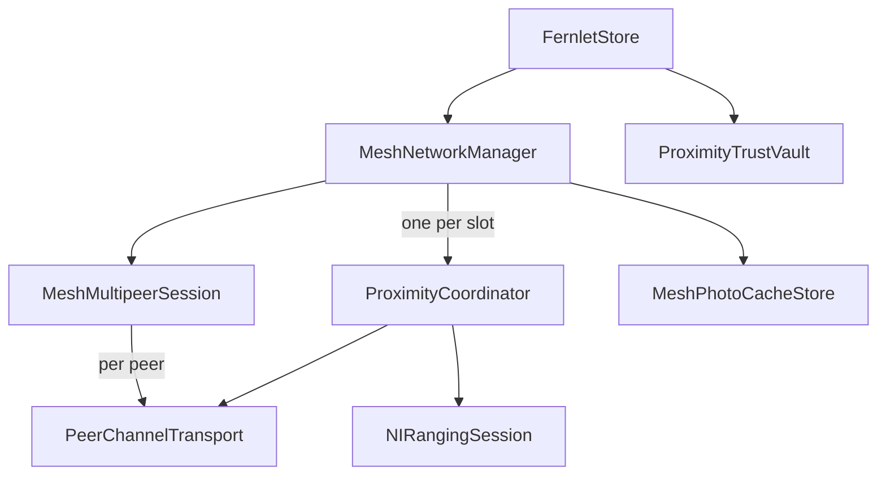

# Proximity + Mesh Consolidation Plan

**Status:** Planning / implementer-ready  
**Updated against:** Current post-redesign tree  
**Scope:** The proximity connection engine, mesh session manager, MultipeerConnectivity transport layer, ranging support, identity envelopes, trust policy, audit data, and friend-photo pipeline.

---

## 1. TL;DR

The proximity redesign has already removed the largest architectural duplication:

- Production routes pairwise and mesh friend sessions through `MeshNetworkManager`.
- `MeshNetworkManager` is the only production owner that constructs `ProximityCoordinator`.
- The standalone `FriendPhotoSharingService` and its cache store have already been deleted.
- Mesh slots already use real `NIRangingSession` instances and the 15 cm proximity-commit flow.

The remaining cleanup is still worthwhile, but it is narrower than the original consolidation proposal:

1. Extract shared transport types from the legacy `MultipeerSession` file, then delete the unused concrete single-connection wrapper.
2. Move on-the-wire payload types out of UI and oversized envelope files.
3. Remove dead `NoopRangingSession`.
4. Rename the mesh manager's transient distance-window sample so it is not confused with persisted inspector diagnostics.
5. Organize the flat proximity directory into focused folders.
6. Split oversized classes only where extension boundaries do not require broad access-control widening.
7. Consider a shared MultipeerConnectivity substrate and typed payload routing only after the lower-risk cleanup lands.

This is consolidation around the existing `ProximityCoordinator`, not a rewrite.

---

## 2. Current architecture

`ProximityCoordinator` is the per-connection state machine. It is dependency-injected with a transport, ranging provider, optional inspector, payload handler, trust policy, replay cache, and foreground anchor.



Current behavior:

- `MeshNetworkManager.startJoin()` starts the friend discovery flow.
- `MeshMultipeerSession` owns one shared `MCSession` and creates one `PeerChannelTransport` per connected peer.
- `MeshNetworkManager` constructs one `ProximityCoordinator` per channel.
- Each slot coordinator receives a real `NIRangingSession`.
- One committed friend remains pairwise with no `MeshDescriptor`.
- A second committed friend promotes the session in place to a mesh.
- `ProximityCoordinator` owns identity exchange, heartbeat handling, trust checks, and proximity/manual commit gates.
- `MeshNetworkManager` owns mesh, admission, removal, encryption, photo, and manifest payloads.

### Legacy transport status

`MultipeerSession` is no longer constructed by production code. It still cannot be deleted immediately because live code refers to nested types declared on it:

- `MultipeerSession.State`
- `MultipeerSession.PendingInvite`
- `MultipeerSession.InboundMessage`
- `MultipeerSession.MultipeerError`
- `MultipeerSession.defaultServiceType`

Those support types belong at the transport layer, not on an unused concrete adapter.

---

## 3. Remaining maintenance issues

### P1 - Transport support types are attached to a dead concrete wrapper

`MultipeerSession.swift` mixes reusable transport contracts and value types with an unused single-connection `MCSession` implementation. `PeerChannelTransport`, `MeshMultipeerSession`, `ProximityCoordinator`, mocks, and tests still depend on the nested support types.

**Resolution:** extract neutral transport types first, update references, then delete the unused concrete `MultipeerSession` implementation and retire tests that only cover that deleted adapter.

Do not add a replacement single-connection adapter unless a production feature needs one.

### P2 - Wire types are scattered

`PayloadType`, envelope signing, mesh payloads, admission tokens, and rotation payloads share `FernletIdentityEnvelope.swift`. Friend-photo wire payloads live at the top of `FriendPhotoShareView.swift`, mixed with cache code and SwiftUI views.

**Resolution:** move wire models into `Proximity/Wire/`. Keep Codable shape unchanged.

### P3 - Large owner files hide boundaries

`MeshNetworkManager.swift` and `ProximityCoordinator.swift` contain several distinct responsibilities. Their existing `// MARK:` sections show useful boundaries, but splitting them into extensions is not automatically mechanical: Swift `private` declarations are file-scoped.

**Resolution:** extract standalone types and helpers first. Split extensions only where the required access-control changes remain narrow and reviewable. Avoid a broad `private` to internal rewrite.

### P4 - Similar names hide intentionally different models

Two distance sample types currently share the name `DistanceSample`:

| Type | Purpose | Resolution |
|---|---|---|
| `ConnectionSessionLog.DistanceSample` | Persisted inspector diagnostic with timestamp and optional direction components | Keep as-is |
| Global `DistanceSample` in `MeshNetworkManager.swift` | Transient rolling window for mesh slot ranking | Rename to `MeshDistanceSample` or `DistanceStabilitySample` |

The two event enums are also intentionally different:

| Type | Purpose | Resolution |
|---|---|---|
| `ConnectionSessionLog.Event.Kind` | Detailed inspector telemetry | Keep |
| `TrainerAuditEvent.Kind` | Persisted security audit vocabulary | Keep |

Do not merge persisted diagnostics and security audit data simply because some cases overlap.

### P5 - Dead and misleading declarations remain

- `NoopRangingSession` is dead. Slots use `NIRangingSession()`.
- `MeshSlotTrustPolicy` is misleadingly named and partially redundant. It delegates revoked, blocked, and audit operations through `FernletStore`, while returning `true` for trusted-peer checks. In friend mode that permissiveness is intentional because the proximity gate is the authorization step.

**Resolution:** delete `NoopRangingSession`. Keep the slot policy behavior initially, but rename or replace it with a thin friend-session policy wrapper over `ProximityTrustVault` after adding focused tests.

### P6 - Payload dispatch should remain layered

There are two live inbound dispatch layers:

1. `ProximityCoordinator` handles connection-engine payloads such as identity introduction, identity acknowledgement, and session heartbeat.
2. `MeshNetworkManager` handles feature payloads such as mesh descriptors, admission, removal, rotation, and friend photos.

This is an intentional boundary. A future typed router can improve exhaustiveness and auditing, but it should preserve the two layers rather than create one global registry.

---

## 4. Target structure

Names can be adjusted to match Xcode project conventions. The folder boundaries are the important part.

```text
Proximity/
├── Transport/
│   ├── MultipeerTransport.swift          # protocol + neutral State, PendingInvite, InboundMessage, Error
│   ├── MultipeerPeer.swift               # MultipeerPeer + MCPeerID persistence
│   └── MeshMultipeerSession.swift        # fan-out MCSession owner + PeerChannelTransport
├── Engine/
│   ├── ProximityCoordinator.swift
│   └── ProximityCommitDetector.swift
├── Ranging/
│   ├── RangingProvider.swift             # RangingDistance, RangingState, protocol
│   └── NIRangingSession.swift
├── Identity/
│   ├── IdentityService.swift
│   └── ReplayCache.swift
├── Wire/
│   ├── PayloadType.swift
│   ├── FernletIdentityEnvelope.swift
│   ├── MeshPayloads.swift
│   ├── FriendPhotoPayloads.swift
│   └── TrainerPayloads.swift
├── Trust/
│   ├── ProximityTrustPolicy.swift
│   ├── ProximityTrustVault.swift
│   └── TrainerAuditLog.swift
├── Audit/
│   ├── ConnectionSessionLog.swift
│   └── ConnectionInspector.swift
├── Mesh/
│   ├── MeshNetworkManager.swift
│   ├── MeshSessionTypes.swift
│   └── MeshNameGenerator.swift
├── Photos/
│   ├── MeshPhotoCacheStore.swift
│   ├── FriendPhotoReviewSheet.swift
│   └── FriendPhotoImageHelpers.swift
├── ForegroundAnchor/
│   └── ProximityForegroundAnchor.swift
└── UI/
    ├── ConnectionInspectorView.swift
    └── ConnectionInspectorHistoryView.swift
```

Keep app-level surfaces such as `ConnectView`, `DisposableCameraView`, and `MeshAdmissionPromptSheet` with the app UI unless moving them provides a concrete navigation benefit.

---

## 5. Recommended phases

### Phase 0 - Refresh documentation and baseline

- Update `FileIndex.md` as files move.
- Update older implementation docs that still refer to `FriendPhotoSharingService`, `FriendPhotoCacheStore`, lobby browsing, or the pre-redesign owner model.
- Build and run the focused proximity suites before editing.

**Gate:** clean build and a recorded passing baseline.

### Phase 1 - Low-risk dead-code and naming cleanup

- Delete `NoopRangingSession`.
- Rename the manager's transient `DistanceSample`.
- Extract `ProximityCommitDetector` from `NIRangingSession.swift`.
- Move `RangingDistance`, `RangingState`, and `RangingProvider` into a small ranging contract file.

**Gate:** build, `ProximityCoordinatorTests`, `MeshNetworkManagerTests`, and ranging tests pass.

### Phase 2 - Wire-type extraction

- Move friend-photo payload models out of `FriendPhotoShareView.swift`.
- Move mesh and trainer payload models out of `FernletIdentityEnvelope.swift`.
- Keep raw values, Codable field names, defaults, and canonical-byte ordering unchanged.
- Leave envelope signing and verification code in `FernletIdentityEnvelope.swift`.

**Gate:** build, encryption tests, snapshot round-trip tests, and mesh tests pass.

### Phase 3 - Retire the legacy single-connection transport

- Extract `MultipeerPeer`, `MCPeerIDStoring`, and `FileMCPeerIDStore`.
- Replace nested `MultipeerSession.*` support types with neutral transport-layer names.
- Update `MultipeerTransport`, `PeerChannelTransport`, `MeshMultipeerSession`, coordinator code, mocks, and tests.
- Delete the unused concrete `MultipeerSession` wrapper.
- Remove or rewrite `MultipeerSessionTests` so the retained behavior is covered at the active fan-out transport boundary.

**Gate:** build and all proximity, mesh, and transport tests pass.

### Phase 4 - Folder organization and selective extraction

- Move files into the target folders.
- Extract photo cache and image helpers from `FriendPhotoShareView.swift`.
- Extract mesh supporting types from `MeshNetworkManager.swift`.
- Consider focused manager extensions only when access-control impact is small.

**Gate:** build and full test suite pass with behavior unchanged.

### Phase 5 - Optional transport substrate

Evaluate whether `MeshMultipeerSession` still contains enough duplicated or hard-to-test `MCSession` lifecycle code to justify an `MCNearbyServiceCore`.

The previous plan assumed two live adapters. That is no longer true. A shared substrate should be added only if it creates a real testing or ownership benefit for the remaining fan-out implementation.

### Phase 6 - Optional typed payload routing

Add typed routing only if it improves exhaustiveness, forbidden-payload rejection, or auditing. Preserve the engine-versus-feature dispatch boundary.

---

## 6. Explicit non-goals

- Do not merge `ProximityCoordinator` into `MeshNetworkManager`.
- Do not recreate a single-connection transport without a live caller.
- Do not unify inspector telemetry with persisted trainer audit events.
- Do not unify transient mesh ranking samples with persisted inspector ranging samples.
- Do not change wire formats during file moves.
- Do not combine behavior changes with broad file moves.
- Do not widen large groups of `private` members solely to split files.

---

## 7. Risks and safeguards

- **Wire compatibility:** admission tokens and identity envelopes depend on canonical byte ordering. Move types without changing encoding or signature input.
- **Persisted data:** audit events, trusted peers, connection logs, and snapshots are Codable. Raw-value or field-name changes require migration work.
- **Concurrency:** `MeshMultipeerSession` has ordering-sensitive channel setup. Keep its invitation and `notifyConnected()` sequencing intact.
- **Trust behavior:** friend sessions intentionally use proximity commit as authorization. Preserve blocked and revoked checks while clarifying the policy type.
- **Test coverage:** deleting the legacy adapter must not reduce coverage of active fan-out behavior. Replace tests where needed before removal.

---

## 8. Documentation follow-up

Update these documents as each phase lands:

- `Docs/FileIndex.md`
- `Docs/MeshNetworkImplementationPlan.md`
- `Docs/Dead-Code-and-Carryover-Gap-Review.md`
- `Docs/FernletSpecificationV3.md`

Older completed implementation plans may remain historical, but active planning docs should stop presenting the deleted standalone friend-photo owner as current architecture.
